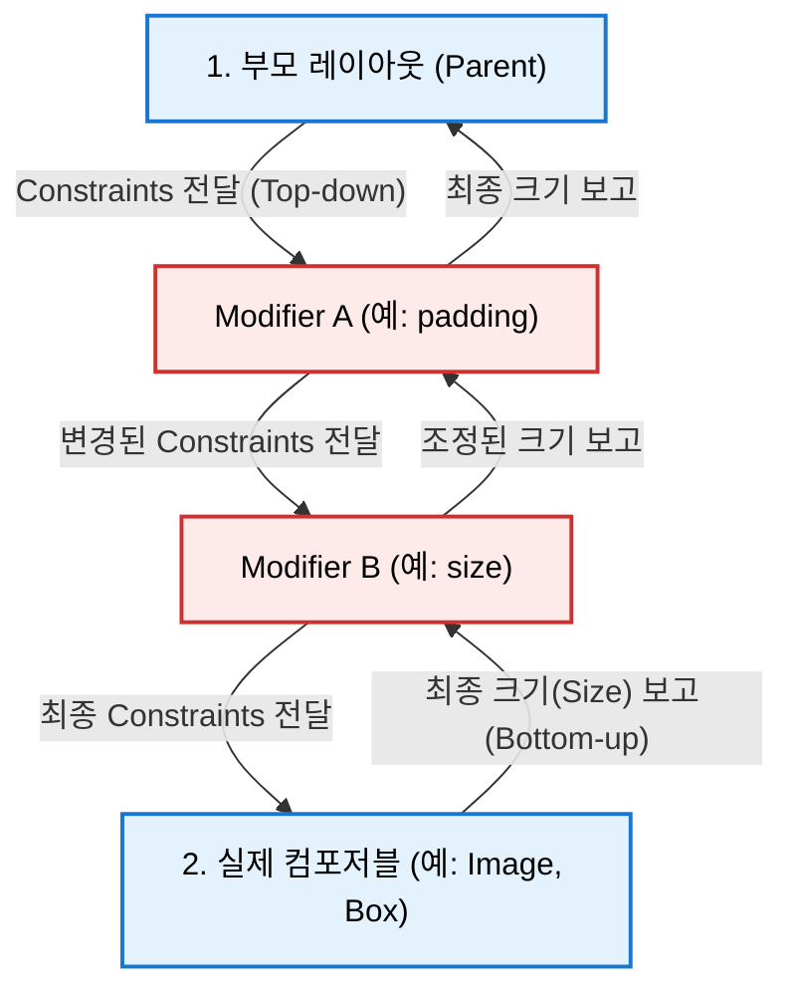

# Modifier 체이닝의 작동 메커니즘 (Mental Model)

Compose의 모든 Modifier는 독립적인 컴포저블이 아니라, **기존 컴포저블 노드를 감싸는 데코레이터 래퍼 노드**를 빌드합니다. 따라서 체이닝 순서에 따라 제약 조건의 전달 방식과 최종 크기 계산 순서가 완전히 달라집니다.

### 2-1. Constraints 전달 (Top-down / Outside-to-Inside)
* 제약 조건은 **Modifier 체인의 첫 번째 요소(가장 바깥쪽)부터 시작해서 마지막 요소(가장 안쪽)를 거쳐 최종 컴포저블**로 흘러 내려갑니다.
* 각 Modifier는 부모로부터 받은 제약 조건을 자신의 역할에 맞게 변경하여 다음 Modifier나 컴포저블에 전달합니다.

### 2-2. 크기 결정 및 보고 (Bottom-up / Inside-to-Outside)
* 제약 조건을 최종 전달받은 실제 컴포저블(예: `Box`, `Text`)이 제약 조건 내에서 자신의 크기를 가장 먼저 결정합니다.
* 결정된 크기는 다시 **역순으로 Modifier 체인을 따라 올라가며(Bottom-up)** 보고됩니다. 각 Modifier는 필요에 따라 이 자식의 크기 보고를 보정하거나 그대로 상위 노드에 보고합니다.

---
