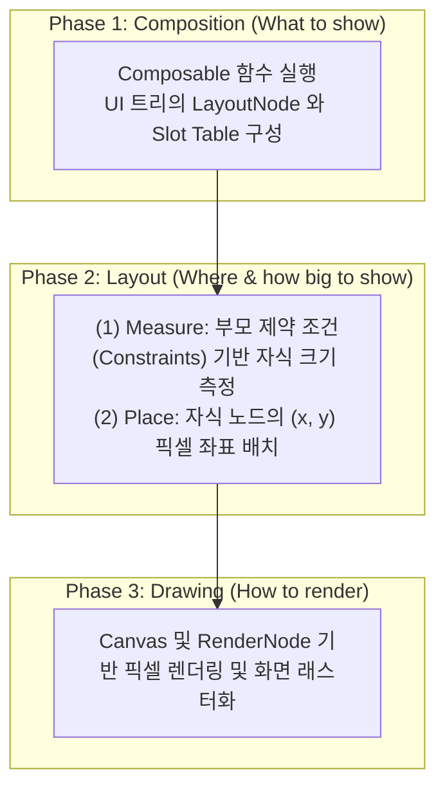

## Compose frame pipeline은 composition, layout, drawing으로 나뉜다

### 1. 개념 정의 (What)
Compose의 프레임 처리 파이프라인(Frame Pipeline)은 단일 통합 렌더링 단계가 아니라 **(1) Composition, (2) Layout (Measurement & Placement), (3) Drawing의 세 가지 명확히 독립된 3단계 Phase**로 분리되어 구동된다.

---

### 2. 3단계 분리 파이프라인의 필요성 (Why)
화면 상의 상태 변화(예: 스크롤에 따른 애니메이션 Offset 변화, 캔버스 색상 변경 등)가 일어날 때마다 전체 파이프라인을 매번 디스패치하면 엄청난 CPU/GPU 낭비가 발생한다.

세 단계가 분리되어 있으면 **상태 읽기(State Read)를 최적의 Phase로 이관(Defer State Read)**할 수 있다. 위치만 변경되는 애니메이션은 1단계(Composition)를 스킵하고 2단계(Layout)만 실행하며, 색상만 바뀌는 렌더링은 1, 2단계를 모두 스킵하고 3단계(Drawing)만 실행하여 120fps 고성능 UI를 유지할 수 있다.

---

### 3. 내부 동작 및 Phase별 역할 (How)



1. **Composition Phase**: `@Composable` 함수를 구동하고 상태(State)를 읽어 `LayoutNode` 트리 구조를 생성/갱신한다.
2. **Layout Phase**: 
   - **Measure 단계**: 제약 조건(`Constraints`)을 하향(Top-down) 전달하여 각 노드의 `Placeable` 크기를 결정한다.
   - **Place 단계**: 상향(Bottom-up)으로 결정된 크기를 받아 각 자식 노드의 좌표를 픽셀 단위로 배치한다.
3. **Drawing Phase**: 노드 트리를 조회를 바탕으로 Android Native `Canvas` 및 `RenderNode`에 그리기 명령(Draw Commands)을 기록하고 화면 디스플레이로 보낸다.

---

### 4. Phase 이관(Defer State Read) 최적화 코드 사례

```kotlin
@Composable
fun PhaseOptimizationExample(scrollState: ScrollState) {
    // ❌ 1. Composition Phase Read (비효율적인 방식)
    // scrollState.value를 Composition 단계에서 읽음 -> 스크롤할 때마다 전체 Box recomposition 발생!
    Box(
        modifier = Modifier
            .offset(y = scrollState.value.dp) // Recomposition 재실행 원인
            .background(Color.Red)
    )

    // ✅ 2. Layout Phase Defer Read (고성능 최적화 방식)
    // 람다 블록을 전달하여 상태 읽기를 Layout Phase(Placement)로 미룸
    // Composition Phase를 100% 스킵하고 2단계 Layout만 재계산!
    Box(
        modifier = Modifier
            .offset { IntOffset(x = 0, y = scrollState.value) } // Layout Phase Read!
            .background(Color.Blue)
    )

    // ✅ 3. Drawing Phase Defer Read (최고 성능 방식)
    // graphicsLayer 람다를 전달하여 상태 읽기를 Draw Phase로 미룸
    // Composition 및 Layout 단계를 모두 스킵하고 3단계 Drawing만 재계산!
    Box(
        modifier = Modifier
            .graphicsLayer {
                translationY = scrollState.value.toFloat() // Draw Phase Read!
            }
            .background(Color.Green)
    )
}
```

---

관련 노트: [Snapshot State 관찰은 State를 읽은 scope를 invalidation 대상으로 만든다](snapshot-state-observation.md), [Compose 상태 읽기 위치는 recomposition 범위 제어로 직결된다](../performance/compose-state-read-scope.md)

출처: [Phases of Jetpack Compose](https://developer.android.com/develop/ui/compose/phases)

검증일: 2026-08-05. Compose 공식 가이드의 "Phases of Jetpack Compose" 문서 사양을 대조하여 Composition, Layout, Draw 3단계 파이프라인 구조 및 State Read 지점 미루기(Defer Read) 최적화 기법 서술을 정밀 보강했다.
