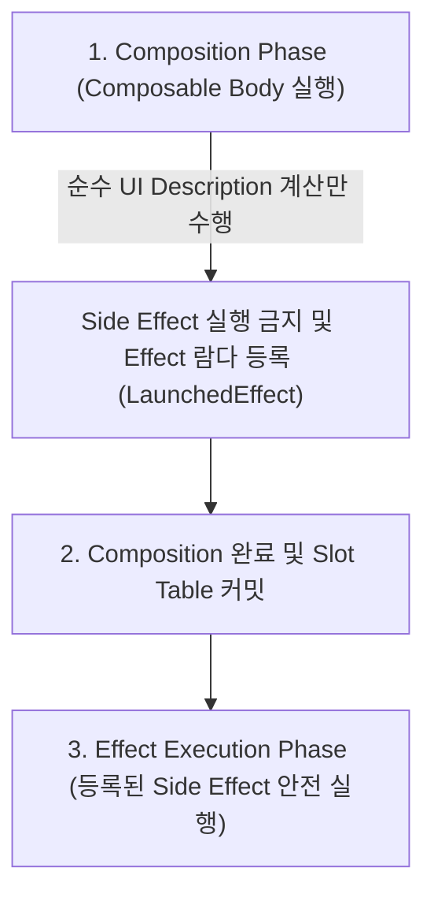

## Composable body 는 빠르고 idempotent 하며 side-effect free 해야 한다

**배경 지식 개념**: [Idempotency (멱등성)](../../../../../../../02_references/computer-science/idempotency.md), [Side Effect (부작용)](../../../../../../computer-science/side-effect.md), [Pure Function (순수 함수)](../../../../../../computer-science/pure-function.md), [Immutability (불변성)](../../../../../../computer-science/immutability.md), [Recomposition (재구성)](../recomposition.md)

---

### 1. 3 가지 핵심 런타임 규약 (What)

Jetpack Compose 의 모든 `@Composable` 함수 본문(Body)은 초당 60fps ~ 120fps 의 부드러운 화면 렌더링을 유지하고 동시성 오류를 방지하기 위해 다음 3 가지 정밀 규약을 반드시 지켜야 한다.

#### 1) 빠름 (Fast)
- Composable 함수는 **16.6ms (60fps) 또는 8.3ms (120fps)라는 매우 짧은 프레임 타임 예산 내**에 실행을 마쳐야 한다.
- 함수 본문 내에 I/O 작업, 파일 읽기/쓰기, 로컬 DB 접근, 복잡한 정렬이나 렌더링 Blocking 연산이 절대 포함되어서는 안 된다.

#### 2) 멱등성 (Idempotent)
- 동일한 입력 파라미터가 전달되면 **몇 번을 실행하더라도 항상 정확히 동일한 UI 트리를 생성**해야 한다.
- 실행할 때마다 결과가 달라지거나 내부 난수/시간 상태에 의존해서는 안 된다. 자세한 개념은 [Idempotency (멱등성)](../../../../../../../02_references/computer-science/idempotency.md) 문서를 참고한다.

#### 3) 부작용 없음 (Side-Effect Free)
- 함수 본문이 직접 실행되는 과정에서 **외부 상태를 변경하거나(전역 변수 수정, 파일 저장, 분석 이벤트 전송), 관리되지 않는 코루틴 작업을 시작하는 등의 [Side Effect (부작용)](../../../../../../computer-science/side-effect.md)** 이 발생해서는 안 된다.
- Composable 함수는 오직 입력된 상태 데이터를 반환용 UI 구조(UI Description)로 변환하는 [Pure Function (순수 함수)](../../../../../../computer-science/pure-function.md) 처럼 작동해야 한다.

---

### 2. 규약 제약이 필요한 이유 (Why)

Compose Runtime 은 성능 극대화 및 멀티코어 동시성을 위해 다음과 같은 **비결정론적 실행 특성**을 갖는다:

- **실행 순서 미보장**: 코드에 작성된 순서대로 하위 Composable 이 실행되지 않고, 컴파일러 최적화에 의해 자유로운 순서로 실행될 수 있다.
- **병렬 실행 (Parallel Recomposition)**: 여러 CPU 코어에서 하위 Composable 함수들이 동시에 병렬로 계산될 수 있다.
- **취소 및 재시도 (Cancellation & Preemption)**: [Recomposition (재구성)](../recomposition.md) 도중 새로운 State 변경이 감지되면, 진행 중이던 작업을 중간에 즉시 취소하고 최신 State 로 다시 처음부터 재실행한다.

따라서 함수 본문에 네트워크 요청이나 데이터 저장이 포함되어 있으면, **요청이 이중/삼중으로 전송되거나, 데이터가 오염되거나, 화면이 심하게 버벅이는 Jank 현상**이 초래된다.

---

### 3. 내부 동작 및 이펙트 격리 메커니즘 (How)

Compose 는 부작용이나 비동기 작업을 수반해야 할 때 이를 안전하게 처리할 수 있도록 **Effect APIs**를 제공한다.



- **Effect APIs 로 부작용 격리**: 네트워크 요청, 분석 이벤트 발송, 리스너 등록 등은 Composition 본문 밖인 `LaunchedEffect`, `DisposableEffect`, `SideEffect` 블록 내부로 격리해야 한다.
- **연산 메모제이션**: 계산 비용이 큰 로직은 `remember { … }`나 `derivedStateOf { … }`로 메모제이션하거나 [ViewModel](../../../viewmodel.md) 계층으로 이관한다.

---

### 4. 올바른 패턴과 안티패턴 코드 비교

```kotlin
// ❌ 안티패턴: Composable Body 내에서 직접 Side Effect 및 무거운 연산 수행
@Composable
fun BadUserProfile(userId: String, analytics: Analytics) {
    // 1. 순수성 위반: Recomposition 때마다 분석 이벤트가 중복 발송됨
    analytics.logEvent("view_profile", mapOf("user_id" to userId))

    // 2. Fast 규약 위반: Composition 도중 디스크 I/O 읽기로 인한 UI Jank 발생
    val rawJson = File("/sdcard/user_$userId.json").readText()

    Text("User Profile: $rawJson")
}

// ✅ 올바른 패턴: Side Effect 격리 및 State 관찰
@Composable
fun GoodUserProfile(userId: String, analytics: Analytics) {
    // Composition이 성공적으로 완료된 후 1회 / userId 변경 시에만 안전하게 실행됨
    LaunchedEffect(userId) {
        analytics.logEvent("view_profile", mapOf("user_id" to userId))
    }

    // 파일 로딩 등 무거운 작업은 ViewModel/Coroutines 영역에서 처리하고 State로 관찰
    Text("User Profile Screen: $userId")
}
```

---

### 5. 연결 문서 및 출처 (Related Links)

- [Recomposition (재구성)](../recomposition.md) - 규약이 적용되는 런타임 재구성 메커니즘
- [Jetpack Compose 런타임과 상태 모델](../compose-runtime-and-state-model.md) - Compose 런타임의 기본 동작 규약
- [LaunchedEffect 실행 규약](../../state-and-lifecycle/compose-state-and-effect-contracts/launched-effect.md) - 취소 가능한 부작용을 관리하는 LaunchedEffect
- [Composition 내 무거운 작업 처리 규약](../../performance/compose-performance-contracts/heavy-work-does-not-belong-in-composition.md) - Fast 규약 준수를 위한 성능 가이드
- [ViewModel](../../../viewmodel.md) - 무거운 데이터 작업과 비즈니스 로직을 이관받는 상태 관리자
- [Compose SSOT](../../../compose-ssot.md) - Composable 이 관찰해야 하는 상태 원천
- [Idempotency (멱등성)](../../../../../../../02_references/computer-science/idempotency.md) - 동일한 입력에 대해 항상 동일한 결과를 생성하는 성질
- [Side Effect (부작용)](../../../../../../computer-science/side-effect.md) - Composable 함수 본문에서 배제해야 하는 부작용 개념
- [Pure Function (순수 함수)](../../../../../../computer-science/pure-function.md) - Composable 함수가 준수해야 하는 순수함수 규약
- [Immutability (불변성)](../../../../../../computer-science/immutability.md) - 스마트 재구성 스킵 및 안전성을 보장하는 데이터 불변성
