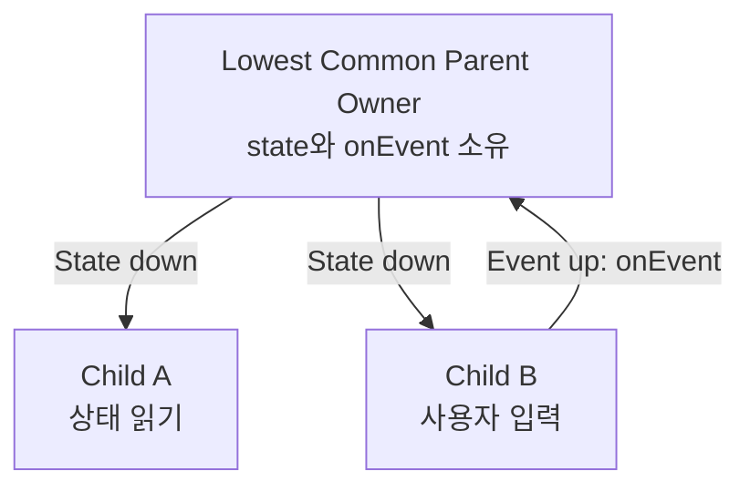

## Compose state owner는 읽고 쓰는 범위의 가장 낮은 공통 owner다

### 1. 개념 정의 (What)
**상태 소유자 최소 공통 분모 규약(Lowest Common Ancestor / Owner)**이란 Compose의 핵심 아키텍처 패턴인 **상태 끌어올리기(State Hoisting)**의 기준점으로서, 상태(State)를 읽거나 수정해야 하는 모든 하위 Composable 컴포넌트들의 **가장 낮은 공통 부모 노드(Lowest Common Parent)**에 해당 상태의 소유권을 위치시켜야 한다는 설계 원칙이다.

---

### 2. 최저 공통 소유자 배치의 필요성 (Why)
상태의 위치가 너무 높거나 너무 낮으면 심각한 아키텍처 문제가 발생한다:
- **너무 높게 배치할 경우**: 최상위 노드(예: Activity 또는 Root Screen)가 불필요하게 모든 자식의 상태를 가지게 되어 데이터 캡슐화가 깨지고, 상태 변경 시 최상위 스코프가 Recomposition 범위에 노출될 위험이 커진다.
- **너무 낮게 배치할 경우**: 형제(Sibling) 컴포넌트 간에 동일한 상태를 공유하거나 동기화해야 할 때 상태 전달이 불가능해진다.

따라서 상태를 읽고 써야 하는 자식 컴포넌트들을 정확히 커버하는 최하위 공통 부모에 상태를 정의함으로써, 단일 진실 출처(SSOT) 및 불변 단방향 데이터 흐름(UDF, Unidirectional Data Flow)을 구현한다.

---

### 3. 내부 동작 및 UDF 데이터 흐름 (How)



1. **State Down, Events Up**: 부모 노드가 `State` 상태 값을 자식 컴포넌트로 내려보내고(State Down), 자식 컴포넌트는 이벤트 콜백 람다(`onEvent: () -> Unit`)를 상위 부모로 전달(Events Up)한다.
2. **상태 불변성 유지**: 하위 컴포넌트는 수신된 State를 직접 수정할 수 없으며, 콜백을 호출하여 최저 공통 소유자 영역에서 상태 수정이 이루어지도록 강제한다.

---

### 4. 올바른 State Hoisting 코드 패턴

```kotlin
// ❌ 안티패턴: 상태가 하위 컴포넌트 내부에 갇혀 형제 컴포넌트와 공유 불가능
@Composable
fun BadCounterContainer() {
    Column {
        CounterDisplay() // 자체 count 상태 가짐
        CounterControl() // count 제어 불가
    }
}

// ✅ 올바른 패턴: 최저 공통 부모(GoodCounterContainer)로 상태 끌어올리기(State Hoisting)
@Composable
fun GoodCounterContainer() {
    // 1. 읽기/쓰기를 실행하는 하위 컴포넌트들의 가장 낮은 공통 부모에 State 정의
    var count by remember { mutableStateOf(0) }

    Column {
        // State Down: 읽기 컴포넌트에 상태 값 전달
        CountViewer(count = count)
        
        // Events Up: 쓰기 컴포넌트에 이벤트 람다 전달
        CountController(onIncrement = { count++ })
    }
}

@Composable
fun CountViewer(count: Int) {
    Text("Current Count: $count")
}

@Composable
fun CountController(onIncrement: () -> Unit) {
    Button(onClick = onIncrement) {
        Text("Increase")
    }
}
```

---

관련 노트: [Compose UI는 상태를 입력으로 계산되는 선언적 결과다](./compose-ui-is-declarative-function-of-state.md), [Automatic State Observation이 Flutter rebuild 사고와 Compose를 가른다](./automatic-state-observation-is-the-compose-flutter-rebuild-difference.md)

출처: [State hoisting in Compose](https://developer.android.com/develop/ui/compose/state-hoisting)

검증일: 2026-08-05. Compose 공식 가이드의 "State hoisting in Compose" 문서 사양을 대조하여 최저 공통 부모 배치 기준, UDF(State Down/Events Up) 패턴 및 캡슐화 서술을 정밀 보강했다.
