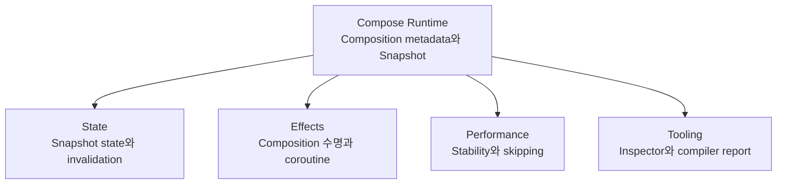

## Compose runtime은 state, effect, performance, tooling 정본으로 이어지는 중심 모델이다

### 1. 개념 정의 (What)
**Compose Runtime 통합 링크 지도**는 Compose 프레임워크의 코어 엔진인 Runtime이 상태 관리(State), 부작용 격리(Effects), 성능 최적화(Performance), 개발 툴링(Tooling) 영역과 결합하는 상호작용 메커니즘을 총괄 링킹하는 최상위 노드다.

---

### 2. 서브시스템 간 통합의 필요성 (Why)
Compose의 개별 기술들(`remember`, `LaunchedEffect`, `derivedStateOf`, Compiler Skippable, Layout Inspector)은 단독으로 존재하는 파편화된 기술이 아니다. 모두 **Slot Table 기반의 Positional Memoization**과 **Snapshot 관찰 엔진**이라는 동일한 Runtime 멘탈 모델 위에서 설계되었다.

서브시스템 간의 통합 체계를 파악하지 못하면, 효과적인 툴링 디버깅이나 근본적인 성능 최적화를 달성할 수 없다.

---

### 3. 서브시스템 간 상호작용 메커니즘 (How)

1. **State & Runtime**: `mutableStateOf`는 Snapshot 트랜잭션과 직접 연결되어 RecomposeScope를 무효화한다.
2. **Effects & Runtime**: `LaunchedEffect` 및 `DisposableEffect`는 Composition 수명주기에 바인딩되어 코루틴의 시작과 취소를 관리에 연동한다.
3. **Performance & Runtime**: Compiler의 stability 분석 지표(`stable`/`unstable`)와 Strong Skipping 옵션이 Runtime의 Skip 여부를 결정한다.
4. **Tooling & Runtime**: Android Studio의 Layout Inspector 및 Compose Compiler Metrics는 Runtime의 [recomposition](recomposition.md) 횟수 및 Skip 로그를 픽셀/텍스트 레벨로 시각화한다.

---

### 4. 주요 정본 문서로의 하이퍼링크 맵

- **상태 및 수명주기 API**: [Compose 상태와 Effect 계약](../state-and-effects/compose-state-and-effect.md)
- **성능 및 Skippability 최적화**: [Compose 성능 계약](../performance/compose-performance.md)
- **UI 레이아웃 및 세맨틱스**: [Compose UI 계약](../layout-and-ui/compose-ui.md)
- **디자인 시스템 및 테밍**: [Compose 디자인 시스템 계약](../design-system/compose-design-system.md)

---

관련 노트: [Jetpack Compose 런타임과 상태 모델의 기본 개념](compose-runtime-and-state-model.md)

출처: [Jetpack Compose Architecture Overview](https://developer.android.com/develop/ui/compose/architecture)

검증일: 2026-08-05. Compose 공식 가이드의 Architecture Overview를 대조하여 Runtime 서브시스템 상호작용 및 계약 링크 구조 서술을 정밀 보강했다.
