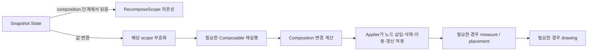

## Compose UI는 상태의 선언적 함수다

### 1. 개념 정의 (What)
Jetpack Compose에서 UI는 명령형 View 객체의 집합을 수동으로 탐색하여 속성을 변경하는 대상이 아니라, **현재 앱 상태(State)를 입력으로 받아 트리를 계산하고 기술하는 선언적 함수($UI = f(State)$)**다. `@Composable` 함수는 데이터를 수신하여 UI 구조(Composition)를 생성하며, 상태가 변경되면 Compose Runtime이 수신된 새 상태를 기반으로 영향을 받는 함수를 다시 호출([recomposition](../recomposition.md))하여 UI 설명을 갱신한다.

---

### 2. 선언적 모델의 도입 배경 및 필연성 (Why)
기존 Android View System(Imperative UI Model)에서는 XML 기반 뷰 트리를 자바/코틀린 코드에서 `findViewById()`, `ViewBinding`, 또는 `DataBinding`으로 찾아 개별 setter(`textView.setText()`, `view.setVisibility()`)를 호출했다. 

이 방식은 다음과 같은 치명적 한계를 안고 있었다:
- **상태 불일치(State-UI Desynchronization)**: 데이터 모델의 값과 화면에 표시된 뷰 상태가 동기화되지 않아 예외적인 UI 버그(예: 비동기 데이터 로딩 후 숨겨져야 할 로딩 프로그레스바가 여전히 표시됨)가 자주 발생한다.
- **높은 상태 복잡도**: 뷰 자체도 내부 상태(예: `EditText` 입력 텍스트, `CheckBox` 체크 여부)를 가질 수 있어, 별도 모델과 함께 사용할 때 단일 진실 출처([single source of truth](../../../compose-ssot.md), SSOT)를 일관되게 유지하려면 추가 동기화 코드가 필요하다.

Compose의 선언적 모델은 현재 상태에 대응하는 UI를 Composable 함수로 기술하게 하여, 개발자가 개별 UI 객체의 변경 절차(How)보다 **현재 상태에서 보여 줄 내용(What)**에 집중하도록 돕는다. 런타임은 매번 전체 화면을 다시 만드는 대신 필요한 scope와 후속 단계만 갱신할 수 있다.

---

### 3. 내부 동작 메커니즘 (How)



1. **상태 관찰 및 캡처**: Composable 함수가 실행되는 동안 `State<T>` 객체의 `.value`를 읽으면, Compose Runtime의 Snapshot 엔진이 해당 읽기 동작을 감지하고 현재 실행 중인 `RecomposeScope`에 이 State를 의존성으로 등록한다.
2. **Composition 변경 계산 (Recomposition)**: State 값이 변경되면 런타임은 그 값을 composition 단계에서 읽은 scope를 무효화하고, 스케줄된 recomposition에서 변경 가능성이 있는 Composable을 재실행한다. 입력이 안정적이고 바뀌지 않은 호출은 건너뛸 수 있다.
3. **Slot Table과 노드 변경 적용의 분리**: Slot Table은 Composer가 호출 위치, 그룹, `remember` 값과 이전 매개변수 같은 composition 메타데이터를 기억하는 내부 자료구조다. 이를 화면 픽셀이나 `LayoutNode` 전체를 비교하는 범용 virtual-DOM diff로 이해하면 안 된다. Composer가 구조 변경을 계산하면 `Applier`가 대상 트리에 노드 삽입·삭제·이동·갱신 연산을 적용한다.
4. **Composition, layout, drawing의 독립적인 재실행**: 프레임은 composition, layout(measurement와 placement), drawing 단계로 나뉜다. Compose는 필요한 최소 작업만 수행하며, 상태를 layout이나 drawing 단계에서만 읽었다면 composition을 거치지 않고 해당 후속 단계만 다시 실행할 수 있다. 따라서 recomposition이 항상 재측정이나 전체 redraw를 의미하지 않는다.

---

### 4. View System vs Jetpack Compose 비교

```kotlin
// [기존 View System]: 명령형 (Imperative)
// UI 객체를 직접 찾아가 상태 변경 메서드를 실행해야 함
class LegacyCounterActivity : AppCompatActivity() {
    private var count = 0
    private lateinit var binding: ActivityCounterBinding

    private fun updateCount() {
        count++
        binding.textViewCount.text = "Count: $count" // 수동 변경
    }
}

// [Jetpack Compose]: 선언형 (Declarative)
// 상태(count)를 입력받아 UI 구조를 선언. count가 변경되면 Compose가 자동 갱신.
@Composable
fun CounterScreen(count: Int, onIncrement: () -> Unit) {
    Column {
        Text(text = "Count: $count") // count 상태의 선언적 표현
        Button(onClick = onIncrement) {
            Text("Increment")
        }
    }
}
```

---

관련 노트: [Recomposition은 전체 UI redraw가 아니라 필요한 Composable scope 재실행이다](./recomposition-scope-control.md), [Compose 상태와 Effect 계약](../../state-and-lifecycle/compose-state-and-effect/compose-state-and-effect.md)

출처: [Thinking in Compose](https://developer.android.com/develop/ui/compose/mental-model), [Jetpack Compose phases](https://developer.android.com/develop/ui/compose/phases), [How Composition Works](https://android.googlesource.com/platform/frameworks/support/+/HEAD/compose/runtime/design/how-compose-works.md)

검증일: 2026-08-06. Compose 공식 phase 문서와 AndroidX Runtime 설계 문서를 대조해 Slot Table, Composer/Applier 변경 적용, layout/drawing 무효화를 서로 다른 책임으로 분리했다.
