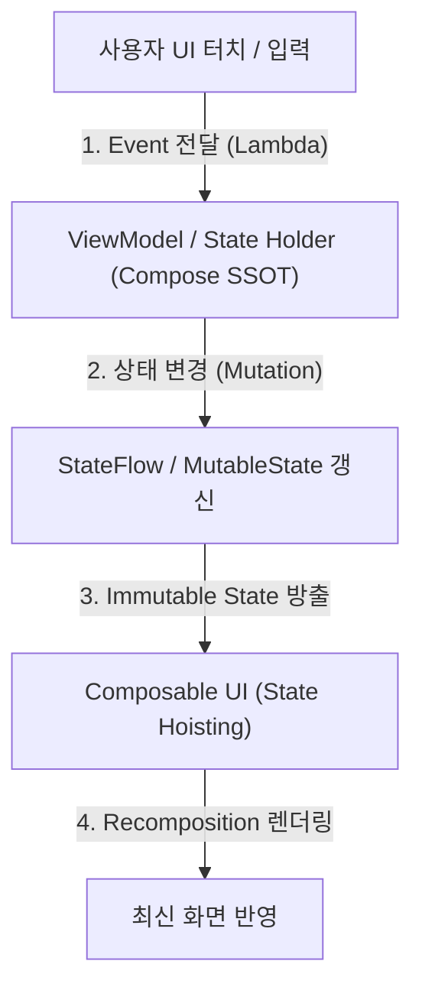

## Compose Single Source of Truth (Compose SSOT)

### 1. 개요 (Overview)

**Compose Single Source of Truth (Compose SSOT)** 는 Jetpack Compose 기반 안드로이드 앱 아키텍처에서 **특정 UI 상태(State)의 소유권(Ownership)과 변경 권한을 오직 단 하나의 주체(ViewModel 또는 Repository)에만 부여하고, State Hoisting 과 단방향 데이터 흐름(Unidirectional Data Flow - UDF)을 통해 UI 상태 불일치를 근본적으로 방지하는 핵심 설계 원칙**이다.

컴포지션(Composition) 내부에서 UI 상태를 각 Composable 함수들이 개별적으로 보관하고 직접 수정하면, 재구성(Recomposition) 발생 시 상태 동기화가 깨지는 문제가 빈번히 발생한다. Compose SSOT 는 UI 상태를 ViewModel 이나 상위 홀더로 올려(State Hoisting) 관리하게 함으로써 단 하나의 진실된 상태만 존재하도록 보장한다.

---

#### 초보자를 위한 쉽게 이해하는 비유

- **Compose SSOT (중앙 은행 통합 계좌)**:
  - 각 통장 지점(Composable UI)이 손님의 잔액 데이터를 개별적으로 보관하고 수정하면 지점마다 잔액 불일치 사태가 발생함.
  - Compose SSOT 는 모든 잔액 상태를 오직 **중앙 전산망 계좌(ViewModel)** 한 곳에만 두고, 통장 화면(UI)은 그 잔액 수치만 불변(Immutable) 상태로 읽어서 보여주는 원리와 같음.



---

### 2. Compose SSOT 의 3 대 핵심 기둥

1. **단방향 데이터 흐름 (Unidirectional Data Flow - UDF)**:
   - 데이터(State)는 위에서 아래로(ViewModel ➔ Composable UI) 흐르고, 이벤트(Event)는 아래에서 위로(Composable UI ➔ ViewModel)로만 흐른다.
2. **상태 끌어올리기 (State Hoisting)**:
   - Composable 함수를 비상태형(Stateless)으로 만들기 위해, 상태를 자신이 아닌 상위 가깝거나 ViewModel 수준으로 끌어올려 인자로 수신받는다.
3. **불변성 (Immutability)**:
   - UI 는 방출된 State 객체를 직접 수정할 수 없으며, 반드시 이벤트를 발송하여 Compose SSOT 소유자(ViewModel)가 새 State 객체로 교체하도록 강제한다.

---

### 3. 실전 코드 예시 (Jetpack Compose SSOT 구현)

```kotlin
// 1. Compose SSOT 소유자 (ViewModel)
class UserProfileViewModel : ViewModel() {
    private val _uiState = MutableStateFlow(UserProfileUiState())
    val uiState: StateFlow<UserProfileUiState> = _uiState.asStateFlow()

    fun updateName(newName: String) {
        _uiState.update { it.copy(name = newName) }
    }
}

// 2. Stateless Composable (State Hoisting 적용)
@Composable
fun UserProfileScreen(
    uiState: UserProfileUiState,
    onNameChange: (String) -> Unit
) {
    TextField(
        value = uiState.name,
        onValueChange = onNameChange
    )
}
```

---

### 4. 연결 문서 (Related Links)

- [ViewModel](../../architecture/state-management/viewmodel.md) - Configuration Change 를 견디는 Compose SSOT 상태 홀더
- [StateFlow & SharedFlow](../../data/async-flow/flow-state/stateflow-and-sharedflow.md) - Compose SSOT 상태 방출 스트림
- [Activity](../../architecture/app-components/activity.md) - Compose UI 루트 호스트
- [Composable Body Purity](composable-body-purity.md) - Compose UI 함수 작성 준칙
