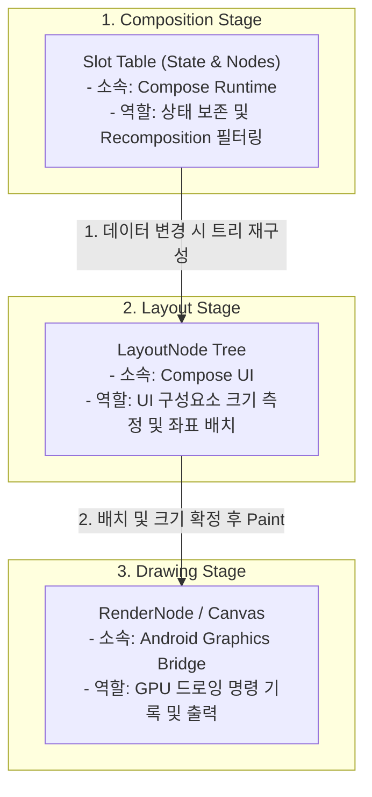

# 렌더링을 지원하는 3가지 트리 구조 (Three Trees)

3단계 파이프라인을 효율적으로 처리하기 위해 Compose Runtime과 UI 레이어는 내부적으로 3개의 유기적인 트리를 연동하여 관리합니다. 이는 Flutter의
`Widget -> Element -> RenderObject` 모델과 유사합니다.

* **Slot Table (Composition Tree)**: `@Composable` 함수 호출 사이에 상태값(
  `remember`)을 집어넣는 메모리 백업 테이블입니다. 이를 통해 값이 변경된 Composable 단락만 정확히 찾아가서 다시 실행(Recomposition)할 수
  있습니다.
* **LayoutNode Tree (Layout Tree)
  **: 화면에 실제로 배치할 컴포저블들의 위계 구조를 나타냅니다. 모든 UI 요소는 부모-자식 관계를 가지며 가로/세로 크기 및 위치 정보를 가지고 있습니다.
* **RenderNode Tree (Platform Graphic Layer)**: 안드로이드 OS 수준의 하드웨어 가속 드로잉 노드(
  `android.view.RenderNode` 등)와 연동하여 실제 선, 도형, 이미지, 텍스트 등을 화면에 그리는 GPU 하드웨어 가속 명령을 관리합니다.

---
