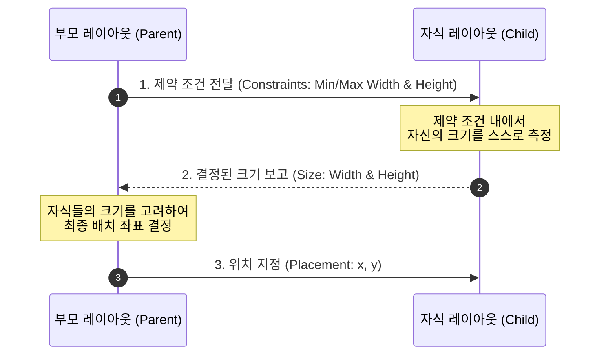

# 부모-자식 레이아웃 모델 (Layout Constraints & Sizes Flow)

컴포즈의 레이아웃 노드들은 부모와 자식 간에 **Constraints(제약 조건)** 과 **Sizes(결정된 크기)** 를 주고받으며 화면 내 영역을 조율합니다.

1. **Constraints Down**: 부모는 자식에게 허용 가능한 최대/최소 가로/세로 크기 제약 조건(`Constraints`)을 아래로 전달합니다.
2. **Sizes Up**: 자식은 전달받은 제약 범위 내에서 자신이 차지할 크기를 스스로 결정하여 부모에게 보고합니다.
3. **Placement**: 부모는 자식들의 크기를 바탕으로 구체적인 `(x, y)` 좌표를 결정하여 배치(`place`)합니다.

### 단일 패스 측정 원칙 (Single Pass Measurement)

* **Double Taxation의 해결**: 기존 XML 뷰 시스템은 중첩된 레이아웃에서 자식 뷰를 두 번 이상 측정하는 **이중 측정**으로 성능 저하가 발생했습니다.
* **Compose의 강제화
  **: 컴포즈는 **모든 노드를 단 한 번만 측정(Single Pass)**하도록 보장하여 $O(N)$의 선형 복잡도로 렌더링 성능을 극대화합니다. 부모-자식 간의 크기 조율이
  특별히 필요한 경우에 한해
  `Intrinsic measurements(고유 크기 측정)`을 제공합니다.

---
