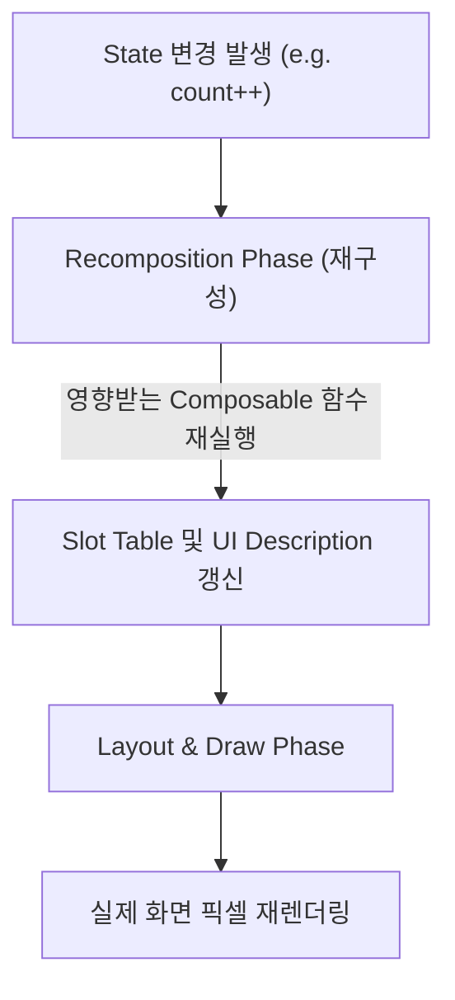

# Recomposition (재구성)

## 1. Recomposition 이란 무엇인가 (Overview)

Jetpack Compose에서 **Recomposition(재구성)**이란 **"상태(State)가 변경되었을 때, 변경된 최신 상태 데이터를 반영하기 위해 영향을 받는 Composable 함수들을 다시 실행(Re-execute)하고 UI 트리를 업데이트하는 런타임 메커니즘"**을 의미한다.

### 초보자를 위한 명령형 UI vs 선언적 Compose UI 비교
- **기존 명령형 UI (XML / View 시스템)**:
  - 개발자가 직접 View 객체를 찾아가 상태를 직접 바꾼다. (예: `textView.text = "새로운 카운트: $count"`)
- **선언적 UI (Jetpack Compose)**:
  - 개발자는 "상태 X가 주어졌을 때 UI가 어떻게 보이는가"를 함수로 선언한다.
  - 카운트 상태가 변경되면, Compose 런타임이 자동으로 해당 Composable 함수를 다시 실행(**Recomposition**)하여 변경된 UI 트리를 다시 계산하고 화면을 갱신한다.

---

## 2. Recomposition 의 핵심 런타임 특성 (Runtime Characteristics)

Compose 런타임은 앱의 성능과 부드러운 프레임(60fps/120fps)을 유지하기 위해 Recomposition 시 다양한 스마트 최적화 및 동시성 기술을 적용한다.

### 1) 스마트 스킵 최적화 (Recomposition Skip)
- Composable 함수의 파라미터 값이 이전 실행과 동일하거나, 데이터 타입에 [Immutability (불변성)](../../../../../computer-science/immutability.md)이 보장되는 경우, Compose 런타임은 해당 함수 실행을 **건너뛰고(Skip)** 기존 렌더링 결과를 재사용한다.

### 2) 비결정적 및 비동기 실행 특성 (Non-deterministic Execution)
- **실행 순서 미보장**: 코드 작성 순서대로 하위 Composable이 실행된다는 보장이 없다. 컴파일러 최적화에 의해 순서가 달라질 수 있다.
- **병렬 실행 (Parallel Recomposition)**: 성능 최적화를 위해 멀티코어 CPU 환경에서 여러 Composable 함수가 동시에 병렬로 실행될 수 있다.
- **취소 및 재시도 (Cancellation & Preemption)**: Recomposition이 진행되는 도중 새로운 State 변경이 들어오면, 진행 중이던 재구성 작업을 즉시 취소(Cancel)하고 새로운 State 값으로 처음부터 다시 계산을 시작한다.

### 3) Side-Effect 격리 필수
- Recomposition은 언제든 수시로 실행되거나, 병렬 실행되거나, 중간에 취소될 수 있다.
- 따라서 Composable 함수 본문(Body) 내부에 네트워크 요청, DB 접근, 전역 변수 변경과 같은 [Side Effect (부작용)](../../../../../../02_references/computer-science/side-effect.md)이 들어가면 무한 실행, 이중 처리, UI 멈춤(Jank) 등 심각한 오작동이 발생한다.

---

## 3. Recomposition 런타임 규약과 개발 가이드

Compose 런타임이 안정적이고 빠르게 Recomposition을 수행하도록 하기 위해 Composable 함수 본문은 다음과 같은 세 가지 핵심 규약을 엄격히 준수해야 한다.

- **빠름 (Fast)**: 16.6ms(60fps) 이내에 실행 완료되어야 하며 무거운 연산을 포함하지 않는다.
- **멱등성 (Idempotent)**: 동일한 파라미터에 대해 몇 번을 실행하든 항상 동일한 UI 결과를 생성한다.
- **부작용 없음 (Side-Effect Free)**: 함수 본문에서 외부 상태를 수정하거나 직접 비동기 작업을 시작하지 않는다. [Pure Function (순수 함수)](../../../../../computer-science/pure-function.md)처럼 반환 UI 구조만 정의한다.

상세한 규약 설명은 [Composable Body Must Be Fast, Idempotent and Side-Effect Free](compose-runtime-contracts/composable-body-must-be-fast-idempotent-and-side-effect-free.md) 문서를 참고한다.

### 상태 관리를 위한 ViewModel 결합
UI가 안전하게 Recomposition을 일으키려면 [ViewModel](../../viewmodel.md)의 [Single Source of Truth](../../single-source-of-truth.md) 상태를 `collectAsStateWithLifecycle()` 등으로 관찰(Observe)하여 Compose State로 변환하는 패턴을 채택한다.

---

## 4. 연결 문서 (Related Links)

- [Composable Body Must Be Fast, Idempotent and Side-Effect Free](compose-runtime-contracts/composable-body-must-be-fast-idempotent-and-side-effect-free.md) - Recomposition 과정에서 준수해야 하는 3가지 런타임 규약
- [Pure Function (순수 함수)](../../../../../computer-science/pure-function.md) - Recomposition 대상이 되는 Composable 함수가 가져야 하는 순수성
- [Side Effect (부작용)](../../../../../../02_references/computer-science/side-effect.md) - Recomposition 본문에서 반드시 격리해야 하는 외부 작용
- [Immutability (불변성)](../../../../../computer-science/immutability.md) - Recomposition 건너뛰기(Skip) 최적화를 가능케 하는 데이터 불변성
- [ViewModel](../../viewmodel.md) - Recomposition 을 유발하는 UI State 의 소유자
- [Single Source of Truth (단일 진실 출처)](../../single-source-of-truth.md) - Recomposition 의 원천 데이터가 되는 상태 아키텍처
