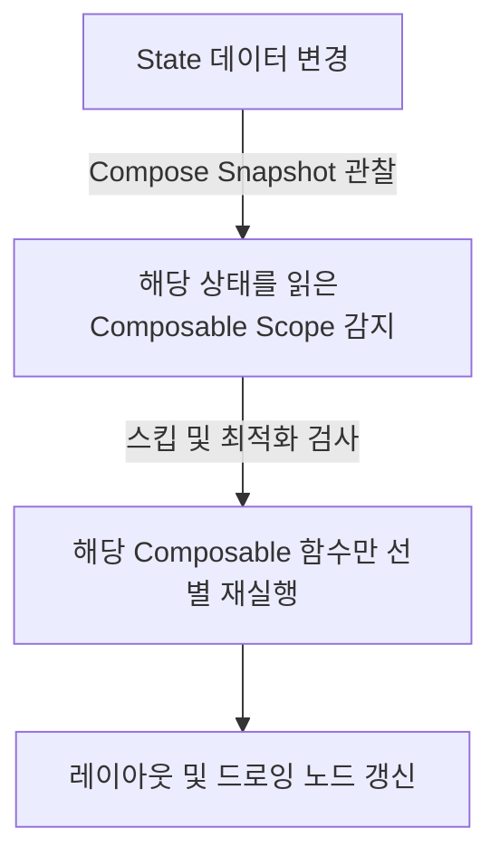

# Recomposition (Jetpack Compose 재구성)

## 1. 개요 (Overview)

**Recomposition (리포지션 / 재구성)** 은 Jetpack Compose 런타임이 **상태(State) 데이터의 변화를 감지했을 때, 해당 상태를 읽고 있는 `@Composable` 함수 영역만을 선별하여 다시 실행(Rerun)하고 화면을 새 상태로 갱신하는 메커니즘**이다.

기존 레거시 View System 처럼 `findViewById()`로 뷰를 찾아 `setText()` 같은 명령을 내리는 대신, 상태가 바뀌면 Composable 레시피 함수를 다시 불러 화면을 자동 업데이트한다.

---

### 초보자를 위한 쉽게 이해하는 비유

* **View System 갱신 (수동 벽지 교체)**:
  - 벽에 새 그림이 들어오면 사람이 일일이 기존 그림을 떼고 새 그림을 일일이 붙이는 방식.
* **Compose Recomposition (스마트 빔 프로젝터)**:
  - 빔 프로젝터에 연결된 사진(State)이 바뀌면 프로젝터가 바뀐 부분의 빛(화면)만 즉각 다르게 쏘아 갱신해 주는 방식.

---

## 2. Recomposition 의 핵심 작동 원리

1. **상태 관찰 (State Observation)**: Composable 함수 내부에서 `State<T>` 데이터를 읽는 순간, Compose 런타임이 해당 읽기 영역(Scope)을 기억한다.
2. **스킵 최적화 (Smart Recomposition / Skip)**: 입력 매개변수 데이터가 이전과 동일하다면, 해당 Composable 함수의 재실행을 완전히 스킵(Skip)하여 불필요한 계산을 방지한다.
3. **지능형 재실행**: 상태가 변경된 서브트리 노드만 정밀하게 다시 렌더링한다.

---

## 3. View System 과 Jetpack Compose 의 비교

명령형 XML View System 과 선언적 Compose 간의 패러다임 차이점 및 가독성/상태 보관 비교표는 독립된 [View System vs Jetpack Compose 비교 문서](../view-system-vs-jetpack-compose.md)를 참고한다.

---

## 4. 연결 문서 (Related Links)

- [View System vs Jetpack Compose 비교](../view-system-vs-jetpack-compose.md) - 명령형 XML 과 선언적 Compose 비교
- [ViewModel](../../viewmodel.md) - Recomposition 에 필요한 StateFlow 최신 상태를 관리하는 컴포넌트
- [Compose SSOT](../../compose-ssot.md) - Compose 상태 호이스팅과 단일 진실 출처
