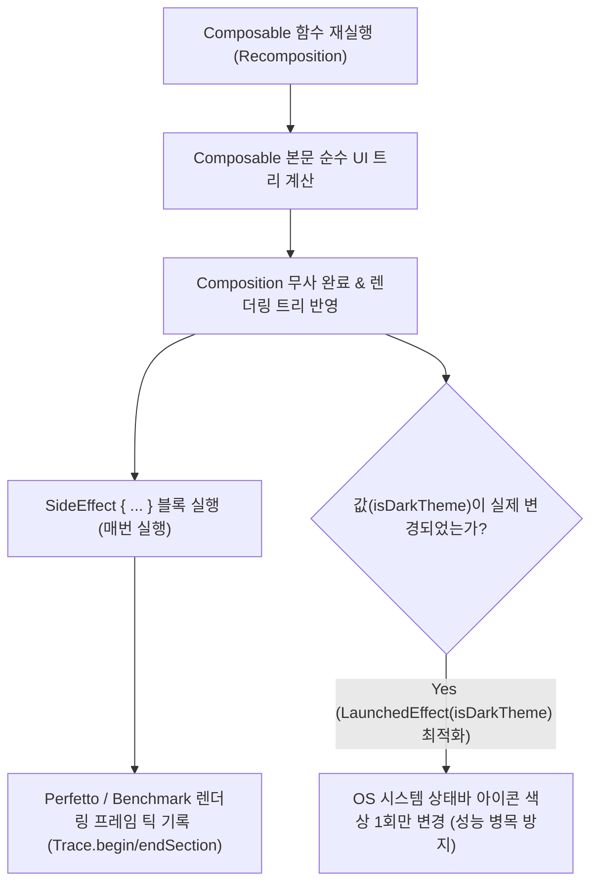

## Compose Side Effect

### 1. 개요 (Overview)

**Compose Side Effect (부수 효과)** 는 Jetpack Compose 의 Composable 함수 내부에서 **[CS Side Effect](../../../../../computer-science/side-effect.md) 개념이 적용된 것으로, Composable 스코프 외부의 상태(State)를 변경하거나 시스템 I/O 작업을 수행하는 모든 동작**을 의미한다.

Composable 함수는 성능 최적화를 위해 재구성(Recomposition) 과정에서 언제든지, 임의의 순서로, 병렬 스레드에서 수차례 재실행되거나 중단될 수 있다([Composable Body Purity](../runtime/composable-body-purity.md)). 따라서 Composable 본문 내부에서 직접 외부 변수를 수정하거나 상태를 조작하면 무한 재구성이나 상태 오염 버그가 발생한다.

---

#### 🚨 아키텍처 경고: UI 레이어에서 비즈니스 Analytics 호출은 안티패턴

- 비즈니스 로직(결제 완료, 로깅 등)을 UI Composable 안에서 직접 `analytics.logEvent()` 로 처리하는 것은 **UI 레이어에 도메인 로직이 침범하는 아키텍처 안티패턴**이다. (비즈니스 이벤트는 ViewModel/Repository 에서 처리되어야 한다.)
- 그렇다면 `SideEffect { … }` 는 왜 존재하는가? `SideEffect` 의 정당한 존재 이유는 **"Compose `State` 를 Compose 가 다루지 않는 안드로이드 OS 시스템 영역(상태바 색상)이나 레거시 뷰(Custom View/Canvas), 또는 Perfetto / Benchmark 렌더링 성능 관측 도구에 매 Composition 완료 직후 안전하게 동기화(Synchronize)하기 위함"** 이다.

---

#### ⚠️ 성능 경고: 매 Recomposition 시 OS System Flag 재설정 병목 주의

- `SideEffect { … }` 는 Composition 이 성공할 때마다(매 Recomposition 마다) 실행된다.
- 만약 `SideEffect` 내부에서 `WindowInsetsController.isAppearanceLightStatusBars = …` 와 같이 **안드로이드 OS Window Flag 를 매 재구성마다 재설정하면 내부 OS Framework 통신 및 윈도우 재계산으로 인해 성능 병목(Performance Bottleneck)** 이 발생할 수 있다.
- 따라서 상태바 색상처럼 **"값(isDarkTheme)이 실제로 바뀔 때만 OS System Flag 를 터치해야 하는 작업"은 `SideEffect` 대신 `LaunchedEffect(isDarkTheme)` 을 사용하여 값이 변할 때만 1 회 실행하도록 최적화**하는 것이 올바르다.

---

#### 초보자를 위한 쉽게 이해하는 비유

- **SideEffect API (무대 연출 완료 후 조명 기사의 상태바 스위치 조작 & 스톱워치 틱)**:
  - 연극 무대(UI Composable)의 연기가 무사히 다 끝난 직후(Composition Success), 건물 상단의 외부 상태바 조명(Android System Bar Color) 스위치를 매번 켜고 끄거나, 무대 연기 완료 순간을 성능 기록 스톱워치(Perfetto / Benchmark)에 틱(Tick)으로 기록하는 시스템 동기화 기사.



---

### 2. `SideEffect { … }` vs `LaunchedEffect(key)` 최적화 선택 기준

1. **매 Composition 무사 완료 시 틱 기록 (SideEffect)**:
   - Perfetto / Macrobenchmark 트레이싱 지표 수집처럼 **매 프레임 렌더링 완료 타이밍 자체를 기록해야 할 때** `SideEffect` 가 정당하다.
2. **특정 값 변경 시 1 회 OS System Flag 터치 (LaunchedEffect(key) 최적화)**:
   - OS 상태바 색상 변경, 윈도우 인셋 제어처럼 **OS Framework Flag 를 계속 재설정하면 병목이 생기는 작업은 `LaunchedEffect(isDarkTheme)` 으로 키가 변경될 때만 1 회 실행**해야 한다.

---

### 3. 실전 코드 예시

#### 예시 1: `LaunchedEffect` 기반 OS 시스템 상태바 색상 변경 최적화 (성능 병목 방지)

```kotlin
@Composable
fun SystemBarThemeSyncScreen(isDarkTheme: Boolean) {
    val view = LocalView.current

    // ⭕ 매 Recomposition 마다 OS Window Flag 를 터치하여 병목을 만드는 SideEffect 대신,
    // isDarkTheme 값이 실제로 변경될 때만 1회 OS Window Flag 를 설정하도록 최적화!
    LaunchedEffect(isDarkTheme) {
        val window = (view.context as Activity).window
        val insetsController = WindowCompat.getInsetsController(window, view)
        insetsController.isAppearanceLightStatusBars = !isDarkTheme
    }

    Text(text = "현재 테마: ${if (isDarkTheme) "다크 모드" else "라이트 모드"}")
}
```

#### 예시 2: `SideEffect` 기반 Perfetto & Macrobenchmark 렌더링 성능 Metrics 관측

```kotlin
import androidx.tracing.trace

@Composable
fun MetricTracedFeedScreen(feedState: FeedUiState) {
    // 매 프레임 Composition 이 무사히 완료된 직후 Perfetto / Benchmark 툴에 렌더링 완료 틱 기록
    SideEffect {
        trace("FeedScreen:CompositionCompleted") {
            // Perfetto 트레이스 뷰어 및 Macrobenchmark 렌더링 메트릭 리포트에 전송
            android.os.Trace.setCounter("FeedItemsCount", feedState.items.size.toLong())
        }
    }

    LazyColumn {
        items(feedState.items) { item ->
            FeedCard(item)
        }
    }
}
```

---

### 4. 연결 문서 (Related Links)

- [compose-effect-api-selection](compose-effect-api-selection.md) - 상황별 Effect API 선택 가이드 결정 트리
- [CS Side Effect](../../../../../computer-science/side-effect.md) - 소프트웨어 공학 부수 효과 원자 노드
- [compose-state-and-effect](compose-state-and-effect.md) - Compose 이펙트 규약 통합 인덱스
- [launched-effect](launched-effect.md) - 비동기 취소 가능 이펙트
- [disposable-effect](disposable-effect.md) - 자원 해제 정리 이펙트
- [Composable Body Purity](../runtime/composable-body-purity.md) - Composable 함수 순수성 규칙
