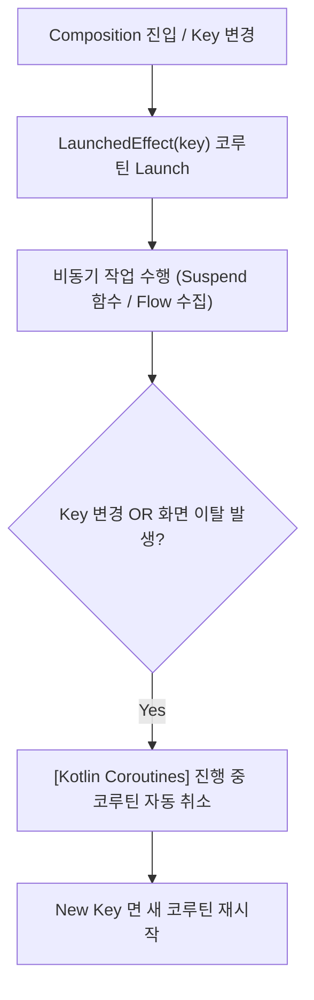

## LaunchedEffect (Compose 취소 가능한 비동기 코루틴 이펙트)

### 1. 개요 (Overview)

**LaunchedEffect** 는 Composable 이 컴포지션(Composition)에 진입할 때 **안전하게 [Kotlin Coroutines](../../async-flow/coroutines/kotlin-coroutines.md) 코루틴을 시작하고, 화면에서 이탈(Disposition)하거나 키(Key)가 변경되면 실행 중인 코루틴을 자동으로 취소(Cancellation)해 주는 [Jetpack Compose Side Effect](compose-side-effect.md) API**이다.

Composable 본문 내부에서 직접 `coroutineScope.launch` 를 호출하면 Recomposition 때마다 무한히 코루틴이 중복 실행된다. `LaunchedEffect` 는 컴포지션 수명주기에 구속된 `CoroutineScope` 를 제공하여 비동기 작업(Snackbar 표시, 서버 1 회성 요청, 수명주기 수집)을 렌더링 파이프라인과 안전하게 격리한다.

---

#### 초보자를 위한 쉽게 이해하는 비유

- **LaunchedEffect (스마트 비동기 자동 조종 장치)**:
  - 무대에 진입할 때 자동으로 켜지고, 무대에서 내려가거나 미션이 바뀌면 진행 중인 비동기 작업을 알아서 폭파/취소(Cancellation)해 주는 안전한 자동 조종 장치.



---

### 2. LaunchedEffect 핵심 규약 및 `key` 전략

1. **`key` 기반 수명주기 제어**:
   - `LaunchedEffect(Unit)` 또는 `LaunchedEffect(true)`: 최초 Composition 진입 시 단 1 회만 실행하고 화면 이탈 시 취소된다.
   - `LaunchedEffect(userId)`: `userId` 가 변경되면 기존 코루틴을 즉시 `cancel()` 한 후 새 `userId` 로 비동기 작업을 재시작한다.
2. **자동 Cancellation 보장**:
   - 컴포지션을 벗어나면 `Job.cancel()` 이 호출되므로 [Structured Concurrency](../../../../../computer-science/structured-concurrency.md) 부모 - 자식 취소 규약을 완벽히 준수한다.

---

### 3. 실전 코드 예시 (Snackbar 및 단회성 이벤트 처리)

```kotlin
@Composable
fun UserProfileScreen(
    userState: UserUiState,
    snackbarHostState: SnackbarHostState
) {
    // userState.errorMessage 가 변경될 때마다 1회성 Snackbar 표시
    userState.errorMessage?.let { message ->
        LaunchedEffect(message) {
            snackbarHostState.showSnackbar(message)
        }
    }
}
```

---

### 4. 연결 문서 (Related Links)

- [Kotlin Coroutines](../../async-flow/coroutines/kotlin-coroutines.md) - 코루틴 비동기 런타임
- [rememberCoroutineScope](remember-coroutine-scope.md) - 버튼 이벤트 핸들러용 스코프
- [DisposableEffect](disposable-effect.md) - 리스너 해제 Cleanup 전용 이펙트
- [rememberUpdatedState](remember-updated-state.md) - 이펙트 내 최신 값 참조
