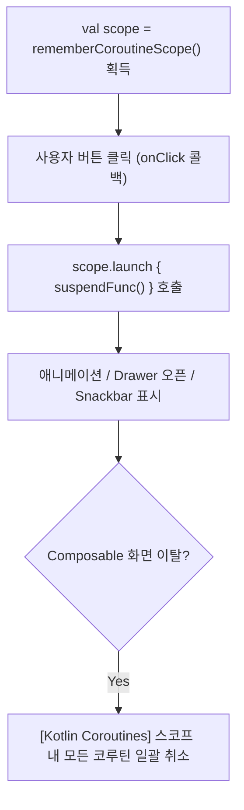

## rememberCoroutineScope (UI 이벤트 전용 수동 코루틴 스코프)

### 1. 개요 (Overview)

**rememberCoroutineScope** 는 Composable 바깥의 사용자 입력 이벤트 핸들러(버튼 `onClick`, 스크롤 동작 등) 내부에서 **비동기 코루틴 작업을 수동으로 시작(launch)하기 위해, 현재 컴포지션 수명주기(Composition Lifecycle)에 수속된 `CoroutineScope` 를 획득하는 Jetpack Compose API** 이다.

Composable 함수 몸체 내부가 아닌 **"콜백 이벤트 핸들러 내부"** 에서 서스펜드(Suspend) 함수를 호출해야 할 때 사용한다. 이 스코프에서 생성된 코루틴은 해당 Composable 이 화면에서 이탈(Disposition)하면 자동으로 일괄 cancellation 되어 메모리 누수나 고아 작업(Orphan Job)을 예방한다.

---

#### 초보자를 위한 쉽게 이해하는 비유

- **rememberCoroutineScope (손님이 단추를 누를 때 동작하는 전용 리모컨)**:
  - 무대가 켜질 때 자동 실행되는 것(`LaunchedEffect`)과 달리, **손님이 벨(Button Click)을 누르는 순간**에만 비동기 동작을 수행할 수 있도록 손에 쥐여주는 안전한 전용 리모컨.



---

### 2. rememberCoroutineScope vs LaunchedEffect 구분 기준

| 구분        | `LaunchedEffect`                                                 | `rememberCoroutineScope`                 |
| :-------- | :--------------------------------------------------------------- | :--------------------------------------- |
| **호출 위치** | Composable 몸체 직출 (Composition 진입 시 자동)                           | onClick, onScroll 등 **콜백 이벤트 핸들러 내부**    |
| **실행 시점** | 화면에 나타날 때 자동 시작                                                  | **사용자가 이벤트를 발생시킬 때 수동 시작**               |
| **용도**    | Initial Fetch, 화면 진입 [부수 효과](compose-side-effect.md), Flow 수집 | 버튼 클릭 스크롤, Drawer 열기, Toast/Snackbar 띄우기 |
| **취소 범위** | key 가 바뀌거나 화면 이탈 시 취소                                            | 화면 이탈 시 스코프 전체 일괄 취소                     |

---

### 3. 실전 코드 예시 (Drawer 스크롤 컨트롤)

```kotlin
@Composable
fun DrawerControlScreen() {
    val drawerState = rememberDrawerState(initialValue = DrawerValue.Closed)
    // 1. 이벤트 핸들러용 코루틴 스코프 획득
    val scope = rememberCoroutineScope()

    Button(onClick = {
        // 2. 콜백 내부에서 suspend 함수 호출을 위해 scope.launch 실행
        scope.launch {
            drawerState.open()
        }
    }) {
        Text("서랍 열기")
    }
}
```

---

### 4. 연결 문서 (Related Links)

- [launched-effect](launched-effect.md) - 화면 진입 시 자동 비동기 이펙트
- [Kotlin Coroutines](../../async-flow/coroutines/kotlin-coroutines.md) - 코루틴 동시성 엔진
- [Structured Concurrency](../../../../../computer-science/structured-concurrency.md) - 부모 - 자식 취소 전파 규약
