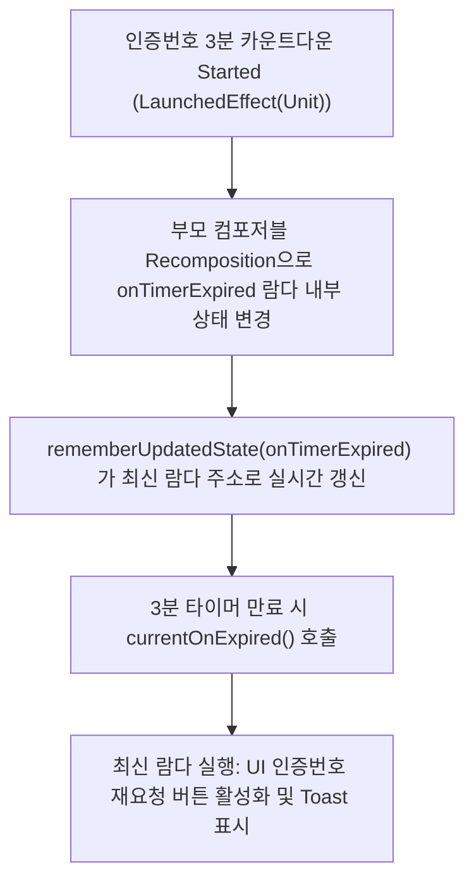

## rememberUpdatedState (장시간 이펙트 내 최신 상태/람다 참조)

### 1. 개요 (Overview)

**rememberUpdatedState** 는 `LaunchedEffect` 나 `DisposableEffect` 같이 장시간 실행(Long-running)되는 부수 효과 내부에서, **이펙트를 취소 후 재시작(Re-launch)하지 않고도 상위에서 넘겨준 최신 값(Latest Callback / Lambda / State)을 안전하게 실시간으로 참조하기 위한 Jetpack Compose API**이다.

인증번호 3 분 카운트다운 타이머, 롱 폴링(Long Polling) 네트워크 핑, Lottie 애니메이션 완료 리스너 등 장시간 유지되는 이펙트 도중에 상위 파라미터 람다(예: `onTimerExpired`)가 Recomposition 으로 교체될 수 있다. 이때 `rememberUpdatedState` 를 쓰지 않으면 이펙트 종료 시점에 **"과거의 낡은 람다(Stale Lambda)"** 가 실행되어 버그가 발생한다.

---

#### 💡 현대 안드로이드 UX 노트: 인위적 스플래시 `delay()` 금지

- 현대 모바일 UX(Modern Android Development)에서는 **인위적으로 `delay(3000L)` 같은 억지 지연을 주어 브랜드 스플래시를 띄우는 패턴은 "앱이 느리다"는 부정적 인상을 주므로 전면 안티패턴으로 금지**된다. (Android 12+ 에서는 첫 프레임이 준비되는 즉시 사라지는 Native `SplashScreen` API 가 표준이다.)
- 따라서 `rememberUpdatedState` 는 억지 스플래시 delay 가 아니라, **실제 시간 기반 카운트다운 타이머, 네트워크 롱 폴링, 터치/애니메이션 완료 이벤트**에서 빛을 발한다.

---

#### 초보자를 위한 쉽게 이해하는 비유

- **rememberUpdatedState (통화 중 실시간으로 교체되는 무전기 메모지)**:
  - 3 분 동안 진행되는 인증번호 타이머 통화(`LaunchedEffect`)를 도중에 끊었다가 다시 거는 위험 없이, 중간에 바뀐 최신 만료 처리 메모(`onTimerExpired` 람다)만 무전기 메모지에 쏙 바꿔 붙여서, 3 분 뒤 최신 콜백을 안전하게 실행시키는 보조 장치.



---

### 2. 왜 `rememberUpdatedState` 를 안 쓰면 버그가 터지는가?

```kotlin
// ❌ 잘못된 구현: rememberUpdatedState 미사용
@Composable
fun TimerScreen(onTimerExpired: () -> Unit) {
    // onTimerExpired 가 외부 상태에 의해 최신 람다로 바뀌어도, LaunchedEffect(Unit) 은 3분 동안 재실행되지 않음!
    LaunchedEffect(Unit) {
        delay(180000L) // 3분
        onTimerExpired() // ⚠️ 3분 전 최초 진입 시점의 "낡은 람다(Stale Lambda)" 가 실행됨!
    }
}
```

- 만약 `LaunchedEffect(onTimerExpired)` 으로 작성하면 `onTimerExpired` 가 바뀔 때마다 **3 분 타이머가 캔슬되고 처음부터 다시 3 분을 세는 치명적인 버그**가 발생한다.
- 반대로 `LaunchedEffect(Unit)` 으로 주면 타이머는 취소되지 않으나, 3 분 뒤 3 분 전의 낡은 람다(Stale Lambda)를 실행해 버린다.
- 따라서 `LaunchedEffect(Unit)` 으로 타이머의 연속성을 보장하면서, 3 분 뒤 실행할 람다만 최신으로 유지하기 위해 `rememberUpdatedState` 가 필수적이다.

---

### 3. 실전 코드 예시 (인증번호 3 분 카운트다운 타이머)

```kotlin
@Composable
fun SmsAuthTimerScreen(
    onTimerExpired: () -> Unit,
    modifier: Modifier = Modifier
) {
    // 람다가 교체되어도 3분 타이머를 재시작하지 않고 최신 람다 참조 유지
    val currentOnExpired by rememberUpdatedState(onTimerExpired)

    LaunchedEffect(Unit) {
        delay(180000L) // 3분 (180초) 대기
        currentOnExpired() // 3분 뒤 최신 인증번호 만료 콜백 실행!
    }

    Text(
        text = "인증번호를 입력해 주세요",
        style = MaterialTheme.typography.bodyLarge
    )
}
```

---

### 4. 연결 문서 (Related Links)

- [launched-effect](launched-effect.md) - 취소 가능한 장시간 비동기 이펙트
- [disposable-effect](disposable-effect.md) - 리스너 해제 Cleanup 전용 이펙트
- [Compose SSOT](../runtime/compose-ssot.md) - UI 단일 진실 출처
- [Composable Body Purity](../runtime/composable-body-purity.md) - Composable 함수 순수성 규칙
