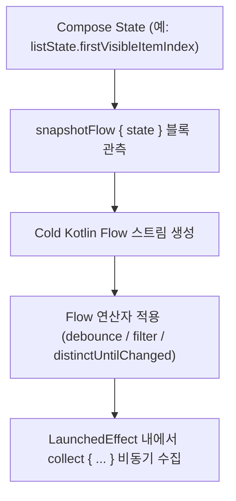

## snapshotFlow (Compose State 를 Cold Kotlin Flow 스트림으로 변환)

### 1. 개요 (Overview)

**snapshotFlow** 는 Jetpack Compose 의 `State<T>` 객체를 **Cold Kotlin `Flow<T>` 스트림으로 변환(Convert)하여, `filter`, `map`, `debounce`, `distinctUntilChanged` 등 코루틴 Flow 연산자(Operators)를 적용할 수 있게 해주는 API**이다.

ViewModel 호이스팅(State Hoisting)으로 다루기 힘든 Pure UI 저수준 상태(스크롤 위치 `LazyListState`, 페이징 탭 `PagerState`)의 관측값을 코루틴 반응형 파이프라인으로 연결해 주는 유일한 다리(Bridge) 역할을 수행한다.

---

#### 💡 안드로이드 팀이 `snapshotFlow` 를 만든 결정적 이유: ViewModel State Hoisting 으로 대체 불가능한 영역

>**"State 를 ViewModel 로 호이스팅(State Hoisting)해서 넘겨주면 되는데, 왜 굳이 `snapshotFlow` 가 존재하는가?"**

1. **Pure UI 상태(`LazyListState`, `PagerState`)에 코루틴 연산자 (`debounce`, `filter`) 적용 (가장 핵심)**:
   - 스크롤 픽셀 위치나 페이징 탭 상태는 ViewModel 로 끌어올릴 수 없는 pure UI 레이어 고유의 상태입니다.
   - Compose `State` 자체로는 `debounce(300L)` (스크롤이 멈춘 후 300ms 대기) 나 `distinctUntilChanged()` 연산을 적용할 수 없습니다.
   - `snapshotFlow { listState.firstVisibleItemIndex }` 로 감싸야만 **스크롤이 멈췄을 때만 네트워크 연관 검색을 호출하는 등의 코루틴 파이프라인 결합이 가능**해집니다.
2. **`LaunchedEffect` 내에서 이펙트 취소 없이 State 변경 관측**:
   - `LaunchedEffect(Unit)` 이 실행되는 도중에 이펙트를 취소 후 재시작하지 않고도, 내부에서 `snapshotFlow { state }.collect { … }` 를 통해 상태 변화를 비동기로 연속 관측할 수 있습니다.
3. **Compose Snapshot 엔진과 Kotlin Coroutine 파이프라인의 단방향 어댑터**:
   - Compose 의 렌더링 상태 추적 시스템(Snapshot System)을 Kotlin 의 반응형 동시성 파이프라인(Flow Engine)으로 연결하는 표준 프레임워크 어댑터입니다.

---

#### 초보자를 위한 쉽게 이해하는 비유

- **snapshotFlow (디지털 카메라 연속 촬영 렌즈)**:
  - Compose 의 정지된 사진(`State`)을 코루틴의 연속된 동영상 스트림(`Flow`)으로 연속 촬영하여, 멈춤 감지(`debounce`)나 필터링(`filter`) 편집 효과를 적용할 수 있게 해주는 스마트 변환 렌즈.



---

### 2. snapshotFlow 작동 메커니즘 및 주의사항

1. **값 변경 시에만 Emitting (distinctUntilChanged 기본 동작)**:
   - `snapshotFlow` 블록 내부에서 읽은 Compose State 가 변경되어 이전 결과와 다를 때만 Flow 로 `emit` 된다.
2. **Cold Flow 특징**:
   - `collect` 가 시작될 때 비로소 람다 블록이 실행되며, 수집이 중단되면 State 관측도 자동으로 종료된다.

---

### 3. 실전 코드 예시 (스크롤 멈춤 감지 `debounce` 네트워크 연관 검색어 요청)

```kotlin
@Composable
fun SearchListScreen(
    listState: LazyListState = rememberLazyListState(),
    viewModel: SearchViewModel = viewModel()
) {
    // 1. LaunchedEffect 이펙트 내부에서 snapshotFlow 로 pure UI 스크롤 State 감시
    LaunchedEffect(listState) {
        snapshotFlow { listState.firstVisibleItemIndex }
            .map { index -> index > 10 } // 10번째 아이템 돌파 여부
            .distinctUntilChanged() // 상태가 실제로 변경될 때만
            .debounce(300L) // 스크롤이 300ms 동안 멈추었을 때만!
            .collect { isScrolledDeep ->
                // 스크롤이 멈췄을 때만 네트워크/Analytics 연관 데이터 로딩
                if (isScrolledDeep) {
                    viewModel.loadMoreSearchResults()
                }
            }
    }

    LazyColumn(state = listState) {
        // 검색 리스트 아이템들
    }
}
```

---

### 4. 연결 문서 (Related Links)

- [produce-state](produce-state.md) - snapshotFlow 와 반대로 외부 소스를 State 로 변환
- [derived-state-of](derived-state-of.md) - 고빈도 State 기반 파생 연산 최적화
- [launched-effect](launched-effect.md) - snapshotFlow 를 수집하는 비동기 이펙트
- [compose-effect-api-selection](compose-effect-api-selection.md) - 이펙트 API 선택 가이드
- [Compose SSOT](../runtime/compose-ssot.md) - UI 단일 진실 출처
