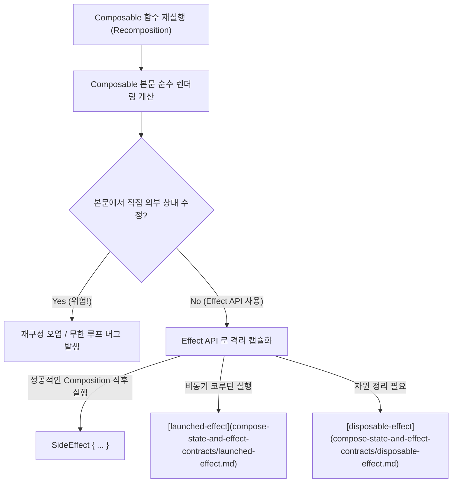

## Compose Side Effect (Jetpack Compose 부수 효과 메커니즘 & API)

### 1. 개요 (Overview)

**Compose Side Effect (부수 효과)** 는 Jetpack Compose 의 Composable 함수 내부에서 **[Pure CS Side Effect](../../../../../computer-science/side-effect.md) 개념이 적용된 것으로, Composable 의 스코프 외부 상태(State)를 변경하거나 비동기 I/O 작업을 수행하는 모든 동작**을 의미한다.

Composable 함수는 재구성(Recomposition) 과정에서 언제든지, 임의의 순서로, 병렬 스레드에서 수차례 재실행될 수 있다([Composable Body Purity](../runtime/compose-runtime-contracts/composable-body-purity.md)). 따라서 Composable 본문 내부에서 직접 외부 변수를 수정하거나 네트워크/DB 작업을 실행하면 무한 루프나 상태 오염 버그가 발생한다. 이를 안전하게 통제하기 위해 Compose 는 **Effect API (`LaunchedEffect`, `DisposableEffect`, `SideEffect` 등)** 규약을 제공한다.

---

#### 초보자를 위한 쉽게 이해하는 비유

- **Compose Side Effect (무대 위 연극 배우와 조종실 전용 버튼)**:
  - 연극 배우(Composable 함수)는 연기(UI 렌더링)에만 집중해야 함. 연기 도중에 직접 무대 밖 조명을 켜거나(부수 효과) 외부로 전화를 거는 행위는 연극을 망침.
  - 외부 조명을 켜야 할 때는 반드시 **무대 조종실의 정해진 전용 버튼(`LaunchedEffect`, `SideEffect`)** 에 신호를 보내어, 무대 연기가 안전하게 끝난 시점에만 불이 켜지도록 캡슐화하는 원리.



---

### 2. Compose 부수 효과 제어의 2 대 핵심 법칙

1. **Composable Body 에 Side Effect 절대 엄금**:
   - Composable 함수 본문에서는 상태 읽기(Read)와 UI 구성요소 반환만 수행해야 하며, Analytics 이벤트를 보내거나 외부 객체를 수정하면 안 된다.
2. **`SideEffect {}` API 의 역할**:
   - `SideEffect { … }` 는 **현재 Composition 이 성공적으로 완료(Recomposition Success)되어 렌더링 트리에 반영된 직후**에 매번 실행되는 부수 효과 전용 블록이다. Compose 상태를 비 -Compose 관리 객체(Firebase Analytics, 사용자 정의 뷰 시스템 상태)에 동기화할 때 주로 사용된다.

---

### 3. 실전 코드 예시 (`SideEffect` 와 Effect API 활용)

```kotlin
@Composable
fun UserAnalyticsScreen(user: User, analytics: FirebaseAnalytics) {
    // 1. Composition 성공 직후 비-Compose 객체에 최신 정보 동기화 (SideEffect)
    SideEffect {
        analytics.setUserProperty("user_type", user.type)
    }

    // 2. 비동기 1회성 네트워크 요청 (LaunchedEffect)
    LaunchedEffect(user.id) {
        viewModel.fetchUserLogs(user.id)
    }

    Text(text = "사용자 프로필: ${user.name}")
}
```

---

### 4. 연결 문서 (Related Links)

- [CS Side Effect](../../../../../computer-science/side-effect.md) - 소프트웨어 공학 부수 효과 원자 노드
- [compose-state-and-effect-contracts](compose-state-and-effect-contracts/compose-state-and-effect-contracts.md) - Compose 이펙트 규약 통합 인덱스
- [launched-effect](compose-state-and-effect-contracts/launched-effect.md) - 비동기 취소 가능 이펙트
- [disposable-effect](compose-state-and-effect-contracts/disposable-effect.md) - 자원 해제 정리 이펙트
- [remember-coroutine-scope](compose-state-and-effect-contracts/remember-coroutine-scope.md) - 수동 이벤트 전용 이펙트 스코프
- [Composable Body Purity](../runtime/compose-runtime-contracts/composable-body-purity.md) - Composable 함수 순수성 규칙
