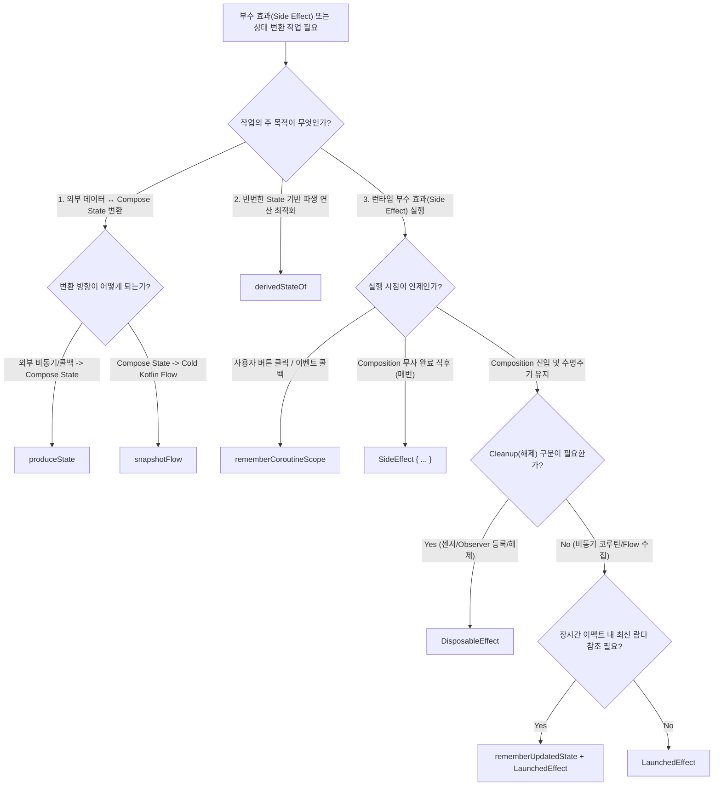

## Compose Effect API Selection (Compose 부수 효과 및 변환 API 선택 가이드)

### 1. 개요 (Overview)

**Compose Effect API Selection** 은 Jetpack Compose 앱을 개발할 때 화면 진입/이탈, 비동기 코루틴, 외부 데이터 변환(`produceState`), State-Flow 변환(`snapshotFlow`), 파생 상태 최적화(`derivedStateOf`) 등 **다양한 부수 효과(Side Effect) 및 상태 변환 요구사항에 따라 최적의 API 를 선택하기 위한 결정 트리(Decision Tree) 가이드 문서**이다.

잘못된 API 선택은 Composable 본문 내 부수 효과 직접 호출로 인한 무한 재구성(Recomposition) 버그, 화면 이탈 후 고아 코루틴 남아있음, 비동기 수신 오염, 초당 60 회의 불필요한 재구성 오버헤드를 발생시킨다.

---

#### 초보자를 위한 쉽게 이해하는 비유

- **Compose Effect & 변환 API 선택 (상황별 특수 무대 기사 맞춤 배정)**:
  - **`LaunchedEffect` (자동 시작/폭파 조종사)**: 화면 진입 시 비동기 작업을 자동으로 켜고, 이탈 시 캔슬시키는 기사.
  - **`DisposableEffect` (대여소 반납 전담 기사)**: 센서/리스너를 빌려 쓸 때 들어왔다가, 이탈 시 `onDispose` 로 반납하는 정리 기사.
  - **`rememberCoroutineScope` (손님 전용 벨 리모컨)**: 사용자가 버튼을 클릭하는 순간에만 수동으로 일을 켜는 리모컨.
  - **`produceState` (외부 신호 컨버터)**: RxJava/콜백/네트워크 외부 신호를 Compose `State` 로 바꿔주는 신호 변환기.
  - **`snapshotFlow` (상태 감시 안테나)**: Compose `State` 변경을 감지하여 Cold `Flow` 파이프라인으로 쏴주는 역방향 안테나.
  - **`derivedStateOf` (초당 60 회 갱신 수문장)**: 스크롤 픽셀처럼 자주 변하는 입력값 중 최종 결과(Boolean)가 바뀔 때만 재구성을 허용하는 수문장.

---

### 2. Effect & 변환 API 별 종합 선택 기준표

| API 명칭 | 주요 목적 | 실행 / 작동 시점 | 종료 / 정리 방식 |
| :--- | :--- | :--- | :--- |
| **`LaunchedEffect`** | 1 회성 비동기 요청, Flow 수집 | Composition 진입 시 또는 `key` 변경 시 | 화면 이탈 시 코루틴 자동 `cancel()` |
| **`DisposableEffect`** | 센서/Observer 등록 및 해제 | Composition 진입 시 또는 `key` 변경 시 | `onDispose {}` 블록으로 반드시 Cleanup |
| **`SideEffect`** | 비 -Compose 외부 객체(Analytics) 상태 동기화 | 매 Composition 무사 완료 직후 | 별도 종료 구문 없음 |
| **`rememberCoroutineScope`** | 버튼 클릭, 스크롤 컨트롤 이벤트 | 클릭 콜백 이벤트 실행 시 | Composition 이탈 시 스코프 내 코루틴 일괄 취소 |
| **`rememberUpdatedState`** | 카운트다운 타이머, 롱 폴링 | 이펙트 내부 실행 중 실시간 | 이펙트 수명주기와 별개로 최신 람다 유지 |
| **`produceState`** | RxJava / LiveData / 콜백 ➔ `State<T>` 변환 | Composition 진입 시 | `awaitDispose {}` 블록으로 외부 구독 해제 |
| **`snapshotFlow`** | Compose `State<T>` ➔ Cold `Flow<T>` 변환 | 관측 중인 `State` 변경 시 | Flow 수집 코루틴 취소 시 자동 종료 |
| **`derivedStateOf`** | 고빈도 스크롤/입력 파생 연산 Recomposition 최적화 | 파생 결과값(Boolean 등) 변경 시 | `remember` 스코프 수명주기와 동기화 |

---

### 3. 연결 문서 (Related Links)

- [Compose Side Effect](../compose-side-effect.md) - Compose 부수 효과 메커니즘 상위 노드
- [compose-state-api-selection](compose-state-api-selection.md) - Compose UI 상태 저장 API 선택
- [launched-effect](launched-effect.md) - 비동기 코루틴 전용 이펙트
- [disposable-effect](disposable-effect.md) - 자원 해제 전용 이펙트
- [remember-coroutine-scope](remember-coroutine-scope.md) - 수동 이벤트 전용 이펙트 스코프
- [remember-updated-state](remember-updated-state.md) - 이펙트 내 최신 값 참조
- [produce-state](produce-state.md) - 외부 상태 변환 이펙트
- [snapshot-flow](snapshot-flow.md) - State 관측값 Flow 변환 API
- [derived-state-of](derived-state-of.md) - 파생 연산 Recomposition 최적화 API
