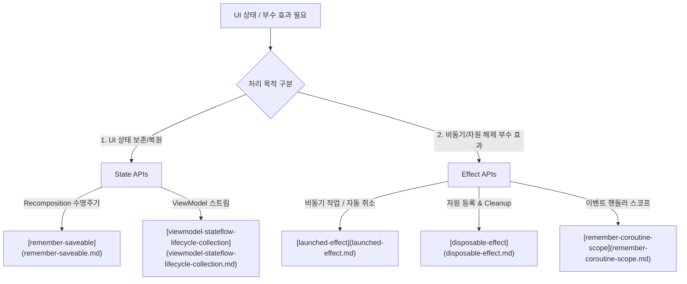

# Compose State & Effect Contracts (Compose 상태와 [부수 효과](../compose-side-effect.md) 아키텍처 규약 지도)

## 1. 개요 (Overview)

**Compose State & Effect Contracts** 는 Jetpack Compose 의 단방향 데이터 흐름([Compose SSOT](../../../compose-ssot.md)) 및 컴포지션 수명주기(Composition Lifecycle) 내에서 **UI 상태(State)를 안전하게 유지·복원하고, 스레드 [부수 효과](../compose-side-effect.md)(Side-Effects)를 제어하기 위한 표준 규약 묶음 지도**이다.

Composable 함수는 순수하고 예측 가능하며 [부수 효과](../compose-side-effect.md)가 없어야 한다([Composable Body Purity](../../runtime/compose-runtime-contracts/composable-body-purity.md)). 화면 진입, 이탈, 수명주기 변경 또는 외부 비동기 스트림 수신 시 발생하는 [부수 효과](../compose-side-effect.md)는 반드시 전용 Effect API (`LaunchedEffect`, `DisposableEffect`, `rememberCoroutineScope` 등) 내부에 캡슐화되어 렌더링 파이프라인의 오염을 막아야 한다.

---

### 초보자를 위한 쉽게 이해하는 비유

* **Compose State & Effect 규약 (스마트 오케스트라 렌더링 지휘소)**:
  - **State (연주 악보)**: 악보가 바뀌면 악단(Composable)이 새 화면을 연주(Recomposition)함.
  - **Effect API (특수 비동기 이펙트 조명 기사)**: 연주가 시작되거나 끝날 때, 무대 외부 조명을 켜고 끄는 부수적인 일을 오케스트라 연주자를 방해하지 않고 전담 조명 기사(`LaunchedEffect`, `DisposableEffect`)가 안전하게 처리하는 모델.

---

## 2. Compose State & Effect 세부 계약 노드 지도

1. **[compose-state-api-selection](compose-state-api-selection.md)**:
   - UI 수명주기와 복원 범위에 따른 State 저장 API (`remember`, `rememberSaveable`, `StateFlow`) 선택 기준.
2. **[remember-saveable](remember-saveable.md)**:
   - 프로세스 재생성(Death) 및 화면 회전(Configuration Change) 시 UI 소형 상태를 `SavedStateHandle` 로 복원하는 규약.
3. **[launched-effect](launched-effect.md)**:
   - Composable 진입 시 취소 가능한 비동기 코루틴 작업을 안전하게 실행하고 관리하는 [부수 효과](../compose-side-effect.md) 규약.
4. **[disposable-effect](disposable-effect.md)**:
   - 뷰 이탈 시 `onDispose {}` 블록으로 리스너 등록 해제 및 리소스 Cleanup 을 보장하는 [부수 효과](../compose-side-effect.md) 규약.
5. **[remember-coroutine-scope](remember-coroutine-scope.md)**:
   - UI 버튼 클릭 등 수동 이벤트 핸들러에서 안전한 `CoroutineScope` 를 획득하는 규약.
6. **[remember-updated-state](remember-updated-state.md)**:
   - 진행 중인 Effect 내부에서 최신 콜백/상태값을 재시작 없이 참조하는 규약.
7. **[produce-state](produce-state.md)**:
   - RxJava / 엑토르 외부 비동기 데이터 소스를 Compose `State` 로 변환하는 규약.
8. **[snapshot-flow](snapshot-flow.md)**:
   - Compose `State` 변경 감지를 Cold Kotlin `Flow` 스트림으로 변환하는 규약.
9. **[viewmodel-stateflow-lifecycle-collection](viewmodel-stateflow-lifecycle-collection.md)**:
   - `collectAsStateWithLifecycle()` 로 안드로이드 Lifecycle 과 연동하여 배터리 수거를 보장하는 규약.
10. **[ui-controllers-and-effect-runners](ui-controllers-and-effect-runners.md)**:
   - UI 컨트롤러 및 Effect Runner 의 수명주기 바인딩 규약.

---

## 3. 연결 문서 (Related Links)

- [Compose SSOT](../../../compose-ssot.md) - Compose UI 단일 진실 출처
- [Kotlin Coroutines](../../../kotlin-coroutines.md) - 코루틴 비동기 런타임 엔진
- [StateFlow & SharedFlow](../../../stateflow-and-sharedflow.md) - 반응형 데이터 스트림
- [Composable Body Purity](../../runtime/compose-runtime-contracts/composable-body-purity.md) - Pure Composable 함수 준칙
