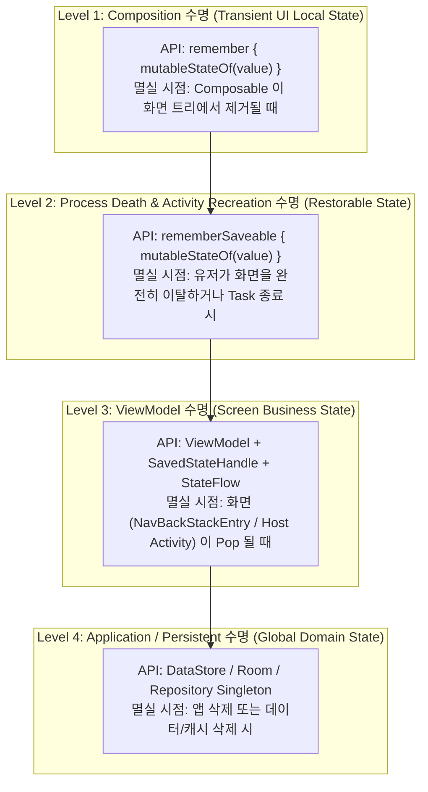

## Compose 상태 API는 필요한 수명에 맞춰 선택한다

### 1. 개념 정의 (What)
Compose 애플리케이션에서 상태(State)를 보존하는 API는 단일 통일 API로 처리되지 않으며, **데이터가 살아있어야 하는 수명주기 범주(Composition Lifetime, Activity Recreation, ViewModel Lifetime, Application Lifetime)**에 따라 적절한 API(`remember`, `rememberSaveable`, `ViewModelState`, `Repository`)를 정밀하게 선택해야 한다.

---

### 2. 수명주기 기반 상태 API 구분의 필요성 (Why)
상태의 수명주기를 잘못 선택하면 다음과 같은 심각한 아키텍처 결함이 야기된다:
- **과도한 보존(Over-retention)**: 단순 스크롤 위치나 텍스트 필드 임시 값이 ViewModel이나 전역 싱글톤에 저장되어 메모리가 낭비되고 초기화 로직이 복잡해진다.
- **조기 파괴(Premature Loss)**: 화면 회전 시 유저가 입력 중이던 Form 데이터가 초기화되거나 탭 상태가 유실된다.

각 데이터의 도메인 성격에 따라 최적의 수명 범위를 가진 API를 선택함으로써 메모리 효율성과 사용자 경험(UX) 보존을 동시에 달성한다.

---

### 3. 수명주기 계층 및 선택 기준 메커니즘 (How)



---

### 4. 올바른 API 선택 코드 가이드

```kotlin
// ✅ 1. Transient UI Local State: 애니메이션 expansion 상태
@Composable
fun ExpandableCard(title: String, content: String) {
    // 단순 UI 확장 상태는 remember 로 수명 제한
    var isExpanded by remember { mutableStateOf(false) }

    Card(onClick = { isExpanded = !isExpanded }) {
        Column {
            Text(title)
            if (isExpanded) {
                Text(content)
            }
        }
    }
}

// ✅ 2. Restorable Local UI State: 검색어 입력 창
@Composable
fun SearchInputBar() {
    // 화면 회전 시에도 입력 중이던 검색어가 유지되어야 하므로 rememberSaveable 사용
    var searchQuery by rememberSaveable { mutableStateOf("") }

    TextField(
        value = searchQuery,
        onValueChange = { searchQuery = it },
        label = { Text("Search") }
    )
}

// ✅ 3. Screen Business State: 서버에서 조회한 사용자 프로필
@HiltViewModel
class UserProfileViewModel @Inject constructor(
    private val savedStateHandle: SavedStateHandle,
    private val userRepository: UserRepository
) : ViewModel() {
    // ViewModel 수명 동안 비즈니스 데이터 및 에러 상태 관리
    val uiState: StateFlow<UserProfileUiState> = userRepository.getUserProfile()
        .stateIn(
            scope = viewModelScope,
            started = SharingStarted.WhileSubscribed(5000),
            initialValue = UserProfileUiState.Loading
        )
}
```

---

상위 문서: [Compose 상태와 Effect 계약](./compose-state-and-effect-contracts.md)

관련 노트: [remember는 일반 cache가 아니라 Composition에 귀속된 저장공간이다](../../runtime/compose-runtime-contracts/remember-is-composition-scoped-storage-not-general-cache.md), [rememberSaveable은 small restorable UI state를 위한 것이다](./remember-saveable-is-for-small-restorable-ui-state.md), [ViewModel의 StateFlow는 collectAsStateWithLifecycle로 화면 상태로 변환한다](./viewmodel-stateflow-becomes-screen-state-with-lifecycle-collection.md)

출처: [State and Jetpack Compose](https://developer.android.com/develop/ui/compose/state)

검증일: 2026-08-05. Compose 공식 상태 관리 가이드를 대조하여 4단계 수명주기 계층(Composition, SavedState, ViewModel, Persistent) 및 API 선택 알고리즘 서술을 정밀 보강했다.
