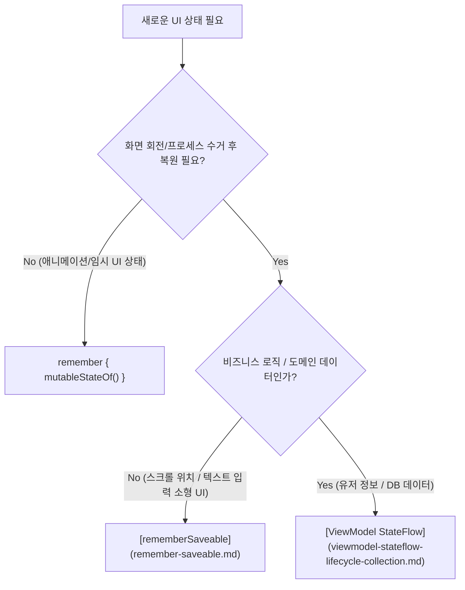

# Compose State API Selection (Compose 상태 저장 API 선택 가이드)

## 1. 개요 (Overview)

**Compose State API Selection** 은 Jetpack Compose 앱을 설계할 때 **UI 상태(State)의 생존 범위(Lifetime)와 복원 필요성(Restoration)에 맞춰 최적의 State 보유 API (`remember`, `rememberSaveable`, `ViewModel StateFlow`)를 선택하기 위한 판단 기준**이다.

잘못된 State API 선택은 화면 회전(Configuration Change) 시 상태가 파괴되거나, 프로세스 수거(System-initiated Process Death) 시 유저 데이터가 날아가는 버그를 발생시킨다. 반대로 모든 소형 UI 상태를 ViewModel 에 몰아넣으면 [Compose SSOT](../../../compose-ssot.md) 계층 구조가 비대해진다.

---

### 초보자를 위한 쉽게 이해하는 비유

* **Compose State API 선택 (수명주기에 따른 보관함 선택)**:
  - **`remember` (임시 메모지)**: 화면이 켜져 있는 동안만 유지되고, 화면을 돌리거나 끄면 지워지는 순간 메모지.
  - **`rememberSaveable` (가방 안의 수첩)**: 화면을 회전하거나 잠시 앱이 죽었다 살아나도 가방에 들어있어 복원되는 소형 수첩.
  - **`ViewModel StateFlow` (금고 전산망)**: 앱 화면이 통째로 닫히고 재구성되어도 안전하게 영구 보호되는 중앙 전산 데이터베이스.



---

## 2. API별 수명주기 및 적재 기준 비교

| 구분 | `remember` | `rememberSaveable` | `ViewModel StateFlow` |
| :--- | :--- | :--- | :--- |
| **생존 범위** | Recomposition 동안 유지 | Recomposition + Configuration Change + Process Death | Activity / Navigation Graph 수명주기 전체 |
| **적합한 상태** | 덧붙임 애니메이션, 확장 여부 | 스크롤 포지션, 텍스트 필드 미완성 입력값 | 유저 프로필 데이터, 서버 데이터, 도메인 SSOT |
| **복원 방식** | 복원 불가 (메모리 갱신) | `Bundle` (SavedStateRegistry) 직렬화 복원 | [Compose SSOT](../../../compose-ssot.md) 및 `SavedStateHandle` |

---

## 3. 실전 코드 예시 (선택 가이드 구현)

```kotlin
@Composable
fun SearchScreen(
    viewModel: SearchViewModel = viewModel() // 1. 도메인 SSOT (ViewModel)
) {
    // 2. 프로세스 수거 시에도 텍스트 복원 (rememberSaveable)
    var searchQuery by rememberSaveable { mutableStateOf("") }

    // 3. 단순 애니메이션 가시성 (remember)
    var isHeaderExpanded by remember { mutableStateOf(true) }

    Column {
        SearchBar(
            query = searchQuery,
            onQueryChange = { searchQuery = it }
        )
        SearchResults(uiState = viewModel.searchResult.collectAsStateWithLifecycle().value)
    }
}
```

---

## 4. 연결 문서 (Related Links)

- [rememberSaveable](remember-saveable.md) - Process Death 복원 소형 UI 상태 API
- [viewmodel-stateflow-lifecycle-collection](viewmodel-stateflow-lifecycle-collection.md) - ViewModel 스트림 수집
- [Compose SSOT](../../../compose-ssot.md) - 단방향 데이터 흐름 아키텍처
- [ViewModel](../../../viewmodel.md) - 안드로이드 표준 비즈니스 상태 홀더
