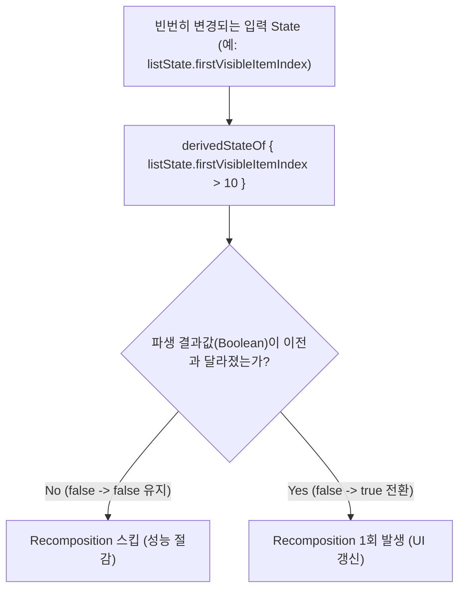

# derivedStateOf (자주 변경되는 State 기반 파생 연산 Recomposition 최적화)

## 1. 개요 (Overview)

**derivedStateOf** 는 스크롤 포지션(`firstVisibleItemIndex`), 텍스트 필드 값 등 매우 빈번하게 갱신(High-frequency Mutation)되는 입력 State 로부터 **"파생된 2차 상태(Derived State)"를 계산할 때, 파생된 결과값(Boolean/Result)이 실제로 변경될 때만 Recomposition 을 발생시키도록 제어하는 Jetpack Compose 성능 최적화 API**이다.

예를 들어, 스크롤 인덱스가 0, 1, 2, 3... 으로 초당 60회 변하더라도 "스크롤이 10번째 이상 내려갔는가 (`firstVisibleItemIndex > 10`)" 라는 Boolean 결과는 `false` 였다가 10번째에서 `true` 로 **단 1번만 변한다**. `derivedStateOf` 없이 직접 작성하면 초당 60회의 불필요한 Recomposition 연산 오버헤드가 터지지만, `derivedStateOf` 는 파생 결과가 바뀔 때만 재구성을 일으킨다.

---

### 초보자를 위한 쉽게 이해하는 비유

* **derivedStateOf (초당 60회 바뀌는 숫자 전광판의 최종 수문장)**:
  - 전광판 숫자(스크롤 픽셀 offset)는 초당 60번 어지럽게 올라가지만, "합격선 100점을 넘었는가?" 라는 합격 판정 현수막(`derivedStateOf`)은 100점을 넘는 순간 딱 1번만 현수막을 교체하여 불필요한 공사(Recomposition)를 막아주는 스마트 수문장.



---

## 2. derivedStateOf 사용 규칙 및 `remember` 조합

1. **`remember(key)` 와의 조합**:
   - `remember { derivedStateOf { ... } }` 형태로 사용하며, 블록 내부에서 참조하는 Compose State 가 바뀔 때마다 파생 연산을 관측한다.
2. **`remember(key)` vs `derivedStateOf` 적재 판단**:
   - 계산 비용만 비싸고 입력값이 바뀔 때마다 파생값도 매번 바뀐다면 `remember(key) { ... }` 가 올바르다.
   - **입력값은 자주(High-frequency) 변하지만, 파생 결과값은 드물게(Low-frequency) 변할 때**만 `derivedStateOf` 를 사용한다.

---

## 3. 실전 코드 예시 (스크롤 '맨 위로 가기' 버튼 가시성 최적화)

```kotlin
@Composable
fun FastScrollScreen(listState: LazyListState = rememberLazyListState()) {
    // 스크롤이 0->100px 올라가는 동안 showScrollToTop 은 false 유지, 100px 돌파 시 1회만 true 전환
    val showScrollToTop by remember {
        derivedStateOf {
            listState.firstVisibleItemIndex > 5
        }
    }

    Box {
        LazyColumn(state = listState) { /* 리스트 아이템들 */ }

        if (showScrollToTop) {
            ScrollToTopButton(onClick = { /* 맨 위로 */ })
        }
    }
}
```

---

## 4. 연결 문서 (Related Links)

- [compose-state-api-selection](compose-state-api-selection.md) - State 저장 API 선택 가이드
- [compose-effect-api-selection](compose-effect-api-selection.md) - 이펙트 API 선택 가이드
- [snapshot-flow](snapshot-flow.md) - State 관측값 Flow 변환 API
- [Compose SSOT](../../../compose-ssot.md) - UI 단일 진실 출처
