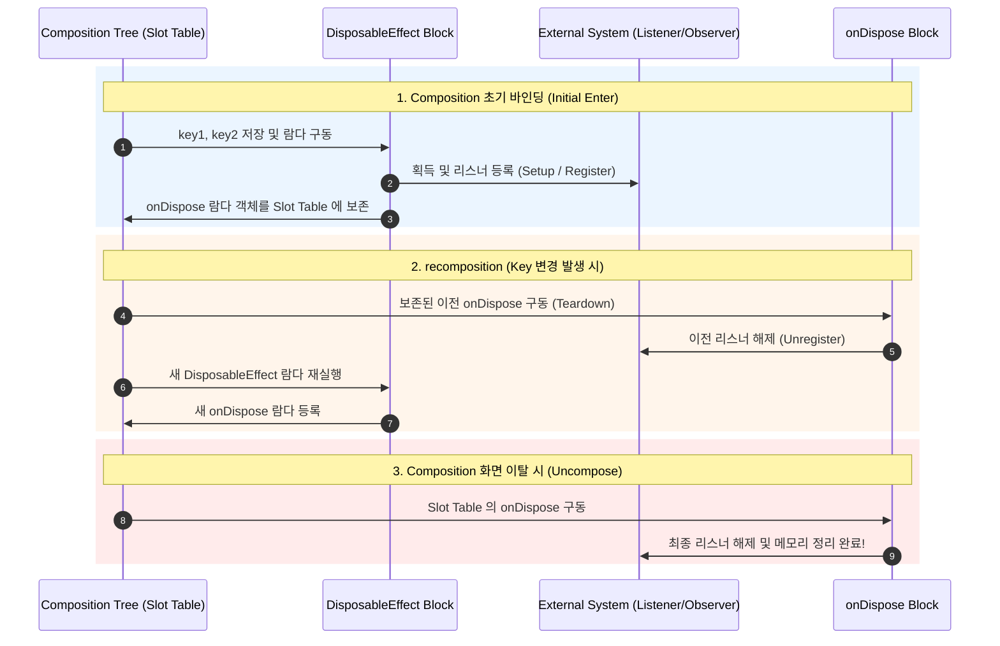

## 등록과 해제가 쌍인 작업은 DisposableEffect 로 관리한다

### 1. 개념 정의 (What)

`DisposableEffect(key1, key2) { … onDispose { … } }` 는 외부 시스템의 획득/등록(Setup/Register) 과정과 이에 반응하는 **해제/정리(Teardown/Cleanup) 작업이 정밀한 1:1 쌍(Pair)** 을 이루는 부작용(Side Effect)을 Composition 수명주기에 맞춰 안전하게 실행 및 리소스 해제하는 API 다.

---

### 2. DisposableEffect 및 onDispose 의 필요성 (Why)

안드로이드 앱 개발에서 외부 리스너 등록(BroadcastReceiver, SensorEventListener, LifecycleObserver, LocationListener) 후 해제를 누락하는 행위는 **메모리 누수(Memory Leak) 및 시스템 리소스 낭비의 주요 원인**이다.

일반 `LaunchedEffect` 는 코루틴의 취소(Cancellation)만 처리할 뿐, 동기적인 리스너 unregister 콜백 구문을 강제하지 않는다. `DisposableEffect` 는 블록 끝에 `onDispose { … }` 반환을 **컴파일 타임에 필수 항목으로 원자적 강제**하여 리소스 누수를 구조적으로 방지한다.

---

### 3. 내부 동작 메커니즘 (How)



1. **onDispose 강제 규약**: `DisposableEffect` 블록의 마지막 표현식은 반드시 `onDispose` 호출이어야 하며, 그렇지 않으면 코틀린 컴파일 에러가 발생한다.
2. **Key 변경 시 재실행 수명주기**: 키 변경 시 이전 등록을 해제하지 않고 새 등록을 수행하면 중첩 수신 버그가 생기므로, 키 변경 즉시 기존 `onDispose` 를 먼저 구동한 후 새로운 구동 블록을 구동한다.

---

### 4. 올바른 DisposableEffect 사용 코드 사례

```kotlin
@Composable
fun SystemLifecycleObserverExample(
    lifecycleOwner: LifecycleOwner = LocalLifecycleOwner.current,
    onStartEvent: () -> Unit,
    onStopEvent: () -> Unit
) {
    // rememberUpdatedState 를 사용하여 이펙트 재시작 없이 최신 콜백 유지
    val currentOnStart by rememberUpdatedState(onStartEvent)
    val currentOnStop by rememberUpdatedState(onStopEvent)

    DisposableEffect(lifecycleOwner) {
        // 1. 등록 (Setup)
        val observer = LifecycleEventObserver { _, event ->
            when (event) {
                Lifecycle.Event.ON_START -> currentOnStart()
                Lifecycle.Event.ON_STOP -> currentOnStop()
                else -> {}
            }
        }
        lifecycleOwner.lifecycle.addObserver(observer)

        // 2. 해제 (Cleanup - 필수 강제!)
        onDispose {
            lifecycleOwner.lifecycle.removeObserver(observer)
        }
    }
}
```

---

상위 문서: [Compose 상태와 Effect 계약](./compose-state-and-effect-contracts.md)

관련 노트: [Composable과 함께 취소되어야 하는 작업은 LaunchedEffect로 시작한다](./launched-effect-owns-composable-cancellable-work.md), [rememberUpdatedState는 effect를 최신 값으로 유지한다](./remember-updated-state-keeps-effect-on-latest-value.md)

출처: [Side-effects in Compose](https://developer.android.com/develop/ui/compose/side-effects#disposableeffect)

검증일: 2026-08-05. Compose 공식 가이드의 DisposableEffect 섹션을 대조하여 Setup/Cleanup 1:1 쌍 관리, onDispose 강제 컴파일 계약 및 LifecycleObserver 연결 패턴 서술을 정밀 보강했다.
