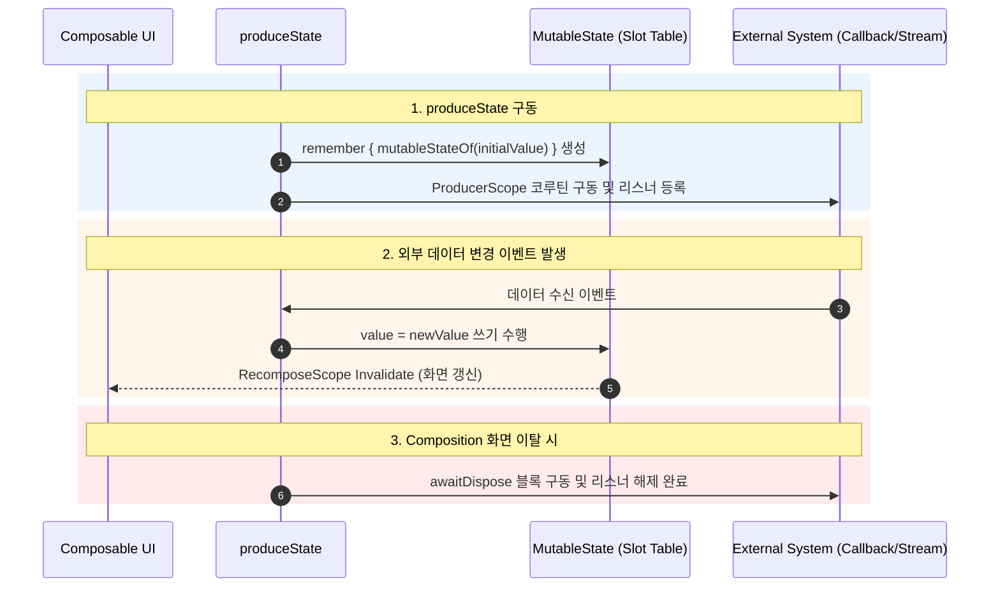

## produceState 는 외부 상태를 Compose 상태로 변환한다

### 1. 개념 정의 (What)

`produceState(initialValue, key1) { … producerScope … }` 는 외부 비동기 데이터 소스(예: 콜백 기반 SDK, RxJava, LiveData, 또는 외부 네트워크/디바이스 센서 스트림)를 **Compose Runtime 이 추적할 수 있는 `State<T>` 형태의 관찰 가능 상태로 브릿징(Bridging) 및 변환**하는 유틸리티 API 다.

---

### 2. produceState 사용의 필요성 (Why)

Compose 가 도입되지 않은 기존 서드파티 라이브러리나 래거시 데이터 소스는 `State<T>` 가 아닌 별도의 콜백이나 커스텀 스트림(예: 센서 이벤트 리스너, 룸 데이터베이스 콜백)을 사용한다.

이를 `@Composable` 내부로 직접 가져오면:

- 상태 변경 시 Recomposition 을 유발할 수 없음.
- 코루틴 수명주기 취소 관리가 수동으로 이루어져 코드가 지저분해짐.

`produceState` 는 `LaunchedEffect` 와 `mutableStateOf` 의 기능을 조합하여, 외부 스트림을 깔끔하게 `State<T>` 로 변환해 선언적 UI 에 제공한다.

---

### 3. 내부 동작 메커니즘 (How)



1. **ProducerScope 스코프**: `produceState` 블록 내부에서는 `ProducerScope<T>` 가 제공되며, `value` 속성에 새 값을 할당하는 순간 내부 `MutableState` 의 지점 갱신이 일어난다.
2. **awaitDispose 연동**: 콜백 기반 외부 시스템 등록 해제는 `awaitDispose { listener.unregister() }` 구문을 통해 안전하게 정리를 수행한다.

---

### 4. 외부 센서 스트림 변환 코드 사례

```kotlin
sealed interface NetworkStatus {
    object Available : NetworkStatus
    object Unavailable : NetworkStatus
}

@Composable
fun rememberNetworkStatus(context: Context): State<NetworkStatus> {
    // 외부 ConnectivityManager 콜백 상태를 Compose State<NetworkStatus> 로 변환
    return produceState<NetworkStatus>(initialValue = NetworkStatus.Unavailable, context) {
        val connectivityManager = context.getSystemService(Context.CONNECTIVITY_SERVICE) as ConnectivityManager

        val callback = object : ConnectivityManager.NetworkCallback() {
            override fun onAvailable(network: Network) {
                value = NetworkStatus.Available // State.value 갱신!
            }

            override fun onLost(network: Network) {
                value = NetworkStatus.Unavailable
            }
        }

        connectivityManager.registerDefaultNetworkCallback(callback)

        // Composition 이탈 시 콜백 해제
        awaitDispose {
            connectivityManager.unregisterNetworkCallback(callback)
        }
    }
}
```

---

상위 문서: [Compose 상태와 Effect 계약](./compose-state-and-effect-contracts.md)

관련 노트: [LaunchedEffect는 Composable과 함께 취소되어야 하는 작업을 소유한다](./launched-effect-owns-composable-cancellable-work.md), [DisposableEffect는 등록과 해제가 쌍인 작업을 관리한다](./disposable-effect-pairs-registration-and-cleanup.md)

출처: [Side-effects in Compose](https://developer.android.com/develop/ui/compose/side-effects#producestate)

검증일: 2026-08-05. Compose 공식 가이드의 produceState 사양을 대조하여 ProducerScope 상태 변환, awaitDispose 정리 구문 및 외부 콜백 브릿징 서술을 정밀 보강했다.
