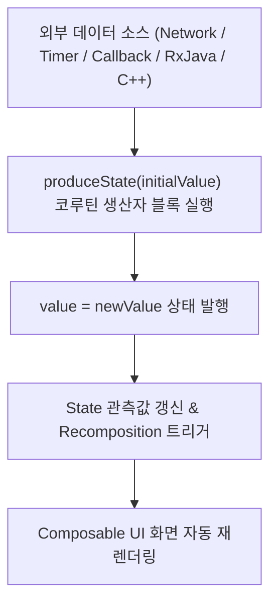

## produceState (외부 데이터 소스를 Compose State 로 변환하는 이펙트)

### 1. 개요 (Overview)

**produceState** 는 RxJava, LiveData, 콜백 리스너, 네트워크 서스펜드(Suspend) 호출 등 **Compose 외부의 비동기 데이터 소스를 수집하여 컴포지션이 관측할 수 있는 불변 `State<T>` 로 변환(Convert)해 주는 Jetpack Compose [부수 효과](../compose-side-effect.md)(Side-Effect) API**이다.

`produceState` 내부적으로 `LaunchedEffect` 와 `mutableStateOf` 가 direct 로 융합되어 작동한다. 비동기 데이터 생산자(Producer) 블록을 캡슐화하여, 외부 데이터 소스가 변경될 때마다 새 `value = newValue` 를 발행함으로써 유연하게 [Compose SSOT](../../../compose-ssot.md) 를 생성해 준다.

---

#### 💡 안드로이드 프레임워크 핵심 팁: `collectAsStateWithLifecycle()` 의 내부 비밀

>**참고: 안드로이드 공식 `collectAsStateWithLifecycle()` API 는 내부적으로 `produceState()` API 를 사용하여 구현되어 있습니다.**

안드로이드 `lifecycle-runtime-compose` 라이브러리의 `collectAsStateWithLifecycle()` 구현체 내부 코드를 들여다보면, Android Lifecycle 의 `repeatOnLifecycle` 상태 변화를 감시하면서 최신 Flow 발행값을 Compose State 로 전환해 주기 위해 **`produceState(initialValue, lifecycle, minActiveState, flow)` 엔진을 핵심 변환 뼈대로 사용**하고 있다. 즉, `produceState` 는 안드로이드 수명주기 상태 수집 API 들의 진정한 근간(Engine)이다.

---

#### 초보자를 위한 쉽게 이해하는 비유

- **produceState (외부 아날로그 신호를 디지털 모니터 화면으로 바꿔주는 정제 컨버터)**:
  - 아날로그 외부 방송 신호(RxJava/콜백/타이머/센서)를 가져와서 디지털 모니터(Compose UI)가 즉시 읽고 렌더링할 수 있는 픽셀 데이터(`State<T>`)로 실시간 변환해 주는 스마트 신호 변환기.



---

### 2. `flow { … }.collectAsState()` 대비 `produceState` 의 3 대 존재 이유 및 실무 가이드

>**"Flow 로 바꾸고 `collectAsState()` 를 연결하는 것과 결과가 똑같은데 왜 `produceState` 가 별도로 존재하는가?"**

1. **Flow 객체 중첩 할당을 생략하는 메모리 최적화 (Zero Flow Allocation)**:
   - `flow { … }.collectAsState()` 는 내부에 `SafeCollector`, `Flow` 인스턴스, `StateFlow` 브릿지 수집 코루틴 등 여러 계층의 중첩 객체를 메모리에 할당(Allocation)한다.
   - 반면 `produceState` 는 내부적으로 **단 1 개의 `LaunchedEffect` + `mutableStateOf` 로만 경량(Lightweight) 작동**하여 객체 할당 오버헤드가 없다.
2. **비 -Flow (콜백, RxJava, 센서) 레거시 데이터 소스의 직관적 1 단계 바인딩**:
   - 이미 `Flow` 스트림이 존재한다면 [viewmodel-stateflow-lifecycle-collection](viewmodel-stateflow-lifecycle-collection.md) 이 정석이다.
   - 하지만 기존 소스가 **콜백(Callback), RxJava `Observable`, C++ Native 이벤트**일 때, 구태여 `callbackFlow { … }.collectAsState()` 로 2 중 포장하는 대신 `produceState` 의 `awaitDispose {}` 로 1 단계 만에 캡슐화하는 것이 훨씬 직관적이다.
3. **Compose Key 기반의 직관적 이펙트 재시작 (`key1`, `key2`)**:
   - `produceState(initial, key1 = userId)` 처럼 UI 의 `key` 가 변경되면 생산자 코루틴을 자동으로 취소 및 재시작시켜 준다.

---

#### 🚨 실무 아키텍처 관점 총평: Data/Infra 레이어에서는 `Flow` 가 정석

- C++ Native SDK, DB, 센서 등의 시스템 데이터 소스는 **Data/Infra 레이어에서 `callbackFlow { … }` 나 `Flow` 로 변환하여 ViewModel 에 `StateFlow` 로 전달**하는 것이 테스트 가능성(Testability)과 레이어 분리 관점에서 실무 모범 답안(Best Practice)이다.
- **그렇다면 `produceState` 는 실무에서 주로 언제 쓰이는가?**:
  1. **UI 전용 서드파티 Compose 라이브러리 제작 (예: Coil 이미지 로더)**: ViewModel 없이 Composable UI 단에서 비동기 다운로드를 `State<ImageResult>` 로 직관적으로 노출할 때.
  2. **ViewModel 을 거칠 필요가 없는 순수 UI 전용 비동기 연산**: Lottie 애니메이션 패키지 비동기 파싱, UI 레이아웃 비동기 폰트 계산 등 도메인 로직과 무관한 Pure UI 헬퍼 연산.

---

### 3. produceState 작동 메커니즘 및 특징

1. **`ProducerScope` 기반 코루틴 실행**:
   - `produceState` 는 `ProducerScope` 블록 내에서 실행되며 `value = …` 형태로 상태를 갱신한다.
2. **자원 정리 `awaitDispose {}` 제공**:
   - 코루틴 블록 내부에서 `awaitDispose { … }` 를 호출하면, 컴포지션을 벗어날 때 외부 리스너나 타이머를 깔끔하게 해제(Clean up)할 수 있다.
3. **`key` 변이 대응**:
   - `produceState(initialValue, key1, key2)` 형태로 키를 전달하여, 키가 바뀔 때 생산자 코루틴을 재시작시킬 수 있다.

---

### 4. 실전 코드 예시

#### 예시 1: UI 서드파티 라이브러리 전용 비동기 이미지 로드 변환 및 UI 소모

```kotlin
// 1. produceState 기반 UI 전용 이미지 로더 헬퍼 함수 선언 (Coil 라이브러리 스타일)
@Composable
fun loadNetworkImage(
    url: String, 
    repository: ImageRepository
): State<Result<Bitmap>> {
    return produceState<Result<Bitmap>>(initialValue = Result.Loading, url) {
        val bitmap = repository.fetchImage(url)
        value = Result.Success(bitmap)

        awaitDispose {
            repository.cancelRequest(url)
        }
    }
}

// 2. 화면 UI Composable 에서 by 위임으로 상태 소모 (Consume)
@Composable
fun UserProfileImageScreen(
    imageUrl: String,
    imageRepository: ImageRepository = remember { ImageRepository() }
) {
    val imageResult by loadNetworkImage(imageUrl, imageRepository)

    when (val result = imageResult) {
        is Result.Loading -> CircularProgressIndicator()
        is Result.Success -> Image(
            bitmap = result.bitmap.asImageBitmap(),
            contentDescription = "프로필 이미지"
        )
        is Result.Error -> Text("이미지 로딩 실패")
    }
}
```

#### 예시 2: 순수 UI 카운트다운 타이머 (SMS 인증 등) 변환 및 UI 소모

```kotlin
// 1. 180초부터 1초씩 줄어드는 SMS 타이머 produceState 선언
@Composable
fun produceSmsAuthTimer(
    totalSeconds: Int = 180,
    key: Any = Unit
): State<Int> {
    return produceState(initialValue = totalSeconds, key1 = key) {
        while (value > 0) {
            delay(1000L) // 1초 대기
            value-- // 1초 감소된 상태 발행
        }

        awaitDispose {
            // 필요시 타이머 자원 해제 로깅
        }
    }
}

// 2. SMS 인증 입력 화면 UI Composable 에서 타이머 소모
@Composable
fun SmsVerificationScreen() {
    val secondsLeft by produceSmsAuthTimer(totalSeconds = 180)

    val minutes = secondsLeft / 60
    val seconds = secondsLeft % 60
    val timeFormatted = String.format("%02d:%02d", minutes, seconds)

    Column {
        Text("남은 인증 시간: $timeFormatted")

        if (secondsLeft == 0) {
            Text("인증 시간이 만료되었습니다. 재요청해 주세요.", color = Color.Red)
            Button(onClick = { /* 인증번호 재발송 */ }) {
                Text("인증번호 재발송")
            }
        }
    }
}
```

---

### 5. 연결 문서 (Related Links)

- [viewmodel-stateflow-lifecycle-collection](viewmodel-stateflow-lifecycle-collection.md) - produceState 기반의 수명주기 안전 Flow 수집 API
- [launched-effect](launched-effect.md) - produceState 의 기반이 되는 비동기 이펙트
- [snapshot-flow](snapshot-flow.md) - State 를 역으로 Flow 로 변환하는 API
- [compose-effect-api-selection](compose-effect-api-selection.md) - 이펙트 API 선택 가이드
- [Compose SSOT](../../../compose-ssot.md) - UI 단일 진실 출처
