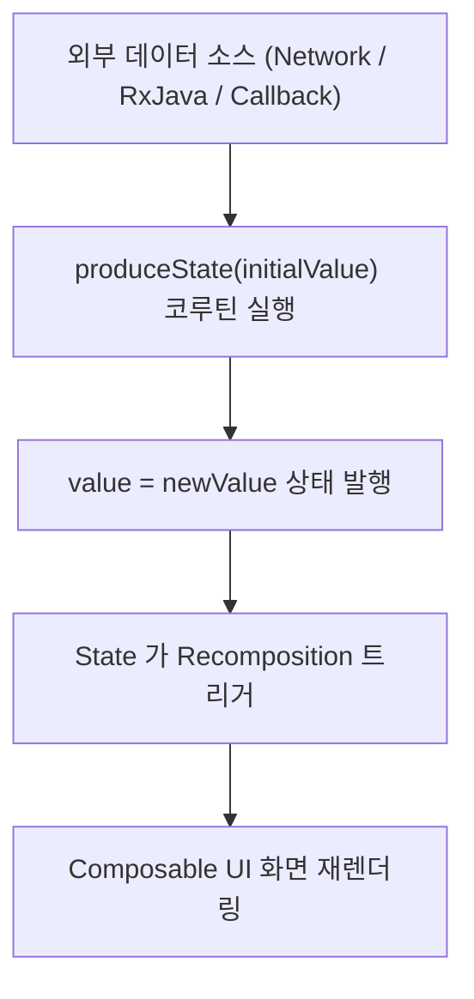

## produceState (외부 데이터 소스를 Compose State 로 변환하는 이펙트)

### 1. 개요 (Overview)

**produceState** 는 RxJava, LiveData, 콜백 리스너, 네트워크 서스펜드(Suspend) 호출 등 **Compose 외부의 비동기 데이터 소스를 수집하여 컴포지션이 읽을 수 있는 불변 `State<T>` 로 변환(Convert)해 주는 Jetpack Compose [부수 효과](../compose-side-effect.md)(Side-Effect) API**이다.

`produceState` 내부적으로 `LaunchedEffect` 와 `mutableStateOf` 가 융합되어 작동한다. 비동기 데이터 생산 생산자(Producer) 블록을 캡슐화하여, 외부 데이터 소스가 변경될 때마다 새 `value` 를 발행함으로써 유연하게 [Compose SSOT](../../../compose-ssot.md) 를 생성해 준다.

---

#### 초보자를 위한 쉽게 이해하는 비유

- **produceState (외부 신호 정제 컨버터)**:
  - 아날로그 외부 방송 신호(RxJava/콜백)를 받아 가져와서 디지털 모니터(Compose UI)가 읽을 수 있는 픽셀 데이터(`State<T>`)로 변환해 주는 스마트 신호 변환기.



---

### 2. produceState 작동 메커니즘 및 특징

1. **`ProducerScope` 기반 코루틴 실행**:
   - `produceState` 는 `ProducerScope` 블록 내에서 실행되며 `value = …` 형태로 상태를 갱신한다.
2. **자원 정리 `awaitDispose {}` 제공**:
   - 코루틴 블록 내부에서 `awaitDispose { … }` 를 호출하면, 컴포지션을 벗어날 때 외부 리스너나 구독(Subscription)을 깔끔하게 해제(Clean up)할 수 있다.
3. **`key` 변이 대응**:
   - `produceState(initialValue, key1, key2)` 형태로 키를 전달하여, 키가 바뀔 때 생산자 코루틴을 재시작시킬 수 있다.

---

### 3. 실전 코드 예시 (네트워크 비동기 이미지 로딩 변환)

```kotlin
@Composable
fun loadNetworkImage(url: String, repository: ImageRepository): State<Result<Bitmap>> {
    // url 이 변경될 때마다 비동기 이미지를 로드하여 State 로 반환
    return produceState<Result<Bitmap>>(initialValue = Result.Loading, url) {
        val bitmap = repository.fetchImage(url)
        value = Result.Success(bitmap)

        awaitDispose {
            repository.cancelRequest(url)
        }
    }
}
```

---

### 4. 연결 문서 (Related Links)

- [launched-effect](launched-effect.md) - produceState 의 기반이 되는 비동기 이펙트
- [snapshot-flow](snapshot-flow.md) - State 를 역으로 Flow 로 변환하는 API
- [Compose SSOT](../../../compose-ssot.md) - UI 단일 진실 출처
