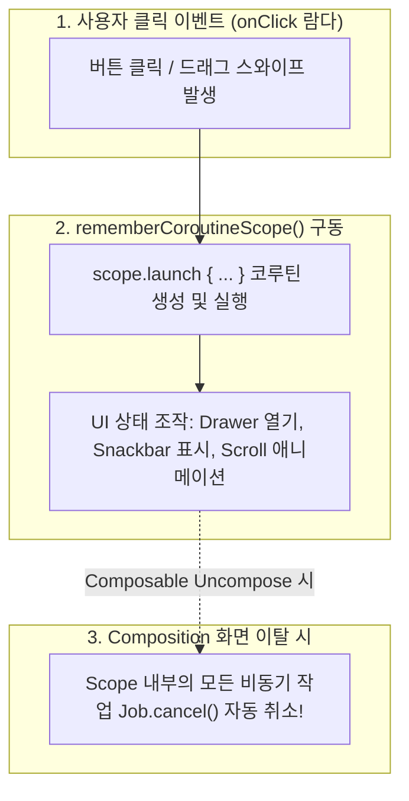

## rememberCoroutineScope 는 수동 제어 UI Coroutine 을 소유한다

### 1. 개념 정의 (What)

`rememberCoroutineScope()` 는 현재 Composable 의 Composition 수명주기에 구속(Bound)된 `CoroutineScope` 인스턴스를 반환하는 함수로, **사용자의 뷰 이벤트 콜백(예: 버튼 클릭, 드래그 스와이프)에 반응하여 수동으로 코루틴을 생성(`scope.launch { … }`)하고 관리하는 유틸리티 API**다.

---

### 2. rememberCoroutineScope 의 필요성 (Why)

`LaunchedEffect` 는 상태 변경이나 최초 진입 등 **Composition 단계**에서 비동기 작업을 구동하는 반면, 사용자 클릭 이벤트 콜백(`onClick: () -> Unit`)은 **Composition 파이프라인 외부**에서 호출된다.

이벤트 람다 내부에서 코루틴을 구동하려 할 때:

- 일반 `CoroutineScope()` 나 `GlobalScope` 를 사용하면 화면이 이탈되어도 작업이 취소되지 않고 비동기 애니메이션/네트워크 작업이 누수된다.

`rememberCoroutineScope()` 는 이벤트 람다 내부에서 코루틴을 구동하되, 화면 이탈 시 해당 코루틴이 자동으로 취소되도록 수명주기를 Composition 트리와 바인딩해준다.

---

### 3. 내부 동작 및 구별 메커니즘 (How)



1. **Job 파괴 연결**: `rememberCoroutineScope()` 가 할당한 `CoroutineScope` 는 내부적으로 `DisposableEffect` 처럼 작동하여, Composable 이 트리를 벗어나는 순간 `coroutineContext.cancel()` 을 즉시 트리거한다.
2. **LaunchedEffect 와의 명확한 책임 분리**:
   - **`LaunchedEffect`**: "상태(State)가 변경되었을 때 비동기 작업을 시작하라" (Composition 뷰 영역)
   - **`rememberCoroutineScope()`**: "사용자가 버튼을 눌렀을 때 비동기 작업을 구동하라" (이벤트 콜백 영역)

---

### 4. 올바른 UI Coroutine 수동 제어 코드

```kotlin
@Composable
fun DrawerAndSnackbarExample() {
    val drawerState = rememberDrawerState(initialValue = DrawerValue.Closed)
    val snackbarHostState = remember { SnackbarHostState() }
    
    // ✅ Composable 바인딩 CoroutineScope 획득
    val scope = rememberCoroutineScope()

    ModalNavigationDrawer(
        drawerState = drawerState,
        drawerContent = { DrawerContent() }
    ) {
        Scaffold(snackbarHost = { SnackbarHost(snackbarHostState) }) { padding ->
            Button(
                onClick = {
                    // ✅ 사용자 클릭 이벤트 콜백에서 안전하게 UI 애니메이션 코루틴 구동
                    scope.launch {
                        drawerState.open()
                        snackbarHostState.showSnackbar("Drawer opened successfully!")
                    }
                },
                modifier = Modifier.padding(padding)
            ) {
                Text("Open Drawer")
            }
        }
    }
}
```

---

상위 문서: [Compose 상태와 Effect 계약](./compose-state-and-effect-contracts.md)

관련 노트: [LaunchedEffect는 Composable과 함께 취소되어야 하는 작업을 소유한다](./launched-effect-owns-composable-cancellable-work.md), [UI controller와 effect runner는 ViewModel이 아니라 UI 수명에 둔다](./ui-controllers-and-effect-runners-live-with-ui-lifetime.md)

출처: [Side-effects in Compose](https://developer.android.com/develop/ui/compose/side-effects#remembercoroutinescope)

검증일: 2026-08-05. Compose 공식 가이드의 rememberCoroutineScope 사양을 대조하여 이벤트 콜백 구동 모델, Composition 수명주기 cancellation 및 LaunchedEffect 와의 역할 분리 서술을 정밀 보강했다.
