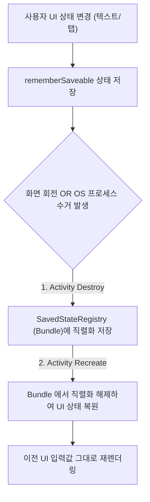

# rememberSaveable (프로세스 재생성 및 화면 회전 대응 UI 상태 복원)

## 1. 개요 (Overview)

**rememberSaveable** 은 일반 `remember` 가 보존하지 못하는 **화면 회전(Configuration Change) 및 시스템에 의한 프로세스 강제 종료/재생성(System-initiated Process Death) 시에도 UI 소형 상태를 `SavedStateRegistry` (Bundle)에 직렬화하여 안전하게 복원(Restoration)해 주는 Jetpack Compose State API**이다.

일반 `remember` 는 메모리 상의 컴포지션 트리에만 상태를 들고 있어 화면이 회전되거나 앱이 백그라운드에서 OOM 으로 수거되면 초기화된다. `rememberSaveable` 은 안드로이드 `Bundle` 인프라와 연동하여 사용자가 입력하던 미완성 텍스트, 스크롤 포지션, 탭 선택 상태를 원활하게 보존한다.

---

### 초보자를 위한 쉽게 이해하는 비유

* **rememberSaveable (비상 백업용 타임캡슐)**:
  - 전원이 꺼지면 지워지는 램(RAM, `remember`)과 달리, 지진(화면 회전)이나 재난(프로세스 수거)이 발생해도 상태를 작은 주머니(`Bundle`)에 보관했다가 다시 켜졌을 때 그대로 복원해 내는 비상 타임캡슐.



---

## 2. rememberSaveable 지원 타입 및 커스텀 Saver

1. **기본 지원 타입 (Bundle 직렬화 가능)**:
   - `Primitive` (Int, String, Boolean 등), `Parcelable`, `Serializable` 객체는 별도 설정 없이 자동 보존된다.
2. **복잡한 객체 커스텀 Saver 구현**:
   - `Parcelable` 이 아닌 일반 데이터 클래스(Data Class)나 도메인 객체는 `Saver` 인터페이스(`listSaver`, `mapSaver`)를 작성하여 복원 방식을 직접 지정할 수 있다.
3. **적합하지 않은 무거운 데이터**:
   - `Bundle` 제한 용량(약 1MB 이내) 때문에 대용량 리스트나 비트맵 이미지는 `rememberSaveable` 에 넣으면 안 되며, [ViewModel](../../../viewmodel.md) 및 `SavedStateHandle` 로 관리해야 한다.

---

## 3. 실전 코드 예시 (커스텀 Saver 활용)

```kotlin
data class UserDraft(val name: String, val age: Int)

val UserDraftSaver = listSaver<UserDraft, Any>(
    save = { listOf(it.name, it.age) },
    restore = { UserDraft(name = it[0] as String, age = it[1] as Int) }
)

@Composable
fun RegistrationScreen() {
    // 커스텀 Saver 를 통한 사용자 임시 드래프트 복원
    var draft by rememberSaveable(stateSaver = UserDraftSaver) {
        mutableStateOf(UserDraft("홍길동", 20))
    }
}
```

---

## 4. 연결 문서 (Related Links)

- [compose-state-api-selection](compose-state-api-selection.md) - 수명주기별 State API 선택
- [viewmodel-stateflow-lifecycle-collection](viewmodel-stateflow-lifecycle-collection.md) - ViewModel 기반 데이터 스트림
- [Compose SSOT](../../../compose-ssot.md) - 단방향 데이터 흐름 아키텍처
