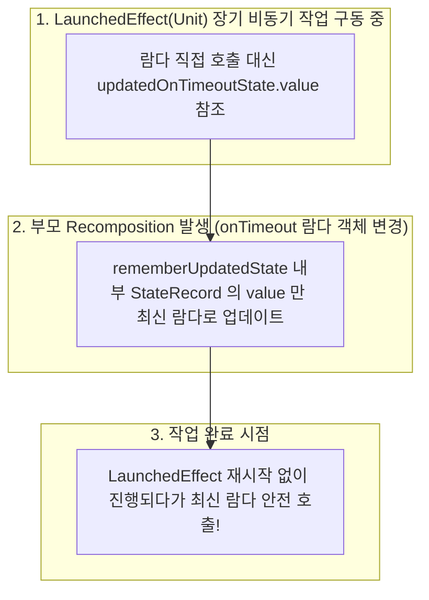

## rememberUpdatedState 는 effect 를 최신 값으로 유지한다

### 1. 개념 정의 (What)

`rememberUpdatedState(newValue)` 는 `LaunchedEffect` 나 `DisposableEffect` 처럼 작업 실행 시간이 길거나 수명주기가 긴 Side Effect 블록 내부에서, **이펙트를 취소하고 재시작(Restart)하지 않으면서도 항상 매 [recomposition](../../runtime/recomposition.md) 시 전달된 최신 파라미터 상태를 참조할 수 있도록 감싸주는 캡쳐 API**다.

---

### 2. rememberUpdatedState 가 필요한 이유 (Why)

장기 실행 비동기 이펙트(예: 5 초 후 타임아웃 이벤트, 스플래시 화면 타이머)에 콜백 람다(`onTimeout: () -> Unit`)를 전달할 때:

- **`LaunchedEffect(onTimeout)`**: `onTimeout` 람다가 재구성 때마다 새로운 개체로 전달되면 `LaunchedEffect` 가 계속 취소되고 처음부터 다시 시작되어 타이머가 영원히 완료되지 못한다.
- **`LaunchedEffect(Unit)`**: 이펙트를 재시작하지 않는 대신 최초 진입 시의 `onTimeout` 람다 개체만 캡쳐하므로, 중간에 부모가 새로운 `onTimeout` 람다를 넘겨주어도 오래된 람다(Stale Lambda)를 실행하는 버그가 생긴다.

`rememberUpdatedState` 는 이펙트를 재시작하지 않는 안정성과 최신 값 참조 가능성을 동시에 충족시킨다.

---

### 3. 내부 동작 메커니즘 (How)



1. **내부 State 래핑**: `rememberUpdatedState` 는 내부적으로 `remember { mutableStateOf(newValue) }` 를 생성하고, 매 Recomposition 마다 `.value = newValue` 를 업데이트한다.
2. **참조 [불변성](../../../../../../computer-science/immutability.md)**: 반환된 `State<T>` 객체 자체의 참조는 바뀌지 않으므로, 이펙트의 `key` 로 지정되거나 이펙트 내부에서 참조되어도 이펙트 재시작을 유발하지 않는다.

---

### 4. 올바른 rememberUpdatedState 활용 예시

```kotlin
@Composable
fun LandingSplashScreen(
    onTimeout: () -> Unit,
    modifier: Modifier = Modifier
) {
    // ✅ onTimeout 람다가 변경되어도 LaunchedEffect 를 재시작하지 않고 최신 람다 캡쳐
    val currentOnTimeout by rememberUpdatedState(onTimeout)

    // key 를 Unit 로 지정하여 화면 진입 시 딱 1회만 타이머 시작
    LaunchedEffect(Unit) {
        delay(3000L) // 3초 대기
        currentOnTimeout() // 3초 후 시점의 최신 onTimeout 람다 안전 실행!
    }

    Box(modifier = modifier.fillMaxSize(), contentAlignment = Alignment.Center) {
        Text("Welcome to App")
    }
}
```

---

상위 문서: [Compose 상태와 Effect 계약](./compose-state-and-effect-contracts.md)

관련 노트: [LaunchedEffect는 Composable과 함께 취소되어야 하는 작업을 소유한다](./launched-effect-owns-composable-cancellable-work.md), [DisposableEffect는 등록과 해제가 쌍인 작업을 관리한다](./disposable-effect-pairs-registration-and-cleanup.md)

출처: [Side-effects in Compose](https://developer.android.com/develop/ui/compose/side-effects#rememberupdatedstate)

검증일: 2026-08-05. Compose 공식 가이드의 rememberUpdatedState 사양을 대조하여 Stale Lambda 문제 방지, 이펙트 재시작 없는 최신 참조 업데이트 메커니즘 서술을 정밀 보강했다.
