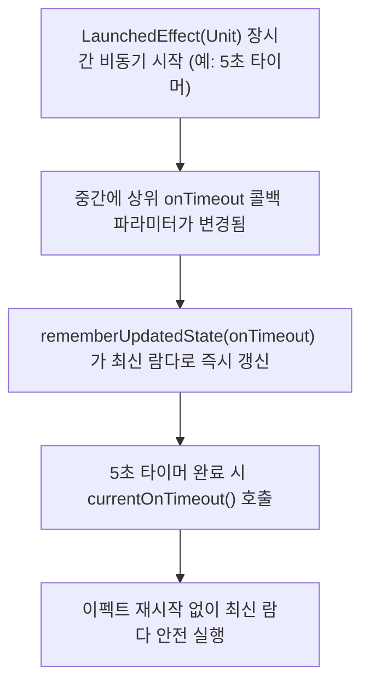

## rememberUpdatedState (장시간 이펙트 내 최신 상태 참조)

### 1. 개요 (Overview)

**rememberUpdatedState** 는 `LaunchedEffect` 나 `DisposableEffect` 같이 장시간 실행(Long-running)되는 [부수 효과](../compose-side-effect.md) 내부에서, **이펙트를 취소 후 재시작(Re-launch)하지 않고도 상위에서 넘겨준 최신 값(Latest Callback / State)을 안전하게 실시간으로 캡처하여 맘놓고 참조하기 위한 Jetpack Compose API**이다.

이펙트의 `key` 에 콜백 함수나 람다를 넣어버리면 콜백이 바뀔 때마다 실행 중이던 장시간 비동기 작업이 계속 캔슬되고 처음부터 다시 시작된다. 반대로 `key` 에 넣지 않으면 이펙트 내부에서 오래된 과거(Stale) 람다/상태값을 참조하여 버그가 발생한다. `rememberUpdatedState` 는 이 딜레마를 깔끔하게 해결한다.

---

#### 초보자를 위한 쉽게 이해하는 비유

- **rememberUpdatedState (전화통화 중 실시간으로 교체되는 무전기 메모지)**:
  - 장시간 통화(`LaunchedEffect`)를 끊었다가 다시 거는 위험 없이, 통화 중간에 바뀐 지시 사항(최신 콜백)만 쏙 무전기 메모지에 붙여서 최신 지침대로 일을 마치는 안전 보조 장치.



---

### 2. rememberUpdatedState 활용 시나리오

1. **타이머 / 애니메이션 수명주기 내 콜백 바인딩**:
   - `LaunchedEffect(Unit)` 으로 3 초 타이머를 켜두었을 때, 3 초 뒤 실행될 `onTimeout` 람다가 Recomposition 으로 교체되어도 타이머를 취소하지 않고 최신 `onTimeout` 을 호출하고자 할 때.
2. **`key` 재시작 오버헤드 방지**:
   - 값이 자주 바뀌는 콜백을 이펙트 `key` 로 사용하면 무한 취소 - 재시작 루프에 빠질 때 사용한다.

---

### 3. 실전 코드 예시 (스플래시 화면 타이머 구현)

```kotlin
@Composable
fun LandingScreen(onTimeout: () -> Unit) {
    // 1. 최신 onTimeout 람다 참조 상태 생성
    val currentOnTimeout by rememberUpdatedState(onTimeout)

    // 2. key 에 Unit 을 주어 타이머를 캔슬 후 재시작하지 않음
    LaunchedEffect(Unit) {
        delay(3000L)
        // 3. 3초 뒤 항시 최신 onTimeout 호출
        currentOnTimeout()
    }
}
```

---

### 4. 연결 문서 (Related Links)

- [launched-effect](launched-effect.md) - 장시간 비동기 이펙트
- [disposable-effect](disposable-effect.md) - 자원 해제 전용 이펙트
- [Composable Body Purity](../../runtime/compose-runtime-contracts/composable-body-purity.md) - Pure Composable 준칙
