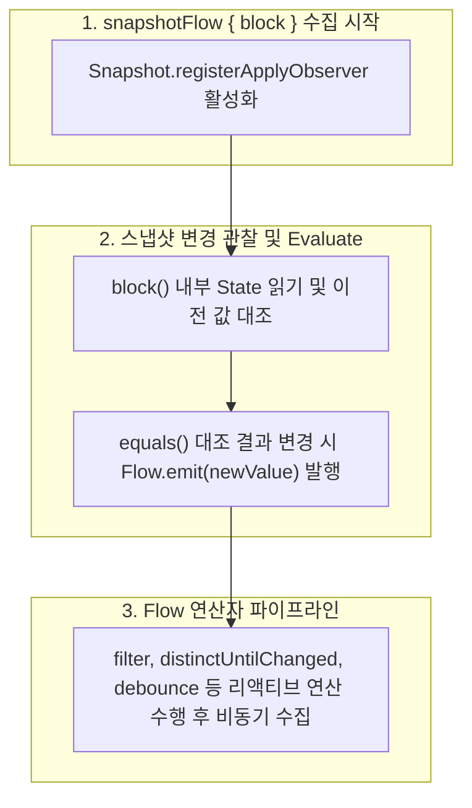

## snapshotFlow 는 Compose 상태를 Cold Flow 로 변환한다

### 1. 개념 정의 (What)

`snapshotFlow { block }` 는 `block` 내에서 읽은 하나 이상의 Compose `State` 객체를 감시하여, 상태 값이 변경될 때마다 새로운 데이터를 발행(Emit)하는 **Cold Kotlin `Flow` 로 변환해 주는 역방향 브릿징 API**다.

---

### 2. snapshotFlow API 의 필요성 (Why)

Compose 의 `State<T>` 는 동기식 UI 표현에는 최적이치만, 비동기 파이프라인 처리에는 제약이 따른다:

- **연산자 부재**: `State` 객체 자체에는 코틀린 Flow 가 제공하는 `debounce()`, `distinctUntilChanged()`, `filter()`, `map()`, `flatmapLatest()` 같은 강력한 리액티브 연산자가 없다.

예를 들어 스크롤 위치(`LazyListState.firstVisibleItemIndex`)가 바뀔 때마다 매번 이벤트를 처리하지 않고, 스크롤이 멈췄을 때만 네트워크 요청을 보내려면 `snapshotFlow` 를 통해 Flow 연산자와 결합해야 한다.

---

### 3. 내부 동작 메커니즘 (How)



1. **Snapshot Apply Observer**: `snapshotFlow` 는 런타임의 `Snapshot.registerApplyObserver` 를 활성화하여 스냅샷이 적용될 때마다 `block` 을 재평가한다.
2. **동등성 검사 및 Emission**: `block` 실행 결과가 이전 발행된 값과 `equals()` 기준으로 다를 때만 Flow Downstream 으로 새 값을 발행한다.

---

### 4. 올바른 snapshotFlow 활용 코드 가이드

```kotlin
@Composable
fun AnalyticsScrollTracker(lazyListState: LazyListState, analytics: Analytics) {
    // ✅ Compose State (firstVisibleItemIndex)를 Cold Flow로 변환 후 debounce 연산자 적용
    LaunchedEffect(lazyListState) {
        snapshotFlow { lazyListState.firstVisibleItemIndex }
            .filter { index -> index > 0 }
            .distinctUntilChanged()
            .debounce(500L) // 스크롤이 500ms 동안 멈췄을 때만 1회 발행
            .collect { index ->
                analytics.logEvent("scroll_reached_index", mapOf("index" to index))
            }
    }
}
```

---

상위 문서: [Compose 상태와 Effect 계약](./compose-state-and-effect-contracts.md)

관련 노트: [Snapshot State 관찰은 State를 읽은 scope를 invalidation 대상으로 만든다](../../runtime/compose-runtime-contracts/snapshot-state-observation-invalidates-state-read-scopes.md), [LaunchedEffect는 Composable과 함께 취소되어야 하는 작업을 소유한다](./launched-effect-owns-composable-cancellable-work.md)

출처: [Side-effects in Compose](https://developer.android.com/develop/ui/compose/side-effects#snapshotflow)

검증일: 2026-08-05. Compose 공식 가이드의 snapshotFlow 사양을 대조하여 State-to-Flow 변환, Snapshot Apply Observer 동작 및 Flow 연산자 결합 패턴 서술을 정밀 보강했다.
