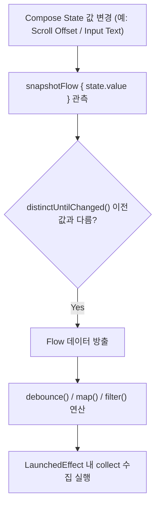

# snapshotFlow (Compose State 관측값을 Cold Flow 로 변환)

## 1. 개요 (Overview)

**snapshotFlow** 는 Compose 스냅샷 시스템이 관리하는 **`State<T>` 상태 객체의 관측값을 읽어서, 값이 변경될 때마다 새로운 데이터를 방출하는 Cold [Kotlin Coroutines](../../../kotlin-coroutines.md) `Flow<T>` 데이터 스트림으로 역변환해 주는 Jetpack Compose API**이다.

`produceState` 가 외부 스트림을 `State` 로 변환한다면, `snapshotFlow` 는 **역으로 Compose `State` 를 `Flow` 로 변환**한다. 이를 통해 Compose UI 의 스크롤 상태, 텍스트 상태 변경 감지 이벤트를 `map`, `filter`, `debounce`, `distinctUntilChanged` 같은 풍부한 Kotlin Flow 연산자(Operators)와 결합하여 정밀하게 다룰 수 있다.

---

### 초보자를 위한 쉽게 이해하는 비유

* **snapshotFlow (Compose 상태 모니터링 안테나)**:
  - Compose 화면의 상태(`State`)를 지켜보다가, 값이 바뀌는 순간 이를 Kotlin Flow 파이프라인으로 전송하여 디바운싱(디바운스 처리)이나 필터링 연산을 할 수 있도록 도와주는 감시 안테나.



---

## 2. snapshotFlow 작동 원리 및 주요 활용법

1. **State 읽기 자동 등록**:
   - `snapshotFlow { ... }` 블록 내부에서 접근한 모든 Compose `State` 객체의 구독이 자동으로 등록된다.
2. **연속 동일 값 필터링**:
   - `snapshotFlow` 는 내부적으로 `distinctUntilChanged()` 가 작동하여, 실제 읽은 `State` 값이 변경되었을 때만 새 요소를 방출한다.
3. **Flow 연산자 결합**:
   - 검색창 입력 상태 `snapshotFlow { queryState }` 에 `debounce(300ms)` 를 걸어 무분별한 네트워크 요청을 차단할 때 최적이다.

---

## 3. 실전 코드 예시 (스크롤 포지션 디바운스 관측)

```kotlin
@Composable
fun LazyListAnalytics(listState: LazyListState) {
    LaunchedEffect(listState) {
        // listState 의 첫 번째 보이기 아이템 인덱스를 Flow 로 변환하여 디바운스 수집
        snapshotFlow { listState.firstVisibleItemIndex }
            .distinctUntilChanged()
            .filter { it > 10 }
            .collect { index ->
                println("사용자가 10번째 리스트 이상 스크롤함: $index")
            }
    }
}
```

---

## 4. 연결 문서 (Related Links)

- [produce-state](produce-state.md) - 외부 데이터를 State 로 변환하는 반대 API
- [launched-effect](launched-effect.md) - snapshotFlow 를 수집하는 비동기 이펙트
- [Kotlin Coroutines](../../../kotlin-coroutines.md) - Cold Flow 파이프라인
