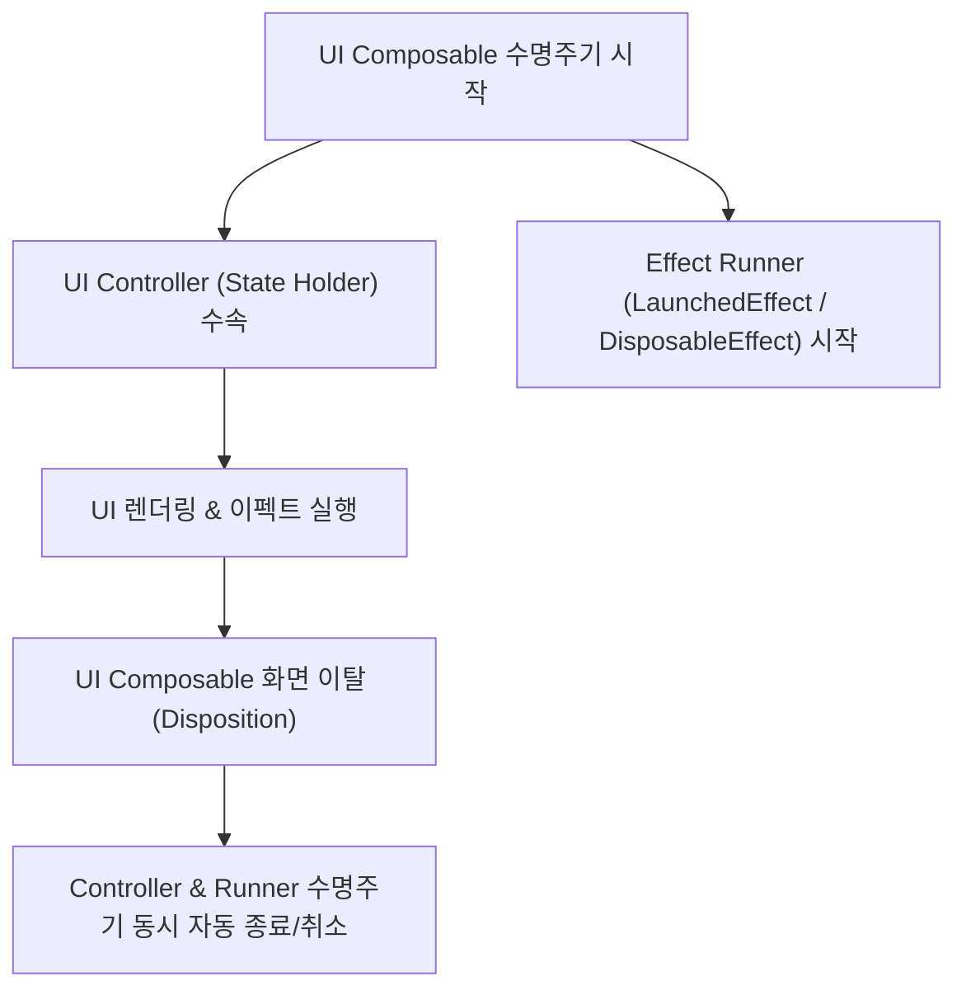

# UI Controllers & Effect Runners (UI 컨트롤러와 이펙트 러너 수명주기 결합 규약)

## 1. 개요 (Overview)

**UI Controllers & Effect Runners** 는 Jetpack Compose 에서 화면 상태를 표현하는 **UI 컨트롤러(State Holder / ViewModel / State) 및 비동기 [부수 효과](../compose-side-effect.md)를 수행하는 이펙트 러너(`LaunchedEffect`, `DisposableEffect`)의 수명주기(Lifetime)가 UI 계층의 수명주기와 반드시 일치(Live with UI Lifetime)해야 한다는 아키텍처 결합 규약**이다.

UI 컨트롤러나 이펙트 러너가 UI 화면의 수명주기보다 오래 살면 메모리 누수(Memory Leak)가 발생하고, 반대로 일찍 죽으면 유저 입력이 유실되거나 비동기 작업 결과가 렌더링에 반영되지 않는다.

---

### 초보자를 위한 쉽게 이해하는 비유

* **UI 컨트롤러 & 이펙트 러너 (무대 연출가와 무대 특수효과팀의 동시 출퇴근)**:
  - 무대(UI Composable)가 열리면 연출가(State Holder)와 조명팀(Effect Runner)이 함께 들어와 일하고, 무대가 닫히면 조명팀도 장비를 챙겨 무대와 함께 퇴근하는 동시 수명주기 팀 모델.

---

## 2. 수명주기 바인딩 3대 규약

1. **상태 홀더와 Composable 스코프 결합**:
   - UI 전용 상태 홀더(예: `DrawerState`, `LazyListState`)는 `remember` 로 묶여 해당 Composable 의 Composition 수명주기와 완전히 궤를 같이해야 한다.
2. **이펙트 러너의 자동 Cancellation**:
   - `LaunchedEffect` 와 `rememberCoroutineScope` 는 Composable 이 화면에서 벗어나는 순간 취소(Cancel)되어 고아 코루틴이 남지 않도록 보장한다.
3. **도메인 비즈니스 수명주기 분리**:
   - UI 렌더링 수명주기를 초과하여 생존해야 하는 비즈니스 데이터(SSOT)는 UI 계층이 아닌 [ViewModel](../../../viewmodel.md) 스코프(`viewModelScope`)에 올바르게 격리 배치되어야 한다.

---

## 3. 연결 문서 (Related Links)

- [launched-effect](launched-effect.md) - UI 수명주기 결합 코루틴 이펙트
- [disposable-effect](disposable-effect.md) - UI 수명주기 결합 Cleanup 이펙트
- [Compose SSOT](../../../compose-ssot.md) - UI 단일 진실 출처
- [ViewModel](../../../viewmodel.md) - 비즈니스 상태 홀더
