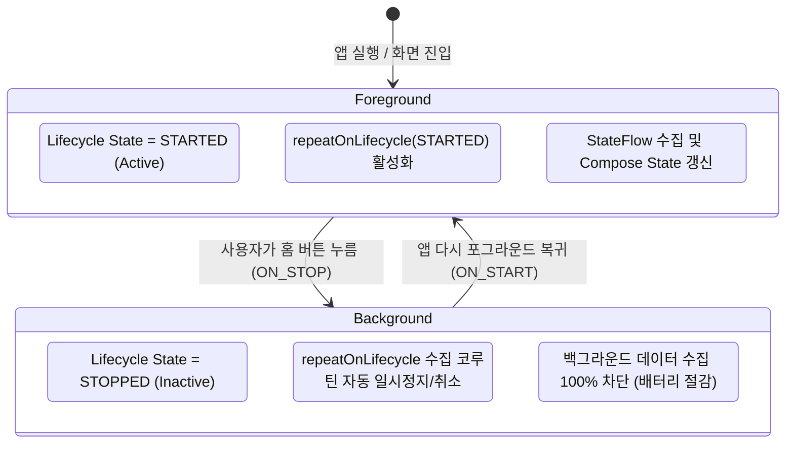

## ViewModel 의 StateFlow 는 collectAsStateWithLifecycle 로 화면 상태로 변환한다

### 1. 개념 정의 (What)
`collectAsStateWithLifecycle()`은 Android Lifecycle-aware 코루틴 라이브러리가 제공하는 최신 표준 API로서, **ViewModel의 `StateFlow` 또는 `SharedFlow`를 Android 수명주기(Lifecycle State)에 동기화하여 수집(Collect)하고 Compose `State<T>`로 변환하는 현대 표준 메커니즘**이다.

---

### 2. collectAsStateWithLifecycle의 필연적 필요성 (Why)
기존의 `collectAsState()` API를 일반 Android Compose 앱에서 사용하면 심각한 백그라운드 자원 누수가 발생한다:
- **`collectAsState()`의 한계**: 단순히 Composition 파이프라인의 수명주기만 바라보므로, 앱이 홈 화면으로 내려가 백그라운드 상태(`STOPPED`)가 되어도 Flow 수집(Collection)을 멈추지 않는다.
- **백그라운드 자원/배터리 소모**: 화면이 보이지 않는 순간에도 백그라운드에서 위치 센서 수집, 소켓 통신, DB 쿼리가 지속 구동되어 시스템 자원 누수 및 앱 강제 종료가 야기된다.

`collectAsStateWithLifecycle()`은 기본값인 `Lifecycle.State.STARTED`를 기준으로, 앱이 백그라운드로 진입하면 수집 코루틴을 자동으로 **일시 정지(Pause/Cancel)**하고, 앱이 다시 포그라운드로 복귀하면 안전하게 **재개(Resume)**한다.

---

### 3. 내부 동작 및 수명주기 인지 메커니즘 (How)



1. **`repeatOnLifecycle` 감싸기**: `collectAsStateWithLifecycle` 내부에서는 `LocalLifecycleOwner.current`를 관찰하며 `repeatOnLifecycle(minActiveState)`가 구동된다.
2. **`SharingStarted.WhileSubscribed(5000)`과의 환상적인 조합**: ViewModel에서 `stateIn()`을 선언할 때 5초 딜레이를 주면, 화면 회전 시 불필요한 upstream 재요청을 방지하면서도 백그라운드 진입 5초 후 업스트림 스트림을 완전 정지시킬 수 있다.

---

### 4. 현대 표준 흐름 수집 구현 코드 사례

```kotlin
@HiltViewModel
class HomeViewModel @Inject constructor(
    private val newsRepository: NewsRepository
) : ViewModel() {
    
    // ✅ 5초 타임아웃 지연을 적용한 표준 StateFlow 선언
    val uiState: StateFlow<HomeUiState> = newsRepository.getLatestNews()
        .map { HomeUiState.Success(it) }
        .stateIn(
            scope = viewModelScope,
            started = SharingStarted.WhileSubscribed(5000L),
            initialValue = HomeUiState.Loading
        )
}

@Composable
fun HomeScreen(
    viewModel: HomeViewModel = hiltViewModel()
) {
    // ✅ 현대 표준: Lifecycle-aware Flow Collection (기본값 minActiveState = STARTED)
    val uiState by viewModel.uiState.collectAsStateWithLifecycle()

    when (val state = uiState) {
        is HomeUiState.Loading -> CircularProgressIndicator()
        is HomeUiState.Success -> NewsList(state.news)
    }
}
```

---

상위 문서: [Compose 상태와 Effect 계약](./compose-state-and-effect-contracts.md)

관련 노트: [UI controller와 effect runner는 ViewModel이 아니라 UI 수명에 둔다](./ui-controllers-and-effect-runners-live-with-ui-lifetime.md), [Compose 상태 API는 필요한 수명에 맞춰 선택한다](./compose-state-api-selection-by-lifetime.md)

출처: [Consuming flows safely from the UI layer in Jetpack Compose](https://medium.com/androiddevelopers/consuming-flows-safely-from-the-ui-layer-in-jetpack-compose-c2e442c0219f)

검증일: 2026-08-05. 안드로이드 공식 가이드를 대조하여 collectAsState vs collectAsStateWithLifecycle 비교, repeatOnLifecycle(STARTED) 동작 방식 및 WhileSubscribed(5000) 연동 서술을 정밀 보강했다.
