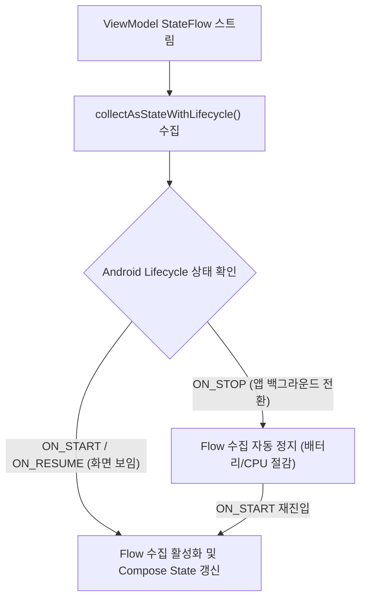

## viewmodel-stateflow-lifecycle-collection (`collectAsStateWithLifecycle` 기반 안전 수집 규약)

### 1. 개요 (Overview)

**viewmodel-stateflow-lifecycle-collection** 은 ViewModel 의 `StateFlow` 비동기 상태 스트림을 Compose UI 화면 상태로 변환할 때, **안드로이드 앱 수명주기(Lifecycle)가 `STARTED` 이상일 때만 수집(Collect)을 수행하고, 백그라운드 전환 시 수집을 자동으로 중단(Pause/Stop)하여 자원 및 배터리 낭비를 막는 표준 안전 수집 규약**이다.

단순 `collectAsState()` 를 사용하면 앱이 백그라운드로 내려가거나 화면이 보이지 않는 순간에도 `StateFlow` 수집 코루틴이 계속 돌아가 배터리와 CPU 자원을 불필요하게 낭비한다. **`collectAsStateWithLifecycle()`** 은 안드로이드 `LifecycleOwner` 와 연동하여 백그라운드 시 안전하게 수집을 일시 정지한다.

---

#### 초보자를 위한 쉽게 이해하는 비유

- **collectAsStateWithLifecycle (스마트 자동 일시정지 밸브)**:
  - 관객이 극장 의자에 앉아 시청 중일 때만 수도 밸브(`StateFlow`)를 열어 전광판(UI)을 갱신하고, 관객이 나가거나 외출(앱 백그라운드)하면 자동으로 밸브를 닫아 불필요한 물(배터리/CPU) 낭비를 정지시키는 스마트 자동 밸브.



---

### 2. `collectAsState()` 대 `collectAsStateWithLifecycle()` 비교

| 구분 | `collectAsState()` | `collectAsStateWithLifecycle()` |
| :--- | :--- | :--- |
| **수집 기준** | Composition 수명주기만 의존 (앱 백그라운드에서도 수집 지속) | **Android Lifecycle (LifecycleOwner) 의존 (STOPPED 시 자동 일시정지)** |
| **배터리 / CPU 영향** | 백그라운드 시 자원 낭비 및 불필요한 연산 위험 | **백그라운드 자원 사용 100% 자동 절감 (MAD 권장 표준)** |
| **필요 라이브러리** | `androidx.compose.runtime` 기본 포함 | `androidx.lifecycle:lifecycle-runtime-compose` 필요 |

---

### 3. 실전 코드 예시 (Compose UI 수집 구현)

```kotlin
@Composable
fun UserProfileScreen(
    viewModel: UserProfileViewModel = viewModel()
) {
    // Android Lifecycle 과 안전하게 바인딩되어 백그라운드 수집 정지
    val uiState by viewModel.uiState.collectAsStateWithLifecycle()

    when (val state = uiState) {
        is UserUiState.Loading -> CircularProgressIndicator()
        is UserUiState.Success -> Text("사용자명: ${state.user.name}")
        is UserUiState.Error -> Text("에러 발생: ${state.message}")
    }
}
```

---

### 4. 연결 문서 (Related Links)

- [Compose SSOT](../../../compose-ssot.md) - ViewModel 단일 진실 출처
- [StateFlow & SharedFlow](../../../stateflow-and-sharedflow.md) - StateFlow 데이터 스트림
- [ViewModel](../../../viewmodel.md) - 안드로이드 비즈니스 상태 홀더
- [compose-state-api-selection](compose-state-api-selection.md) - Compose State 선택 가이드
