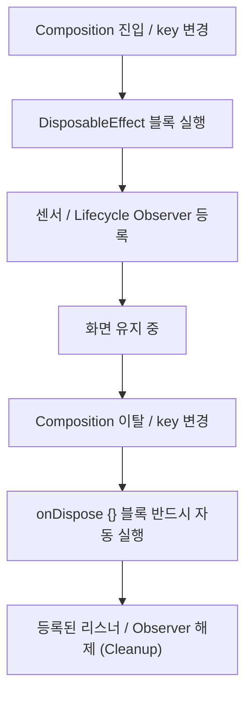

## DisposableEffect (Compose 자원 해제 및 리스너 정리 이펙트)

### 1. 개요 (Overview)

**DisposableEffect** 는 Composable 이 컴포지션(Composition)에 진입할 때 리스너/이벤트를 등록하고, **화면에서 이탈(Disposition)하거나 키(Key)가 변경될 때 `onDispose {}` 블록을 통해 반드시 자원을 정돈(Cleanup/Unregister)하기 위해 사용하는 Jetpack Compose [부수 효과](../compose-side-effect.md)(Side-Effect) API**이다.

센서 리스너 등록, `LifecycleEventObserver` 바인딩, BroadcastReceiver 동적 등록 등 **시작(Register)과 해제(Unregister)가 쌍(Pair)을 이루는 작업**에서 `onDispose {}` 누락 시 메모리 누수(Memory Leak)가 발생한다. `DisposableEffect` 는 컴파일러 수준에서 `onDispose` 구문을 필수적으로 요구하여 이를 완벽히 예방한다.

---

#### 초보자를 위한 쉽게 이해하는 비유

- **DisposableEffect (대여소의 반납 보증금 제도)**:
  - 장비(리스너)를 빌릴 때 대여 도장을 찍고, 반납할 때 보증금을 되찾는 시스템. `onDispose {}` 라는 반납 창구가 없으면 반납을 잊어버리고 장비를 분실(메모리 누수)하는 상황을 막아줌.



---

### 2. DisposableEffect 사용 규칙 및 주의사항

1. **`onDispose {}` 블록 필수 포함**:
   - `DisposableEffect` 블록의 마지막 구문은 반드시 `onDispose { … }` 이어야 한다. `onDispose` 가 없다면 `DisposableEffect` 가 아니라 `LaunchedEffect` 를 사용해야 한다.
2. **`key` 변경 시 재실행 흐름**:
   - `key` 값이 변경되면 이전 `key` 기반의 `onDispose {}` 가 먼저 실행되어 기존 자원을 정돈한 뒤, 새로운 `key` 기반으로 `DisposableEffect` 몸체가 재실행된다.
3. **무거운 작업 금지**:
   - `onDispose` 는 UI 메인 스레드 재구성 파이프라인에서 직렬 실행되므로 무거운 파일 I/O 나 DB 연산을 수행하면 안 된다.

---

### 3. 실전 코드 예시 (Lifecycle Observer 등록 및 해제)

```kotlin
@Composable
fun SystemObserverScreen(lifecycleOwner: LifecycleOwner = LocalLifecycleOwner.current) {
    DisposableEffect(lifecycleOwner) {
        // 1. 등록 (Register)
        val observer = LifecycleEventObserver { _, event ->
            if (event == Lifecycle.Event.ON_RESUME) {
                println("화면 재개됨")
            }
        }
        lifecycleOwner.lifecycle.addObserver(observer)

        // 2. 반드시 반납/해제 (Cleanup)
        onDispose {
            lifecycleOwner.lifecycle.removeObserver(observer)
        }
    }
}
```

---

### 4. 연결 문서 (Related Links)

- [launched-effect](launched-effect.md) - 코루틴 비동기 전용 이펙트 API
- [remember-updated-state](remember-updated-state.md) - 이펙트 내부 최신 콜백 참조 API
- [Composable Body Purity](../../runtime/compose-runtime/composable-body-purity.md) - Pure Composable 준칙
- [BroadcastReceiver](../../../architecture/app-components/broadcast-receiver.md) - 동적 브로드캐스트 리시버 등록/해제
