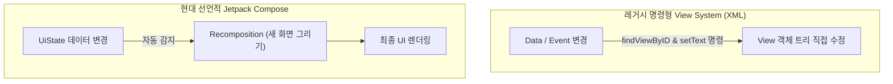

# View System vs Jetpack Compose (안드로이드 UI 패러다임 비교)

## 1. 개요 (Overview)

Android 프레임워크의 화면 구성 방식은 레거시 **XML 기반 명령형 View System (`android.widget.View`)** 과 현대의 **Kotlin 코드 기반 선언적 UI 툴킷인 Jetpack Compose** 로 패러다임 전환이 진행되었다.

---

### 초보자를 위한 쉽게 이해하는 비유

* **명령형 View System (수동 무대 레고 조립)**:
  - 무대감독이 배우(View) 하나하나를 찾아가서 **"너는 글자를 바꾸고(`setText`), 너는 색상을 바꾸고(`setVisibility`)"** 수동으로 상태 변경 절차를 일일이 명령하는 방식 (수동 관리 오버헤드, 상태 불일치 발생 위험).
* **선언적 Jetpack Compose (자동 상태 레시피 화면)**:
  - 무대 재료(UiState)를 보고 **"현재 상태가 X 이면 화면을 이렇게 그려라"** 라고 레시피(Composable)만 선언해 두면, 상태가 바뀔 때 프레임워크가 알아서 변경된 부분만 다시 그려주는([Recomposition](runtime/recomposition.md)) 방식.

---

## 2. View System vs Jetpack Compose 핵심 비교표

| 비교 항목 | 레거시 View System (XML) | 현대 Jetpack Compose |
| :--- | :--- | :--- |
| **UI 정의 패러다임** | **명령형 (Imperative)** | **선언적 (Declarative)** |
| **언어 및 파일** | XML 디렉터리 분리 + Java/Kotlin | **100% Kotlin 소스 코드 (`@Composable`)** |
| **화면 갱신 방식** | `setText()`, `setVisibility()` 수동 명령 | **상태(`State`) 변경 시 자동 [Recomposition](runtime/recomposition.md)** |
| **상태 보관 방식** | View 객체가 자체 내부 상태 소유 | **상태 호이스팅(State Hoisting) 기반 외부 보관** |
| **코드 양 & 가독성** | 파일 분리로 보일러플레이트 코드 많음 | **코드 양 대폭 감소, 가독성 우수** |

---

## 3. 연결 문서 (Related Links)

- [Recomposition](runtime/recomposition.md) - Compose 가 상태 변화를 감지해 화면을 다시 그리는 메커니즘
- [ViewModel](../viewmodel.md) - Compose UI 에 보낼 최신 UiState 데이터를 관제하는 컴포넌트
