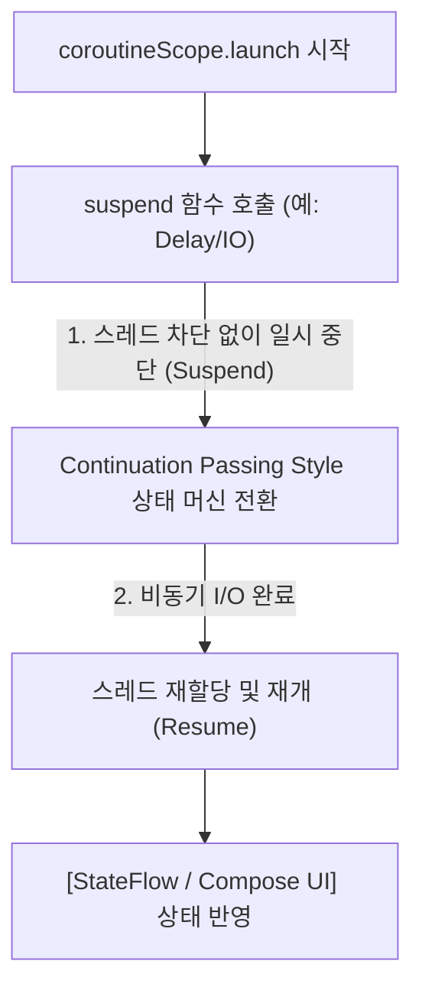

## Kotlin Coroutines (안드로이드 코루틴 비동기 프레임워크)

### 1. 개요 (Overview)

**Kotlin Coroutines (코루틴)** 은 스레드(Thread)를 차단(Blocking)하지 않고 비동기(Asynchronous) 코드를 마치 동기식 순차 코드처럼 작성할 수 있게 해주는 **Kotlin 언어 표준 비동기 경량 경량화 동시성(Lightweight Concurrency) 프레임워크**이다.

기존의 낡은 스레드 생성 오버헤드나 콜백 지옥(Callback Hell)과 달리, 코루틴은 **[Structured Concurrency](../../../computer-science/structured-concurrency.md) (구조화된 동시성)** 원칙을 준수하여 상위 스코프(Scope)가 취소되면 하위 자식 작업도 자동으로 전파 취소(Cancellation Propagation)되어 리소스 누수를 완벽히 방지한다.

---

#### 초보자를 위한 쉽게 이해하는 비유

- **Kotlin Coroutines (작업 일시 중단 및 재개가 가능한 스마트 워커)**:
  - **스레드 (공장의 거대한 물리 기계)**: 기계를 새로 만드는 데 비용이 비싸고, 일이 멈추면 기계 전체가 놀고(Thread Blocking) 멈춤.
  - **코루틴 (기계 위에서 옮겨 다니는 경량 스태프)**: 일이 멈추면 기계를 놓아주고(Suspend) 쉼터로 갔다가, 데이터 준비가 끝나면 다른 한가한 기계에 재빨리 올라타서(Resume) 일을 이어받아 수행하는 경량 스태프.



---

### 2. Kotlin Coroutines 핵심 4 대 요소

1. **Suspend 함수 & Continuation Passing Style (CPS)**:
   - `suspend` 키워드가 붙은 함수는 컴파일 타임에 `Continuation` 콜백 매개변수가 숨겨진 상태 머신으로 변환되며, 스레드를 블로킹하지 않고 비동기 대기를 수행한다.
2. **CoroutineScope & Job**:
   - 코루틴이 실행되는 수명주기 범위를 결정한다. 앱 프레임워크에서는 `viewModelScope`, `lifecycleScope`, Compose 에서는 `rememberCoroutineScope()` 및 `LaunchedEffect()` 와 연동된다.
3. **Dispatchers (디스패처)**:
   - `Dispatchers.Main`: Android 메인 UI 스레드에서 실행.
   - `Dispatchers.IO`: 파일/네트워크 I/O 작업용 스레드 풀.
   - `Dispatchers.Default`: CPU 집약적 연산용 스레드 풀.
4. **Structured Concurrency (구조화된 동시성)**:
   - [Structured Concurrency](../../../computer-science/structured-concurrency.md) 계약에 따라 부모 스코프 취소 시 모든 자식 Job 이 일괄 cancellation 처리된다.

---

### 3. Jetpack Compose 와의 연동 (`rememberCoroutineScope` & `LaunchedEffect`)

Jetpack Compose 환경에서는 Composable 의 Recomposition 수명주기와 안전하게 동기화되는 2 가지 핵심 코루틴 빌더를 제공한다:

1. **`LaunchedEffect(key)`**:
   - Composable 이 화면에 진입(Composition)할 때 부수 효과(Side-Effect)로 비동기 작업을 시작하고, 화면을 이탈(Recomposition/Disposition)하거나 `key` 가 변경되면 진행 중인 코루틴을 자동으로 취소한다.
2. **`rememberCoroutineScope()`**:
   - 사용자 이벤트 클릭 핸들러(Button onClick 등) 내부에서 일회성 비동기 코루틴을 시작할 때, 현재 Composition 의 수명주기에 바인딩된 `CoroutineScope` 를 획득한다.

```kotlin
@Composable
fun UserProfileScreen(userId: String, viewModel: UserViewModel = viewModel()) {
    val scope = rememberCoroutineScope()

    // 1. Composition 진입 시 부수 효과 비동기 실행
    LaunchedEffect(userId) {
        viewModel.fetchUserData(userId)
    }

    Button(onClick = {
        // 2. UI 이벤트 핸들러에서 안전하게 코루틴 launch
        scope.launch {
            viewModel.sendAnalyticsEvent("button_click")
        }
    }) {
        Text("프로필 업데이트")
    }
}
```

---

### 4. 연결 문서 (Related Links)

- [Structured Concurrency](../../../computer-science/structured-concurrency.md) - CS 구조화된 동시성 부모 - 자식 수명주기 원칙
- [StateFlow & SharedFlow](stateflow-and-sharedflow.md) - Coroutines 기반 반응형 Hot Data Stream
- [Compose SSOT](compose-ssot.md) - Coroutines 과 ViewModel 기반 UI 단일 진실 출처
- [ViewModel](viewmodel.md) - `viewModelScope` 를 제공하는 안드로이드 아키텍처 노드
- [Activity](architecture/app-components/activity.md) - `lifecycleScope` 를 제공하는 Compose UI 루트
- [Race Condition & Deadlock](../../../computer-science/race-condition-and-deadlock.md) - 스레드 동시성 및 레이스 조건
