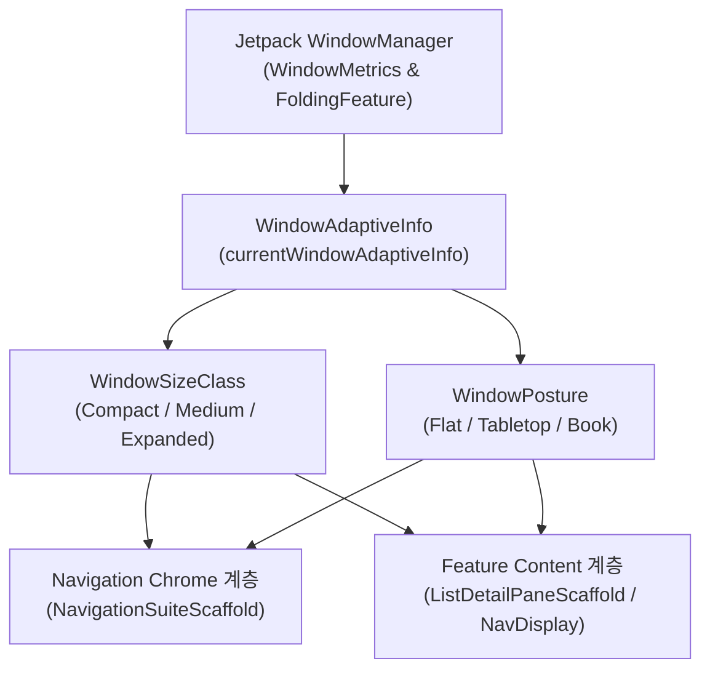

## Adaptive Layout & Navigation 가이드: 현대 안드로이드 반응형 탐색 체계

안드로이드의 다양한 기기 폼 팩터(모바일, 폴더블, 태블릿, 크롬북, 듀얼 스크린) 대응을 위한 **Adaptive Navigation**(창 크기와 기기 힌지 상태에 따라 탐색 UI 및 백스택 배치를 동적으로 변경하는 안드로이드 아키텍처)의 종합 가이드다.

기존 안드로이드 개발에서는 화면 밀도(dpi)나 기기 모델명(`isTablet()`)에 기반한 하드코딩된 분기를 사용했으나, 현대 안드로이드 아키텍처는 **Window Size Class**와 **Posture** 상태에 따라 앱 프레임(Chrome)과 콘텐츠 영역(Pane)을 분리하여 동적으로 반응하는 반응형(Adaptive) 내비게이션을 표준으로 채택한다.

---

### 개념과 필요성 (What & Why)

1. **개념 (What)**:
   - **Adaptive Navigation**은 디스플레이의 물리적 크기나 모델에 의존하지 않고, 앱에 할당된 현재 실행 창(Window)의 실시간 상태(`WindowAdaptiveInfo`)를 추적하여 최적의 탐색 크롬(Bottom Bar, Navigation Rail, Persistent Drawer)과 화면 구획(List-Detail, Supporting Pane)을 배치하는 아키텍처 패턴이다.
2. **필요성 (Why)**:
   - **멀티 윈도우 및 분할 화면**: 대화면/폴더블 기기에서는 앱이 전체 화면을 쓰지 않고 화면의 1/2, 1/3 크기로 실행될 수 있다. 기기가 태블릿이더라도 앱 창이 좁다면 스마트폰용 Compact UI로 동작해야 한다.
   - **폴딩 힌지(Hinge) 대응**: 폴더블 디바이스가 반쯤 접힌 상태(Tabletop/Half-Opened)에서는 힌지 경계를 중심으로 컨트롤 영역과 표시 영역이 물리적으로 분리되어야 한다.
   - **상태 연속성 보장**: 창 크기 변경(회전, 분할, 힌지 전환)이 발생하더라도 사용자가 선택한 작업 맥락(`selectedId`)과 내비게이션 백스택(`NavBackStack`)이 초기화되지 않고 유지되어야 한다.

---

### 내부 동작 메커니즘 (How)

안드로이드 런타임에서 Adaptive UI는 Jetpack WindowManager 및 Material3 Adaptive 라이브러리를 통해 다음 단계로 처리된다:

1. **WindowMetrics 수집**:
   `WindowManager` 서비스가 앱 창의 실제 픽셀 너비/높이 및 디스플레이 Cutout, Hinge bounds(`FoldingFeature`) 정보를 캡처한다.
2. **WindowSizeClass 산출**:
   너비(Width) 기준 분기점(Breakpoint)에 따라 UI 레벨을 분류한다:
   - **Compact**: `< 600dp` (일반 스마트폰 세로 모드, 멀티윈도우 좁은 창)
   - **Medium**: `600dp ~ 840dp` (스마트폰 가로 모드, 소형 태블릿, 폴더블 펼친 모드)
   - **Expanded**: `>= 840dp` (대형 태블릿, 데스크톱/크롬북)
3. **Scaffold 수신 및 UI 재구성**:
   - `NavigationSuiteScaffold`: 창 크기에 따라 하단 바(Bottom Bar) $
ightarrow$ 내비게이션 레일(Navigation Rail) $
ightarrow$ 영구 드로어(Persistent Drawer)로 탐색 크롬을 자동 교체한다.
   - `ListDetailPaneScaffold`: Compact 창에서는 Single Pane(목록 $
ightarrow$ 상세 화면으로 Push/Pop 전이), Medium/Expanded 창에서는 Dual Pane(목록과 상세 화면 동시 노출)으로 레이아웃을 변환한다.

---

### 구시대 레거시 vs 현대 표준 비교 (Legacy vs Modern)

| 구분 | 구시대 레거시 (Legacy) | 현대 안드로이드 표준 (Modern Standard) |
| :--- | :--- | :--- |
| **분기 기준** | `resources.configuration.smallestScreenWidthDp` 또는 기기 모델 비교 (`isTablet()`) | `currentWindowAdaptiveInfo()` (`WindowSizeClass` & `WindowPosture`) |
| **탐색 크롬** | `BottomNavigationView`와 `NavigationRailView`를 XML/Composable 레이아웃 분기로 개별 수동 교체 | `NavigationSuiteScaffold`로 앱 프레임 탐색 크롬 단일 자동 구성 |
| **화면 구획 (Pane)** | FragmentTransaction 기반 수동 `replace()` 및 `if-else` 화면 분할 | M3 Adaptive `ListDetailPaneScaffold`, `SupportingPaneScaffold` |
| **탐색 백스택 관리** | 레이아웃 변경 시 Fragment 백스택을 팝하거나 Activity 재시작으로 상태 손실 발생 | Navigation 3 (`NavKey`, `rememberNavBackStack`)과 State Hoisting으로 창 크기 전환 시 선택 맥락 보존 |

---

### 핵심 정본 지도 (Contract Index)

- [Adaptive Navigation 계약](adaptive-navigation-contracts/adaptive-navigation-contracts.md)
- [Adaptive navigation은 device type이 아니라 현재 window와 posture로 결정한다](adaptive-navigation-contracts/adaptive-navigation-is-driven-by-window-and-posture.md)
- [Top-level destination은 adaptive navigation chrome의 단위다](adaptive-navigation-contracts/top-level-destination-owns-adaptive-navigation-chrome.md)
- [표준 adaptive scaffold를 먼저 검토하고 custom layout은 명시적 이유가 있을 때 둔다](adaptive-navigation-contracts/standard-adaptive-scaffolds-should-precede-custom-layouts.md)
- [Pane layout은 선택 상태와 back policy를 분리해 보존해야 한다](adaptive-navigation-contracts/pane-layout-preserves-selection-and-back-policy.md)
- [Navigation 3 Scene과 adaptive scaffold는 서로 다른 레이아웃 문제를 푼다](adaptive-navigation-contracts/navigation3-scenes-and-adaptive-scaffolds-solve-different-layout-problems.md)

---

### 관련 상위 및 연관 노트

- [Android Navigation 진입 계약](../navigation-contracts/navigation-contracts.md)
- [Navigation 3 계약](../navigation3/navigation3-contracts/navigation3-contracts.md)
- [Large screen contracts](../../../../07_platforms/large-screens/large-screen-contracts/large-screen-contracts.md)
