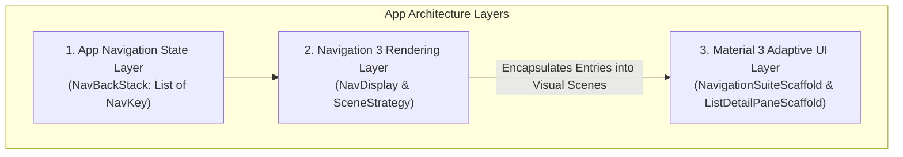

## Scenes 와 adaptive scaffolds 는 같은 문제를 푸는가

상위 문서: [Adaptive Navigation 계약](adaptive-navigation.md)

관련 계층: [Metadata와 SceneStrategy는 표시 정책을 전달한다](../../navigation3/navigation3/metadata-and-scene-strategy-carry-display-policy.md)

### 개념 및 아키텍처 계층 분리 (What & Why)

Navigation 3의 **Scene / SceneStrategy**와 Material 3의 **Adaptive Scaffold**는 흔히 레이아웃을 다룬다는 이유로 오해를 받지만, 안드로이드 아키텍처 상 완전히 다른 계층에서 서로 다른 문제를 해결한다.



1. **Navigation 3 Scene / SceneStrategy (탐색 구조 계층)**:
   - **역할**: 백스택(`NavBackStack`)에 쌓인 여러 목적지 항목(`NavEntry`)들을 시각적 표시 단위인 **`Scene`**으로 그룹화하는 내비게이션 엔진 규칙이다.
   - **해결하는 문제**: 백스택의 최상위 엔트리 두 개를 단일 스크린에 겹쳐 표현할 것인가(Dialog), 팝업으로 띄울 것인가, 아니면 목록과 상세 화면을 하나의 듀얼 씬으로 묶어서 렌더링할 것인가?
2. **Material 3 Adaptive Scaffold (UI 레이아웃 & 조작 계층)**:
   - **역할**: 윈도우 크기(`WindowSizeClass`)와 디자인 시스템(Material 3) 가이드라인에 따라 앱 프레임(Bar, Rail, Drawer) 및 기능 구획(List Pane, Detail Pane)을 물리적으로 배치하고 애니메이션을 통제하는 컴포저블이다.
   - **해결하는 문제**: 창이 넓어질 때 하단 바를 왼쪽 내비게이션 레일로 어떻게 애니메이션 전환할 것인가? 패널 분할 시 Predictive Back(뒤로가기 예측 애니메이션)과 파티션 슬라이드를 어떻게 처리할 것인가?

---

### 두 기술의 세부 역할 비교

| 분류 | Navigation 3 SceneStrategy | M3 Adaptive Scaffold |
| :--- | :--- | :--- |
| **주요 책임** | 백스택(`NavBackStack`)의 엔트리 조합 규칙 결정 | 윈도우 크기에 따른 탐색 크롬 및 컴포넌트 물리적 배치 |
| **입력 상태** | `List<NavEntry<NavKey>>` 및 엔트리별 `Metadata` | `WindowAdaptiveInfo`, `ThreePaneScaffoldValue` |
| **대표 클래스** | `SinglePaneSceneStrategy`, `DialogSceneStrategy`, `ListDetailSceneStrategy` | `NavigationSuiteScaffold`, `ListDetailPaneScaffold`, `SupportingPaneScaffold` |
| **적용 범위** | 화면 전환 아키텍처 및 화면 조합 엔진 | 컴포저블 UI 레이아웃 및 UX 트랜지션 |

---

### 통합 아키텍처 가이드라인 (How to Combine)

가장 표준적인 아키텍처 구축 패턴은 최상위 앱 프레임에는 `NavigationSuiteScaffold`를 배치하고, 개별 기능 영역 내부 렌더링에는 `NavDisplay` 및 적절한 `SceneStrategy` 또는 `NavigableListDetailPaneScaffold`를 배치하는 조합이다:

```kotlin
// 1. App Frame Level: Adaptive Navigation Chrome 관리
NavigationSuiteScaffold(
    navigationSuiteItems = {
        topLevelDestinations.forEach { dest ->
            item(
                icon = { Icon(dest.icon, contentDescription = null) },
                selected = currentTopLevel == dest,
                onClick = { currentTopLevel = dest }
            )
        }
    }
) {
    // 2. Feature Level: Navigation 3 NavDisplay로 화면 렌더링
    NavDisplay(
        backStack = currentBackStack,
        entryProvider = entryProvider,
        // 필요에 따라 Custom SceneStrategy 또는 Dialog/ListDetail Strategy 적용
        sceneStrategy = remember { SinglePaneSceneStrategy() }
    )
}
```

---

### 판단 및 선택 기준

1. **`NavigableListDetailPaneScaffold`를 사용할 때**:
   - Material 3의 표준 List-Detail 패턴, 패널 간 슬라이딩 애니메이션, Predictive Back 제스처 처리가 그대로 필요한 경우.
   - 이때 Scaffold 내부에서 패널 이동 백스택을 관리하므로, 중복으로 커스텀 `ListDetailSceneStrategy`를 중첩 적용하여 백스택 정책이 충돌하지 않도록 주의한다.
2. **Navigation 3 `SceneStrategy`를 사용할 때**:
   - 백스택의 특정 엔트리가 Dialog나 BottomSheet로 독립 표시되어야 할 때 (`DialogSceneStrategy`).
   - 완전히 커스텀된 멀티 엔트리 뷰 포트 구성 아키텍처를 구현해야 할 때.

---

### 관련 상위 및 연관 노트

- 상위 계약: [Adaptive Navigation 계약](adaptive-navigation.md)
- 연관 계약: [Metadata와 SceneStrategy는 표시 정책을 전달한다](../../navigation3/navigation3/metadata-and-scene-strategy-carry-display-policy.md)
- 연관 계약: [NavDisplay와 entry provider는 렌더링과 route registry를 분리한다](../../navigation3/navigation3/navdisplay-and-entry-provider-separate-rendering-from-route-registry.md)
