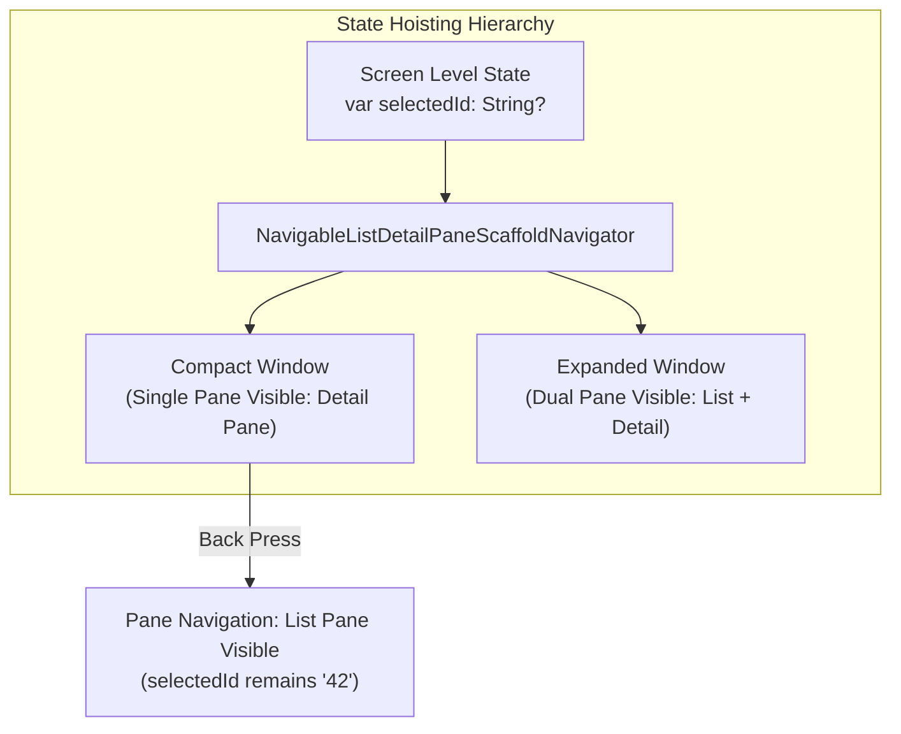

## Pane layout 은 선택 상태와 back policy 를 분리해 보존해야 한다

상위 문서: [Adaptive Navigation 계약](adaptive-navigation.md)

관련 계약: [Navigation 3 Scene과 adaptive scaffold는 서로 다른 레이아웃 문제를 푼다](navigation3-scenes-and-adaptive-scaffolds-solve-different-layout-problems.md)

---

### 개념과 필요성 (What & Why)

1. **개념 (What)**:
   - **Pane Layout**(List-Detail 또는 Supporting Pane 레이아웃)에서 "화면에 보이는 패널의 개수(Pane Visibility)"와 "사용자가 선택한 데이터 항목의 맥락 상태(`selectedId`)" 및 "뒤로 가기 동작의 정책(`Back Policy`)"은 서로 다른 독립적인 아키텍처 축으로 분리하여 보존되어야 한다.
2. **필요성 (Why)**:
   - **화면 회전 및 윈도우 크기 변환 시 맥락 유지**: 사용자가 스마트폰(Compact 창)에서 목록 아이템 #42를 클릭하여 상세 화면 진입 후, 기기를 가로로 돌리거나 폴더블을 펼쳐 Expanded 창이 되었을 때, 선택 상태 `selectedId = 42`가 보존되어 있어야 Dual Pane 오른쪽에 아이템 #42가 즉시 렌더링된다. 선택 상태를 창 크기나 패널 가시성 변수에 종속시켜 소멸시키면 사용자 맥락이 깨진다.
   - **Back Policy의 일관성**: Compact 창에서는 상세 화면에서 Back 버튼 클릭 시 목록 화면으로 돌아가야 하지만, `selectedId` 항목 자체가 초기화되어서는 안 된다. 목록으로 돌아온 상태에서 다시 기기를 펼치면 이전에 보던 #42 아이템 선택 상태가 남아있어야 하기 때문이다.

---

### 내부 동작 및 상태 구조 (How)



- **선택 상태 (`selectedId`)**: 창 크기 및 패널 표시 여부보다 수명이 긴 스크린 레벨 상태로 **Hoist**한다 (`rememberSaveable`).
- **패널 내비게이터 (`ThreePaneScaffoldNavigator`)**: 현재 화면이 Single Pane인지 Dual Pane인지를 파악하고, `canNavigateBack()` 및 `navigateBack()`을 통해 UX 뒤로가기 흐름만 통제한다.

---

### 핵심 구현 코드 예시

```kotlin
@Composable
fun ArticleListDetailScreen() {
    // 1. 선택 상태는 패널 표시 여부와 독립되도록 Hoist
    var selectedArticleId by rememberSaveable { mutableStateOf<String?>(null) }
    
    // 2. M3 Adaptive Navigator 생성
    val navigator = rememberListDetailPaneScaffoldNavigator<String>()

    NavigableListDetailPaneScaffold(
        navigator = navigator,
        listPane = {
            ArticleList(
                selectedId = selectedArticleId,
                onArticleClick = { articleId ->
                    selectedArticleId = articleId
                    // Compact 창일 때 Detail Pane으로 전이
                    navigator.navigateTo(ListDetailPaneScaffoldRole.Detail, articleId)
                }
            )
        },
        detailPane = {
            selectedArticleId?.let { id ->
                ArticleDetail(articleId = id)
            } ?: SelectArticlePlaceholder()
        }
    )
}
```

---

### 구시대 레거시 vs 현대 표준 비교 (Legacy vs Modern)

| 구분 | 구시대 수동 Pane 처리 (Legacy) | 현대 Adaptive State Hoisting (Modern) |
| :--- | :--- | :--- |
| **선택 상태 소유** | `Fragment` 내부 로컬 변수로 소유하여 Fragment `replace()` 시 선택 상태 손실 | `rememberSaveable` 기반 Screen State로 Hoist하여 윈도우 변환 시 유지 |
| **뒤로가기 처리** | `if (isTablet)` 분기를 타며 수동 `popBackStack()` 호출로 백스택 꼬임 | `ListDetailPaneScaffoldNavigator`가 창 크기별 백 스택 및 Predictive Back 자동 조율 |
| **화면 전환 시 동작** | Expanded $\rightarrow$ Compact 전환 시 선택했던 항목이 사라지고 초기 목록으로 튕김 | Compact 전환 시 보던 상세 화면 유지, Back 클릭 시 목록으로 돌아가도 선택 상태 보존 |

---

### 판단 및 검증 질문 (Audit Checklist)

- [ ] `selectedId` 등 선택 맥락 상태가 `rememberSaveable`로 선언되어 프로세스 재시작 및 회전 시 보존되는가?
- [ ] Compact 창에서 Detail 화면에 들어간 후 뒤로가기를 누르면 목록 화면으로 정상 복귀하는가?
- [ ] Compact 상태에서 뒤로가기 후 기기를 펼쳤을 때 이전 선택 항목이 Dual Pane에 유지되는가?

---

### 관련 상위 및 연관 노트

- 상위 계약: [Adaptive Navigation 계약](adaptive-navigation.md)
- 연관 계약: [Navigation 3 back stack은 저장 가능한 navigation state로 복원해야 한다](../../navigation3/navigation3/navigation3-back-stack-needs-saveable-restoration.md)
