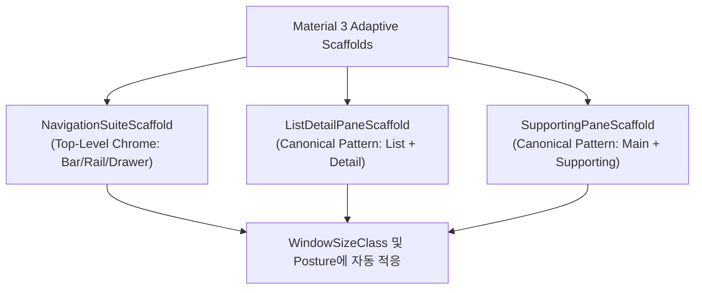

## 표준 adaptive scaffold 를 먼저 검토하고 custom layout 은 명시적 이유가 있을 때 둔다

상위 문서: [Adaptive Navigation 계약](adaptive-navigation.md)

관련 계약: [Top-level destination은 adaptive navigation chrome의 단위다](top-level-destination-owns-adaptive-navigation-chrome.md)

---

### 개념과 필요성 (What & Why)

1. **개념 (What)**:
   - 반응형 안드로이드 UI 구축 시 `BoxWithConstraints`나 수동 `if (width > 600.dp)` 커스텀 분기 레이아웃을 직접 작성하기 전에, 안드로이드 공식 라이브러리가 제공하는 표준 Canonical Layout Scaffold(`NavigationSuiteScaffold`, `ListDetailPaneScaffold`, `SupportingPaneScaffold`)를 최우선적으로 적용해야 한다는 아키텍처 원칙이다.
2. **필요성 (Why)**:
   - **재구현 비용 및 파편화 방지**: 탐색 크롬 전환, 패널 가시성, 힌지 피하기, Predictive Back(뒤로가기 예측 애니메이션) 및 접근성(Accessibility) 지원을 커스텀 코드 경로로 구현하면 윈도우 크기가 변할 때 수많은 엣지 케이스 버그와 파편화가 발생한다.
   - **접근성 및 키보드/마우스 탐색 보장**: 안드로이드 표준 Scaffold는 대화면 키보드 탭 이동, 포커스 하이라이트, TalkBack 스크린 리더 순서를 구글 디자인 가이드라인에 맞춰 내장하고 있다.

---

### 표준 Adaptive Scaffold 모듈 사양 (How)



1. **`NavigationSuiteScaffold`**:
   - `material3-adaptive-navigation-suite` 라이브러리가 제공한다.
   - 창 너비에 따라 Compact(Bottom Navigation Bar) $\rightarrow$ Medium(Navigation Rail) $\rightarrow$ Expanded(Navigation Drawer)로 앱 레벨 내비게이션 크롬을 자동 적응시킨다.
2. **`ListDetailPaneScaffold`**:
   - `material3-adaptive-layout` 라이브러리가 제공한다.
   - Primary Pane(List)과 Secondary Pane(Detail), Extra Pane(Option)의 3패널 구조를 관리하며 window breakpoint에 맞춰 패널 분할 비율을 자동 계산한다.

---

### 핵심 구현 코드 예시

```kotlin
// 표준 NavigationSuiteScaffold 사용 예시
@Composable
fun MainAppAdaptiveShell(
    currentDestination: AppDestination,
    onNavigate: (AppDestination) -> Unit,
    content: @Composable () -> Unit
) {
    NavigationSuiteScaffold(
        navigationSuiteItems = {
            AppDestination.entries.forEach { dest ->
                item(
                    icon = { Icon(dest.icon, contentDescription = dest.label) },
                    label = { Text(dest.label) },
                    selected = dest == currentDestination,
                    onClick = { onNavigate(dest) }
                )
            }
        }
    ) {
        content()
    }
}
```

---

### 구시대 레거시 vs 현대 표준 비교 (Legacy vs Modern)

| 구분 | 레거시 커스텀 Layout 분기 (Legacy) | 현대 표준 Adaptive Scaffold (Modern) |
| :--- | :--- | :--- |
| **구현 방식** | `BoxWithConstraints` 내부에서 `maxWidth` 수동 측정 후 `if-else` 컴포저블 분기 | `NavigationSuiteScaffold` 및 `ListDetailPaneScaffold` 단일 표준 호출 |
| **애니메이션 및 UX** | 창 크기 변환 시 레이아웃이 툭툭 끊기며 갱신됨 | M3 표준 사양에 맞춘 모션 트랜지션 및 Predictive Back 애니메이션 자동 제공 |
| **유지보수성** | 크롬 분기용 코드와 화면 렌더링 코드가 뒤섞여 분기별 독립 버그 유발 | 탐색 크롬 변환과 화면 콘텐츠 영역이 아키텍처적으로 깨끗하게 분리됨 |

---

### 판단 및 검증 질문 (Audit Checklist)

- [ ] UI 레이아웃에 `maxWidth > 600.dp` 같은 하드코딩된 조건문 분기가 존재하는가?
- [ ] Top-level 탐색 전환을 위해 `NavigationSuiteScaffold`를 최우선 검토하였는가?
- [ ] 커스텀 레이아웃을 도입할 경우 standard scaffold로 표현 불가능한 명확한 제품 제약 사유가 문서화되어 있는가?

---

### 관련 상위 및 연관 노트

- 상위 계약: [Adaptive Navigation 계약](adaptive-navigation.md)
- 연관 계약: [Top-level destination은 adaptive navigation chrome의 단위다](top-level-destination-owns-adaptive-navigation-chrome.md)
