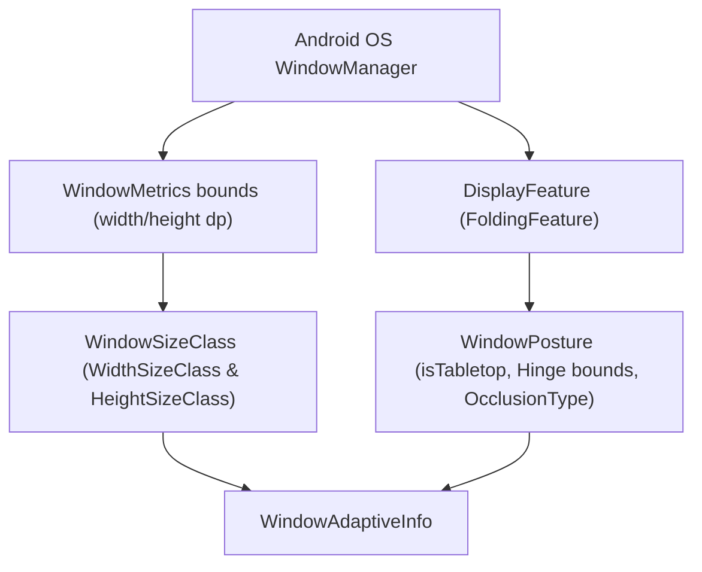

## Adaptive navigation 은 device type 이 아니라 현재 window 와 posture 로 결정한다

상위 문서: [Adaptive Navigation 계약](adaptive-layout-and-navigation.md)

### 개념과 필요성 (What & Why)

1. **개념 (What)**:
   - Adaptive Navigation의 상태 전이는 기기의 하드웨어 폼 팩터 명칭(예: "Pixel Tablet", "Galaxy Z Fold")이 아니라, 런타임에 앱에 할당된 **Window Bounds(`WindowSizeClass`)**와 기기의 물리적 접힘/거치 형태인 **Posture(`WindowPosture`)**의 조합에 따라 동적으로 결정된다.
2. **필요성 (Why)**:
   - **하드웨어 분류의 불확실성**: 태블릿 기기라도 멀티윈도우 분할 화면(Split Screen)이나 팝업 윈도우(Freeform Multi-window)로 실행되면 픽셀 너비가 `400dp` 미만의 Compact 창이 된다. 이 상황에서 "태블릿이므로 Dual Pane을 띄운다"는 로직을 적용하면 화면 짤림 및 터치 불가 현상이 발생한다.
   - **동적 가분성(Resizability)**: 크롬북(ChromeOS)이나 덱스(Samsung DeX) 환경에서는 사용자가 마우스 드래그로 창 크기를 임의로 조절한다. 하드웨어 타입 기반 고정 분기는 이러한 동적 창 크기 변화에 대응할 수 없다.

---

### 내부 동작 메커니즘 (How)

`androidx.compose.material3.adaptive` 라이브러리의 `currentWindowAdaptiveInfo()`는 다음과 같은 하부 OS/포함 라이브러리 데이터를 종합하여 계산된다:



1. **WindowSizeClass 3단계 분류**:
   - **Compact Width**: `< 600dp` (단일 열 UI, Bottom Navigation Bar 표준)
   - **Medium Width**: `600dp ~ 840dp` (확장 열 UI, Navigation Rail 표준)
   - **Expanded Width**: `>= 840dp` (다중 열/Dual Pane UI, Navigation Drawer/Rail 표준)
2. **FoldingFeature / Posture 계산**:
   - **Flat**: 기기가 완전히 펼쳐진 일반 평면 상태.
   - **Half-Opened (Tabletop / Book)**: 힌지가 `90도` 근처로 접혀 상하 또는 좌우 화면이 물성적으로 분리된 상태.
   - **Hinge Occlusion**: 힌지가 화면 중간을 가리는 물리적 차폐 영역인지를 판단하여 콘텐츠 레이아웃 분할점을 계산한다.

---

### 구시대 레거시 vs 현대 표준 비교 (Legacy vs Modern)

| 구분 | 레거시 기기 기반 분기 (Legacy) | 현대 Window & Posture 기반 분기 (Modern) |
| :--- | :--- | :--- |
| **기준 객체** | `Build.MODEL`, `context.resources.configuration.orientation`, `sw600dp` 리소스 폴더 분기 | `currentWindowAdaptiveInfo()` (`WindowSizeClass` & `WindowPosture`) |
| **멀티윈도우 대응** | 멀티윈도우 모드 전환 시 레이아웃 파손 및 기기 라벨 기반 잘못된 UI 노출 | 분할 창 너비 변화에 맞춰 즉시 Compact/Medium/Expanded UI로 유연하게 적응 |
| **폴더블 힌지 대응** | 힌지 위치 인식 불가로 힌지 구획 위에 텍스트나 버튼이 덮여 가려짐 | `WindowPosture` 및 `FoldingFeature` 경계를 감지하여 힌지 양옆으로 Pane 자동 배치 |

---

### 핵심 구현 코드 예시

```kotlin
@Composable
def AdaptiveScreenContainer() {
    val adaptiveInfo = currentWindowAdaptiveInfo()
    val sizeClass = adaptiveInfo.windowSizeClass
    val posture = adaptiveInfo.windowPosture

    if (posture.isTabletop) {
        // 폴더블 기기가 반쯤 접힌 Tabletop 상태: 상단(비디오/표시), 하단(조작부)
        TabletopLayout()
    } else {
        when (sizeClass.windowWidthSizeClass) {
            WindowWidthSizeClass.COMPACT -> SinglePaneCompactNavigation()
            WindowWidthSizeClass.MEDIUM -> MediumRailNavigation()
            WindowWidthSizeClass.EXPANDED -> DualPaneExpandedNavigation()
        }
    }
}
```

---

### 판단 및 검증 질문 (Audit Checklist)

- [ ] 기기 모델명(`Build.MODEL`)이나 텍스트 라벨에 의존하여 레이아웃을 분기하는 코드가 존재하는가?
- [ ] 소형 스마트폰 세로 모드, 태블릿 분할 화면(Compact), 태블릿 전체 화면(Expanded)에서 목적지 키(`NavKey`) 상태가 일관되게 보존되는가?
- [ ] Android Studio Resizable Emulator를 통해 런타임 창 크기 조절 시 레이아웃 변환이 매끄럽게 동작하는가?

---

### 관련 상위 및 연관 노트

- 상위 계약: [Adaptive Navigation 계약](adaptive-layout-and-navigation.md)
- 관련 노트: [Large screen contracts](../../../07_platforms/large-screens/large-screens/large-screen.md)
- 관련 노트: [Pane layout은 선택 상태와 back policy를 분리해 보존해야 한다](pane-layout-selection-back-policy.md)
