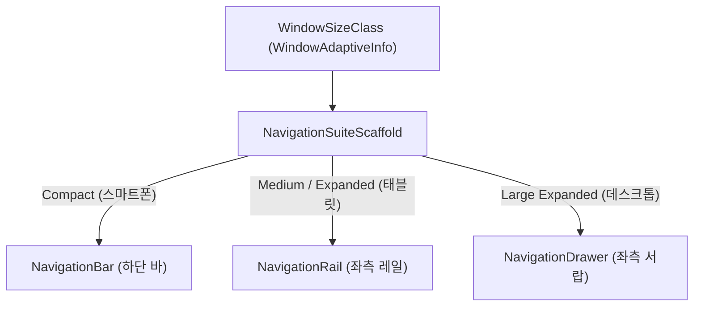

## NavigationSuiteScaffold (Material3 Top-Level Navigation Chrome Adaptive)

### 1. 개요 (Overview)

**NavigationSuiteScaffold** 는 `androidx.compose.material3.adaptive:adaptive-navigationsuite` 라이브러리가 제공하는 스캐폴드로, **화면 크기(Window Size Class: Compact, Medium, Expanded)에 따라 앱의 Top-Level Navigation UI (Outer Navigation Chrome)를 자동으로 최적화 변경해 주는 UI 스캐폴드 Component**이다.

스마트폰(Compact)에서는 하단 `NavigationBar` 로, 태블릿(Expanded)에서는 좌측 `NavigationRail` 로, 데스크톱/대화면에서는 `NavigationDrawer` 로 Navigation Component 의 외곽 틀 형태를 자동으로 반응형 전환한다.

---

#### 초보자를 위한 쉽게 이해하는 비유

* **NavigationSuiteScaffold (스마트 변신 창문 갤러리 틀)**:
  - 창문 크기(화면 크기)가 좁은 폰일 때는 조종 단추들을 밑바닥 전광판(`NavigationBar`)에 배치하고, 창문이 가로로 넓어지면 단추들을 좌측 기둥(`NavigationRail`)으로 알아서 옮겨 배치해 주는 바깥 테두리 갤러리 틀.



---

### 2. 핵심 역할 및 실전 코드 예시

#### 1) 주요 관심사
- **해결 문제**: Top-Level Navigation UI 위치 및 형태 전환 ("어디로 이동할 수 있는가?")
- **관심사**: Bottom Bar vs Rail vs Drawer
- **Multi-Pane Content Layout 포함 여부**: ❌ 포함하지 않음 (콘텐츠 내부 배치는 [navigation3-scene-and-strategy](../navigation3/navigation3-scene-and-strategy.md) 의 역할)

#### 2) 실전 코드 예시

```kotlin
@Composable
fun AppNavigationSuiteScaffold(
    currentDestination: AppDestination,
    onNavigateToDestination: (AppDestination) -> Unit,
    content: @Composable () -> Unit
) {
    NavigationSuiteScaffold(
        navigationSuiteItems = {
            AppDestination.entries.forEach { destination ->
                item(
                    icon = { Icon(destination.icon, contentDescription = destination.label) },
                    label = { Text(destination.label) },
                    selected = currentDestination == destination,
                    onClick = { onNavigateToDestination(destination) }
                )
            }
        }
    ) {
        // 내부 화면 콘텐츠 렌더링 스코프
        content()
    }
}
```

---

### 3. 연결 문서 (Related Links)

- [navigation3-scene-and-strategy](../navigation3/navigation3-scene-and-strategy.md) - Navigation 3 Scene & Multi-Pane 레이아웃
- [navigation-suite-scaffold-vs-navigation3-scene](navigation-suite-scaffold-vs-navigation3-scene.md) - 둘의 비교 및 통합 사용 아키텍처
- [Navigation 3 계약](../navigation3/navigation3.md) - 상위 계약 지도
- [jetpack-navigation-3-guide](../navigation3/jetpack-navigation-3-guide.md) - Jetpack Navigation 3 가이드
