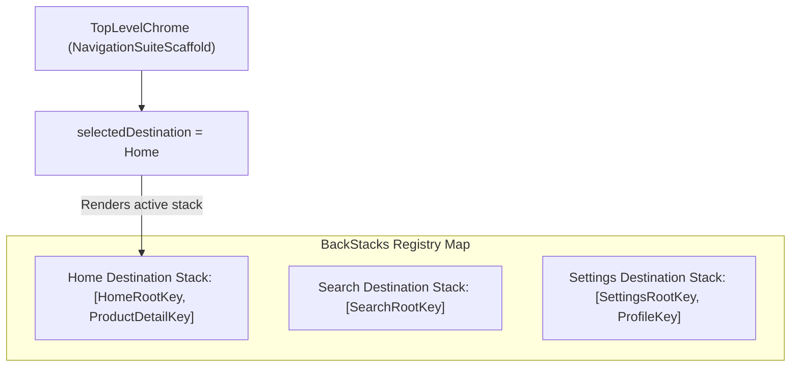

## Top-level destination 은 adaptive navigation chrome 의 단위다

상위 문서: [Adaptive Navigation 계약](adaptive-layout-and-navigation.md)

관련 계약: [표준 adaptive scaffold를 먼저 검토하고 custom layout은 명시적 이유가 있을 때 둔다](standard-adaptive-scaffolds.md)

---

### 개념과 필요성 (What & Why)

1. **개념 (What)**:
   - **Top-level Destination**(앱의 메인 Bottom Bar, Navigation Rail, Drawer에서 직접 전환되는 최상위 아키텍처 화면)은 안드로이드 탐색 크롬(App Navigation Chrome)이 표시되고 상태를 전환하는 **독립적 단위**이다.
2. **필요성 (Why)**:
   - **탭별 백스택 독립성 보존**: 사용자가 "Home" 탭에서 상세 화면 깊숙이 탐색한 후 "Settings" 탭으로 이동했다가 다시 "Home" 탭으로 돌아왔을 때, 이전에 보고 있던 상세 화면과 백스택 위치가 그대로 유지되어야 한다 (Multiple Back Stacks 패턴).
   - **크롬 구조와 백스택의 분리**: 창 크기가 바뀌어 탭 바가 Bottom Bar에서 Navigation Rail로 변하더라도, 각 Top-level Destination이 소유한 내부 백스택 데이터 구조(`NavBackStack`)는 영향을 받지 않고 보존되어야 한다.

---

### 내부 백스택 구조 메커니즘 (How)

Top-level destination 별 독립 백스택 관리는 다음과 같이 상태 map 구조로 모델링된다:



- **Multiple Back Stacks 패턴**: 각 최상위 탭별로 별도의 `NavBackStack<NavKey>` 목록을 소지하거나, Navigation 3의 state saveable 개체로 저장하여 탭 전환 시 기존 백스택을 파기하지 않고 스와핑한다.

---

### 핵심 구현 코드 예시

```kotlin
enum class AppDestination(val label: String, val icon: ImageVector, val rootKey: NavKey) {
    HOME("홈", Icons.Default.Home, HomeRootKey),
    SEARCH("검색", Icons.Default.Search, SearchRootKey),
    PROFILE("프로필", Icons.Default.Person, ProfileRootKey)
}

@Composable
fun AdaptiveAppShell() {
    var currentTopLevel by rememberSaveable { mutableStateOf(AppDestination.HOME) }
    
    // Top-level destination별 독립 백스택 맵
    val backStacks = remember {
        mutableStateMapOf<AppDestination, NavBackStack<NavKey>>().apply {
            AppDestination.entries.forEach { dest ->
                put(dest, navBackStackOf(dest.rootKey))
            }
        }
    }

    val currentStack = backStacks.getValue(currentTopLevel)

    NavigationSuiteScaffold(
        navigationSuiteItems = {
            AppDestination.entries.forEach { dest ->
                item(
                    icon = { Icon(dest.icon, contentDescription = dest.label) },
                    label = { Text(dest.label) },
                    selected = dest == currentTopLevel,
                    onClick = { currentTopLevel = dest }
                )
            }
        }
    ) {
        // 활성화된 Top-level destination의 백스택 렌더링
        NavDisplay(
            backStack = currentStack,
            entryProvider = appEntryProvider
        )
    }
}
```

---

### 구시대 레거시 vs 현대 표준 비교 (Legacy vs Modern)

| 구분 | 레거시 탭 전환 방식 (Legacy) | 현대 Top-level Chrome 계약 (Modern) |
| :--- | :--- | :--- |
| **탭 전환 시 백스택** | 탭 전환 시 단일 `NavController`에서 이전 탭의 상세 백스택을 전부 `popBackStack()`하여 파기 | Top-level 탭별 독립 `NavBackStack` 보존 및 복원 (Multiple Back Stacks) |
| **하위 상세 화면 노출** | 하위 상세 화면(Detail Screen)에서도 Bottom Bar가 계속 노출되어 UI 혼선 | 하위 상세 화면 진입 시 탐색 크롬을 가리고(Full Screen), Top-level Root에서만 크롬 소유 |
| **크롬 교체 영향** | 화면 회전 시 BottomBar가 수동 뷰 교체되어 탭 선택 상태 튕김 | `NavigationSuiteScaffold`가 크롬 모양만 바꿀 뿐 selected top-level state 완전 보존 |

---

### 판단 및 검증 질문 (Audit Checklist)

- [ ] 앱의 최상위 탭(Top-level Destination)이 명확히 정의되어 있는가?
- [ ] 탭 이동 후 다시 원래 탭으로 복귀했을 때 하위 상세 화면 맥락이 파기되지 않고 유지되는가?
- [ ] 세로 모드(Bottom Bar)에서 가로 모드(Navigation Rail)로 바뀔 때 선택된 Top-level 탭이 정상 보존되는가?

---

### 관련 상위 및 연관 노트

- 상위 계약: [Adaptive Navigation 계약](adaptive-layout-and-navigation.md)
- 연관 계약: [Navigation 3 back stack은 저장 가능한 navigation state로 복원해야 한다](../navigation3/navigation3-back-stack-restoration.md)
