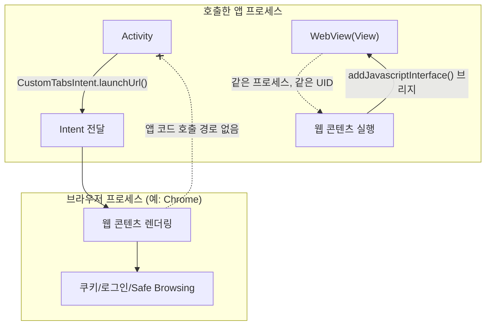

## **Custom Tabs**(외부 브라우저 앱 프로세스의 렌더링 엔진을 활용해 웹 콘텐츠를 안전하게 표시하는 안드로이드 브라우저 모듈) 는 **WebView**(앱 내부 UI 계층에서 웹 코드를 직접 실행하여 비신뢰 영역 조작 위험이 수반되는 뷰 객체) 와 다른 **신뢰 경계(Trust Boundary)**(서로 다른 실행 권한 수준을 가진 독립 프로세스 간의 통제 가능한 보안 경계)와 프로세스 모델을 가진다

배경 지식: [웹 보안](../../../../../../security/web-security.md), [프로세스 생명주기](../../../../../../operating-systems/process-states-lifecycle.md)

Custom Tabs 는 앱을 떠나는 외부 브라우저 전환도 아니고, 앱 프로세스 안에 웹 콘텐츠를 끼워 넣는 `WebView` 도 아니다. 공식 문서는 이 위치를 "By using a Custom Tab, your web content loads in whatever rendering engine powers your user's preferred browser."라고 설명한다. 즉 웹 콘텐츠는 사용자가 이미 설치해 둔 브라우저 앱(프로세스)에서 렌더링되고, 호출한 앱은 그 브라우저를 UI 상으로만 자기 앱 안에 있는 것처럼 보이게 띄운다.

### 내부 동작 메커니즘

- `CustomTabsIntent` 는 결국 `Intent` 한 장이다. 시스템은 이 intent 를 Custom Tabs 를 지원하는 브라우저(예: Chrome)에 위임하고, 그 브라우저가 자신의 프로세스와 렌더링 엔진으로 실제 페이지를 그린다. 호출한 앱 프로세스는 브라우저 UI 를 자기 화면 위에 겹쳐 보이게 할 뿐, 웹 콘텐츠 코드를 직접 실행하지 않는다.
- `WebView` 는 반대다. `WebView` 는 앱 레이아웃 안의 `View` 하나이고, 그 안에서 실행되는 웹 콘텐츠는 앱과 같은 프로세스, 같은 **UID(User ID)**(안드로이드 OS가 앱 패키지마다 부여하여 프로세스와 데이터 접근을 샌드박스로 격리하는 고유 유저 식별자) 로 동작한다. 그래서 `addJavascriptInterface()` 로 앱의 Kotlin/Java 메서드를 웹 콘텐츠에 직접 노출할 수 있다 — 신뢰할 수 없는 웹 콘텐츠가 앱 코드를 호출할 수 있는 다리가 존재한다는 뜻이다. WebView 자체의 신뢰 경계와 위험은 [WebView 계약](../../../ui/system/webview-contracts/webview-contracts.md)에서 다룬다.
- Custom Tabs 는 이 다리가 애초에 없다. 웹 콘텐츠는 브라우저 프로세스 안에서만 실행되므로 앱 코드를 직접 호출할 방법이 없다. 대신 공식 문서가 말하는 것처럼 "Custom Tabs are powered directly by the user's preferred browser and automatically share the state and features offered by it" — 로그인 세션, 저장된 비밀번호, 결제 수단, Safe Browsing 같은 브라우저의 기존 보안·상태 인프라를 그대로 물려받는다. "Shared cookie jar and permissions model so users don't have to sign in to sites they are already connected to, or re-grant permissions they have already granted."
- 외부 브라우저로 완전히 전환하는 방식과도 다르다. 공식 문서는 일반 브라우저 전환이 "a heavy context switch for users that isn't customizable"이라고 지적한다. Custom Tabs 는 브라우저 프로세스에서 렌더링하면서도 뒤로 가기로 호출한 앱으로 즉시 복귀하고, toolbar 색상 같은 일부 UI 를 커스터마이즈할 수 있다.



### 코드 예시

```kotlin
// Custom Tabs: 웹 콘텐츠는 브라우저 프로세스에서 렌더링된다.
val customTabsIntent = CustomTabsIntent.Builder()
    .setShowTitle(true)
    .build()
customTabsIntent.launchUrl(context, Uri.parse("https://example.com/terms"))

// 세션을 미리 열어 두면 브라우저 프로세스가 미리 준비(pre-warm)할 수 있다.
class WarmupConnection : CustomTabsServiceConnection() {
    override fun onCustomTabsServiceConnected(name: ComponentName, client: CustomTabsClient) {
        client.warmup(0L)
        val session = client.newSession(null)
        session?.mayLaunchUrl(Uri.parse("https://example.com/terms"), null, null)
    }
    override fun onServiceDisconnected(name: ComponentName) {}
}
```

```kotlin
// 대조: WebView는 같은 프로세스에서 실행되므로 신뢰 경계를 앱이 직접 관리해야 한다.
webView.settings.javaScriptEnabled = true
webView.addJavascriptInterface(BridgeApi(), "AndroidBridge") // 신뢰하지 않은 페이지라면 위험
```

### 관측 가능한 증거

- `adb shell dumpsys activity processes | grep -i chrome` 로 Custom Tabs 로 연 화면이 호출 앱과 다른 패키지(브라우저)의 별도 PID 로 떠 있는 것을 확인할 수 있다. 반대로 `WebView` 화면은 `adb shell dumpsys activity processes | grep <호출 앱 패키지명>` 에서 호출 앱과 동일한 PID 아래 나타난다.
- Custom Tabs 로 연 페이지에서 호출 앱의 `Application` 클래스나 커스텀 클래스명을 검색해도 브라우저 프로세스의 heap/classloader 에서는 찾을 수 없다 — 애초에 로드되지 않았기 때문이다. `WebView` + `addJavascriptInterface` 조합에서는 앱 프로세스 안에서 해당 클래스가 그대로 로드돼 있다.
- 브라우저 로그인 세션이 있는 사이트를 Custom Tabs 로 열면 별도 로그인 없이 바로 로그인된 상태로 보이는 것으로, 쿠키 jar 를 공유한다는 계약을 직접 관찰할 수 있다.

상위 지도: [Android Navigation 진입 계약](../../navigation-contracts/navigation-contracts.md)

관련 노트: [WebView 계약](../../../ui/system/webview-contracts/webview-contracts.md), [Intent는 컴포넌트 실행을 설명하는 메시지다](../../intents-and-deep-links/intent-manifest-contracts/intent-describes-component-action-request.md)

공식 문서: [Overview of Android Custom Tabs](https://developer.android.com/develop/ui/views/layout/webapps/overview-of-android-custom-tabs)

검증일: 2026-08-04. "브라우저 렌더링 엔진에서 로드", "브라우저와 상태·쿠키를 공유", "일반 브라우저 전환은 무거운 context switch" 인용문은 공식 문서 원문으로 확인했다. `WebView`/`addJavascriptInterface` 의 세부 위험 조건은 이 노트가 링크하는 WebView 계약(다른 세션이 신설 중) 쪽에서 별도로 검증한다.
