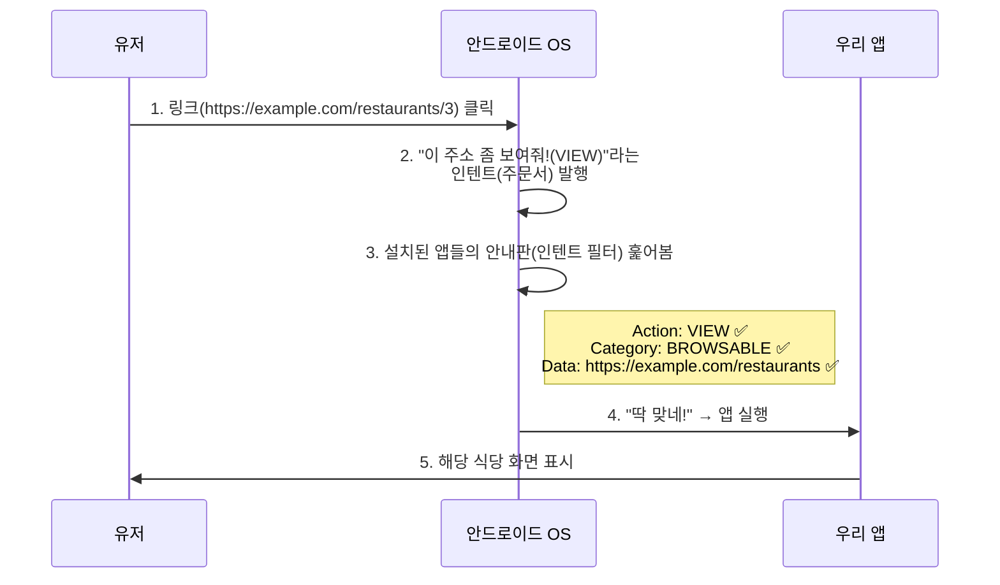

# Intent, Intent Filter & Deep Link 기초

이 문서는 안드로이드에서 컴포넌트 간 통신의 근간이 되는 **인텐트(Intent)**, **인텐트 필터(Intent Filter)**, 그리고 이를 활용한 **딥 링크(Deep Link)** 메커니즘을 다룹니다.

---

## 1. 인텐트 (Intent) = "주문서"

스마트폰 안에는 수많은 앱과 화면(컴포넌트)들이 살고 있습니다. 이들이 서로 소통할 때 사용하는 **편지이자 주문서**가 바로 인텐트(Intent)입니다.

* **원래 뜻**: 의도, 목적
* **쉽게 말하면**: "나 지금 이거 하고 싶어!"라고 안드로이드 시스템에 던지는 요청서입니다.
* **배달 비유**: 유저가 링크를 누르는 행위는 시스템에 "이 주소(URL)로 가서 식당 정보를 보여줘!"라는 주문서를 작성해서 보내는 것과 같습니다.

---

## 2. 인텐트 필터 (Intent Filter) = "가게 문 앞에 붙은 안내판"

주문서(Intent)가 여기저기 날아다닐 때, 특정 앱이 "그 주문, 우리가 처리할 수 있어요!"라고 손을 들어야 합니다. 앱이 어떤 주문을 받을 수 있는지 **문 앞에 붙여놓는 조건표/안내판**이 바로 인텐트 필터입니다.

* **원래 뜻**: 의도를 걸러내는 장치
* **쉽게 말하면**: "우리 앱은 이러이러한 주문서만 받아서 처리합니다"라고 `AndroidManifest.xml`이라는 설정 파일에 적어두는 것입니다.
* **배달 비유**: 식당 문 앞에 `[치킨 배달 가능, 밤 11시까지 영업]`이라고 붙여놓은 안내판입니다. 시스템은 배달 주문서가 들어오면 이 안내판을 보고 올바른 식당을 찾아줍니다.

---

## 3. 인텐트 필터 안의 3대 필수 태그

가게 안내판(인텐트 필터)에 "아무거나 받음"이라고 적으면 안 됩니다. 안드로이드는 딱 **3가지 핵심 태그**를 요구하며, 이 3개가 모두 삼박자로 맞아야 앱이 켜집니다.

```xml
<intent-filter>
    <action android:name="..." />
    <category android:name="..." />
    <data android:scheme="..." />
</intent-filter>
```

### 3-1. `<action>` = "무슨 일을 할 것인가? (행위)"

이 안내판이 어떤 **행동**을 처리할 수 있는지 적는 곳입니다.

* **딥 링크에서의 값**: 주로 `android.intent.action.VIEW`를 씁니다. "무언가를 유저에게 '보여주는(VIEW)' 역할을 하겠다"는 뜻입니다.
* **배달 비유**: "우리 가게는 [요리]를 합니다." (세탁이나 청소가 아님)

### 3-2. `<category>` = "어떤 환경에서 실행되는가? (분류)"

이 주문이 어떤 성격을 가졌는지 추가적인 카테고리를 분류합니다. 딥 링크에서 주로 사용하는 두 가지 값이 있습니다:

| 카테고리 | 역할 |
|:---|:---|
| `android.intent.category.DEFAULT` | 시스템이 기본적으로 호출할 수 있는 화면이라는 뜻 |
| `android.intent.category.BROWSABLE` | 웹 브라우저 등에서 링크를 클릭했을 때도 앱이 반응할 수 있도록 선언. **이게 없으면 웹 링크를 눌러도 앱이 안 켜짐** |

* **배달 비유**: "우리 가게는 [배달앱 전용] 매장입니다." 혹은 "[홀 영업 가능] 매장입니다."

### 3-3. `<data>` = "어떤 데이터를 다루는가? (대상)"

**"구체적으로 어떤 주소(URL)를 눌렀을 때 반응할 것인가?"**를 아주 상세하게 정의하는 곳입니다.

여기에 주소의 앞머리(`https`), 도메인(`example.com`), 상세 주소 세부 규칙(`pathPrefix="/restaurants"`) 등을 빽빽하게 적어둡니다.

* **배달 비유**: "우리 가게는 [강남구 역삼동] 지역의 주문만 받습니다." (배달 가능 지역/대상을 명확히 한정 짓는 것)

---

## 4. 동작 흐름 총정리 (딥 링크 시나리오)

유저가 인터넷에서 `https://example.com/restaurants/3`이라는 링크를 클릭하면 아래의 과정이 진행됩니다:



> [!TIP]
> 이 매커니즘은 인텐트 필터를 등록하는 `AndroidManifest.xml`의 구조와 밀접하게 연결됩니다. 매니페스트 구조에 대한 상세 내용은 [[android-manifest|android_manifest.md]]를 참조하세요.
