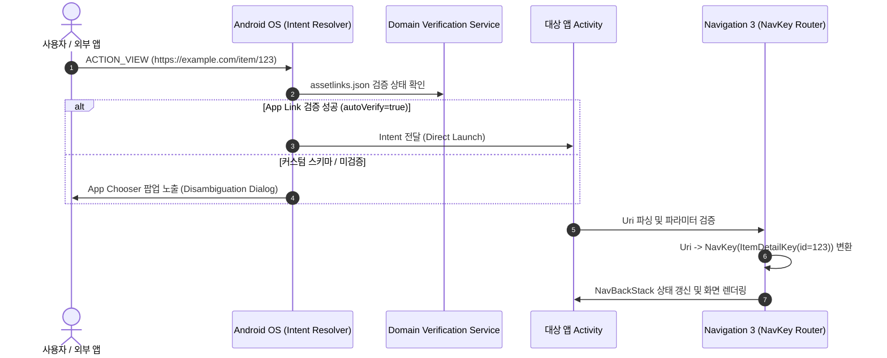

## Android Deep Links 종합 가이드: 딥링크 및 앱 링크 아키텍처

안드로이드 애플리케이션 외부(웹 브라우저, 이메일, 타 앱, 푸시 알림)에서 특정 화면 목적지로 직접 연결하는 **Deep Link**(외부 URI 경로를 통해 앱의 내부 특정 화면으로 즉시 진입시키는 내비게이션 메커니즘)와 **App Links**(도메인 소유권 검증이 수반된 보안 HTTPS 딥링크)의 종합 아키텍처 가이드다.

---

### 개념과 필요성 (What & Why)

1. **개념 (What)**:
   - **Deep Link**: 외부에서 진입하는 URI(`scheme://host/path`)를 해석하여 안드로이드 OS의 Intent Resolution 및 탐색 시스템을 통해 앱 내부 목적지로 사용자를 라우팅하는 기술이다.
   - **App Links**: HTTP/HTTPS 커스텀 scheme의 도메인 소유권을 웹 서버의 `assetlinks.json` 파일과 안드로이드 OS의 Domain Verification Service를 통해 하이재킹 가능성 없이 1:1로 검증하는 표준 앱 링크다.
2. **필요성 (Why)**:
   - **사용자 경험(UX) 연속성**: 웹 페이지를 보던 사용자가 앱 설치 후 동일한 콘텐츠 페이지로 즉시 진입할 수 있도록 돕는다 (Deferred Deep Linking / Seamless Routing).
   - **보안 및 하이재킹 방지**: 구시대 커스텀 스키마(`myapp://`)는 악성 앱이 동일한 스키마를 Manifest에 등록하여 외부 URi 수신을 하이재킹할 수 있다. Verified App Links는 도메인 증명 기반으로 이를 완전 차단한다.

---

### 내부 동작 메커니즘 (How)

---

### 구시대 레거시 vs 현대 표준 비교 (Legacy vs Modern)

| 구분 | 구시대 레거시 (Legacy) | 현대 안드로이드 표준 (Modern Standard) |
| :--- | :--- | :--- |
| **스키마 종류** | 커스텀 URI Scheme (`myapp://profile/123`) | 도메인 검증된 Android App Links (`https://example.com/profile/123`) |
| **도메인 소유권** | 소유권 검증 없음 (동일 스키마 등록 시 악성 앱이 인터셉트 가능) | 웹 서버 `assetlinks.json` SHA-256 서명 검증 (`android:autoVerify="true"`) |
| **라우팅 방식** | Activity에서 수동 Intent `getData()` URI 파싱 후 수동 Fragment/Intent 호출 | Navigation 3 URI-to-`NavKey` 타입 안정 파싱 및 백스택 복원 |
| **인증 화면 처리** | 미인증 상태 진입 시 에러 화면 출력 또는 백스택 소멸 | 로그인 완료 후 기존 딥링크 목적지(`Pending NavKey`) 및 합성 백스택 자동 복원 |

---

### 핵심 정본 지도 (Contract Index)

- [Deep Link 계약](deep-link/deep-link.md)
- [App Link는 검증된 https deep link다](deep-link/app-link-is-verified-https-deep-link.md)
- [Manifest와 assetlinks는 서로 다른 역할을 가진다](deep-link/manifest-and-assetlinks-have-distinct-roles.md)
- [Deep link는 외부 URI 계약이다](deep-link/deep-link-is-external-uri.md)
- [External URI는 navigation 전에 검증되어야 한다](deep-link/external-uri-must-be-validated-before-navigation.md)
- [Authenticated deep link는 대기 목적지와 back stack이 필요하다](deep-link/authenticated-deep-links-require-pending-destination-and-back-stack.md)
- [Notification deep link는 명시적 task와 back stack 정책이 필요하다](deep-link/notification-deep-link-needs-explicit-task-and-back-stack-policy.md)
- [Navigation 3 deep link는 URI를 NavKey로 변환한다](../navigation3/navigation3/navigation3-deep-link-converts-uri-to-navkey.md)

---

### 연관 상위 및 관련 가이드

- [Intent 및 IPC 가이드](android-intent-and-ipc.md)
- [Android Navigation 진입 계약](../navigation/navigation.md)
