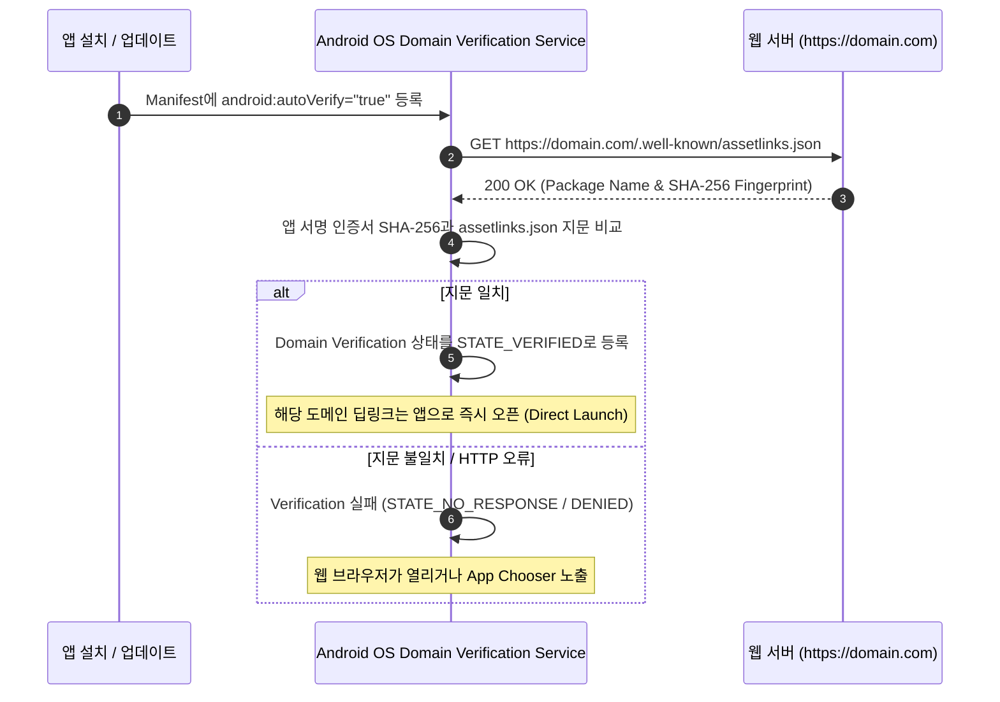

## App Link 는 검증된 https deep link 다

상위 문서: [Deep Link 계약](deep-link.md)

보안 배경 지식: [웹 보안](../../../../../security/web-security.md)

---

### 개념과 필요성 (What & Why)

1. **개념 (What)**:
   - **Android App Link**는 HTTP/HTTPS scheme을 사용하는 딥링크 중에서, 앱의 AndroidManifest.xml에 `android:autoVerify="true"`를 선언하고 웹 서버의 `https://<domain>/.well-known/assetlinks.json` 파일과 통신하여 안드로이드 OS가 웹 도메인 소유권을 증명 완료한 **보안 딥링크**를 의미한다.
2. **필요성 (Why)**:
   - **Custom Scheme (`myapp://`)의 하이재킹 취약점**: 커스텀 스키마는 전역 시스템 네임스페이스 검증이 없다. 악성 앱 B가 자신의 Manifest에 `myapp://` 스키마를 똑같이 등록하면, 사용자가 `myapp://pay` 링크를 클릭했을 때 OS가 어떤 앱을 열지 물어보는 chooser 팝업이 노출되거나 악성 앱이 인터셉트하여 금융/결제 파라미터를 탈취할 수 있다.
   - **App Chooser 팝업 제거 및 UX 향상**: 도메인 검증이 완료된 App Link는 OS Intent Resolver가 앱 선택 선택창(Disambiguation Dialog) 없이 타겟 앱으로 즉시 연결(Direct Launch)시켜 완벽한 UX 연속성을 제공한다.

---

### 내부 검증 메커니즘 (How)



1. **`assetlinks.json` 구조**:
   웹 서버의 파비콘/루트 영역이 아닌 반드시 `https://<domain>/.well-known/assetlinks.json` 경로에 위치해야 하며, HTTPS SSL TLS 통신이 보장되어야 한다.
   ```json
   [{
     "relation": ["delegate_permission/common.handle_all_urls"],
     "target": {
       "namespace": "android_app",
       "package_name": "com.example.myapp",
       "sha256_cert_fingerprints": [
         "14:6D:E9:A0:85:47:A0:C6:7D:0F:D0:A2:85:2F:31:71:0D:37:F6:17:F1:C9:86:A5:7B:6C:51:75:A7:A1:75:38"
       ]
     }
   }]
   ```

---

### 구시대 레거시 vs 현대 표준 비교 (Legacy vs Modern)

| 구분 | 커스텀 스키마 (Legacy) | Verified Android App Links (Modern Standard) |
| :--- | :--- | :--- |
| **URL 형태** | `myapp://product/42` | `https://example.com/product/42` |
| **보안 검증** | 소유권 검증 없음 (동일 스키마 중복 등록 가능) | `assetlinks.json` 기반 SHA-256 앱 서명 지문 검증 |
| **하이재킹 위험** | 악성 앱이 동일 스키마를 등록하여 데이터 탈취 가능 | OS 레벨 도메인 검증으로 인터셉트 완전 불가 |
| **웹 폴백 (Fallback)** | 앱 미설치 시 링크 실행 불가 (오류 발생) | 앱 미설치 시 일반 웹 브라우저에서 웹 사이트로 자동 랜딩 |

---

### 핵심 구현 및 Manifest 예시

```xml
<activity
    android:name=".MainActivity"
    android:exported="true">
    <intent-filter android:autoVerify="true">
        <action android:name="android.intent.action.VIEW" />
        <category android:name="android.intent.category.DEFAULT" />
        <category android:name="android.intent.category.BROWSABLE" />

        <data android:scheme="https" />
        <data android:host="example.com" />
        <data android:pathPrefix="/product" />
    </intent-filter>
</activity>
```

---

### 판단 및 검증 CLI 명령

- **검증 상태 조회 CLI**:
  ```bash
  adb shell pm get-app-links com.example.myapp
  ```
- **수동 검증 실행 CLI**:
  ```bash
  adb shell pm verify-app-links --re-verify com.example.myapp
  ```

---

### 관련 상위 및 연관 노트

- 상위 계약: [Deep Link 계약](deep-link.md)
- 연관 계약: [Manifest와 assetlinks는 서로 다른 역할을 가진다](assetlinks-verification-json.md)
