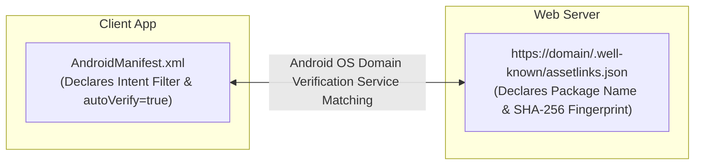

## Manifest 와 assetlinks 는 서로 다른 역할을 가진다

상위 문서: [Deep Link 계약](deep-link-contracts.md)

관련 계약: [App Link는 검증된 https deep link다](app-link-is-verified-https-deep-link.md)

---

### 개념과 역할 분리 (What & Why)

Android App Link의 검증 아키텍처는 **안드로이드 클라이언트 앱 단의 `AndroidManifest.xml`**과 **웹 서버 단의 `assetlinks.json`**이라는 두 독립적인 주체의 상호 검증으로 완성된다.

| 구분 | AndroidManifest.xml (클라이언트 선언) | assetlinks.json (웹 서버 도메인 증명) |
| :--- | :--- | :--- |
| **소유 주체** | 안드로이드 앱 개발자 | 웹 사이트/도메인 소유자 및 서버 관리자 |
| **주요 역할** | 앱이 어떤 도메인/경로의 Intent를 수신할 수 있는지 OS에 선언 | 특정 패키지명의 앱이 해당 도메인의 주인이 맞음을 보증하는 디지털 서명 공개 |
| **위치** | APK 내부 XML 빌드 결과물 | `https://<domain>/.well-known/assetlinks.json` |
| **누락 시 영향** | OS가 딥링크 수신 대상 앱 목록에서 탈락시킴 | 도메인 검증 실패로 일반 웹브라우저로 열리거나 App Chooser 팝업 노출 |

---

### 관련 상위 및 연관 노트

- 상위 계약: [Deep Link 계약](deep-link-contracts.md)
- 연관 계약: [App Link는 검증된 https deep link다](app-link-is-verified-https-deep-link.md)
